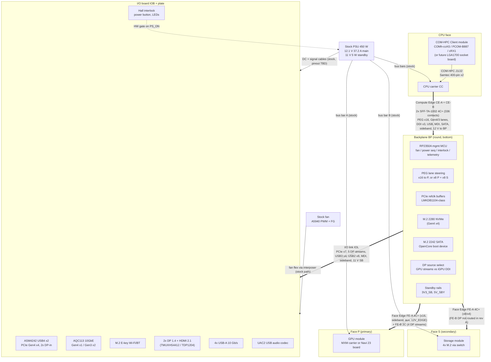
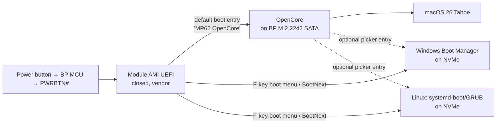

# MacPro6,2: System Architecture Specification, v0.1 (DRAFT)

| | |
|---|---|
| Document | `macpro62-architecture-spec-v0.1.md` |
| Status | **Draft v0.1, for review.** Nothing here is frozen. |
| Date | 2026-09-30 (America/Detroit) |
| Owner | Aidan Winkler |
| Builds on | `/workspace/macpro61-stock-hardware-reference.md` (cited as **[REF-Sx]**, using its source numbers) and `/workspace/macpro62-lineup-options.md` (cited as **[LO-x]**, using its source numbers) |
| New sources | Listed in §10 and cited as **[Nx]** |

## How to read this document

Every statement is tagged with one of these:

| Tag | Meaning |
|---|---|
| **[Sourced]** + citation | A fact from a cited source. The citation is next to it. |
| **[Proposal]** | A design decision this spec proposes. Change it freely. |
| **[Estimate]** | A number derived from sources or arithmetic, with the method stated. Not measured. |
| **[Inference]** | Engineering reasoning that no source states directly. Verify it before relying on it. |
| **[Unverified]** | A source exists but is weak (aggregator, forum, search snippet) or conflicts with another. |
| **TBD** | Unknown. It needs measurement (mostly on the donor 6,1 with D700s), a quote, or a test. |

"Shall" and "must" are requirements in the proposed open standard. "Should" is a recommendation. "May" is optional.

---

## 0. Executive summary (all items are [Proposal] unless tagged)

1. **Topology.** One new round **Backplane (BP)** replaces the Apple logic board. Four boards plug into it:
   - the **CPU carrier (CC)** on the CPU face,
   - two open-standard **Face modules** (Face P = primary, Face S = secondary),
   - the new **I/O board (IOB)**.

   The BP carries no PCH and no CPU. It holds a management MCU, clock buffers, lane steering, and pass-through routing.
2. **Interconnect.** All three core faces use the same connector family: gold-finger card edges into vertical **SFF-TA-1002 ("EDSFF / OCP NIC 3.0") 0.60 mm** sockets on the BP.
   - This copies Apple's CPU-riser approach (card edge into the bottom board) [REF-S1][REF-S4], but with a public, PCIe Gen5-rated, catalogue connector family [N16][N17].
   - **Compute Edge (CPU face):** 2 × 4C+ (2 × 168 contacts).
   - **Face Edge (module faces):** FE-A 4C+ (168, mandatory) plus FE-B 2C (84, optional: display and extras).
   - The **I/O link** also uses this family if the geometry allows. If not, it uses a flex.
   - Reusing the stock MEG-Array flexes stays open as an alternative for you to decide (§5.4).
3. **Main 12.1 V power stays on the stock bus bars** to the CPU face and both module faces, as in the stock machine [REF-S1]. Connectors carry only standby/aux power and a limited 12 V "edge" budget (≤ 25 W per face).
4. **MCU: Raspberry Pi RP2350A.**
   - LCSC C42411118: 7,739 in stock, $1.299 each (checked 2026-09-30) [N15].
   - A4 stepping with erratum E9 fixed [N29].
   - Its USB ROM bootloader cannot be bricked, and it can be flashed from any OS.
   - It appears to all OSes as a composite USB device: HID Sensor temperatures (in-box on Windows and Linux) plus a vendor HID telemetry/control interface [N30][N31].
5. **Lane budget verdict** (details in §2):
   - **COMh-ccAS:** Face P x16 (or x8/x8 with Face S). NVMe x4, USB4 x4, 10GbE and Wi-Fi all fit **without a switch**. The x8/x8 split depends on BIOS 2×8 support, which is unverified [LO §3].
   - **PCOM-B887:** everything fits with lanes to spare.
   - **conga-HPC/cRX1:** limited to x4 groups (Strix Halo has 16 usable lanes [N4]). Face P gets x4 only, and only with the optional on-module switch. It is effectively a single-face system.
   - **Future LGA1700 socket board:** everything fits.
   - **No PCIe switch on the backplane in rev A.** Switches live on modules that need fan-out (the storage module).
6. **I/O board** (rev B target):
   - 2 × USB4 40 Gb/s (ASMedia ASM4242, PCIe Gen4 x4) [N10]
   - 2 × DP 1.4 plus 1 × HDMI 2.1-capable, fed from the GPU module's four DP streams or the CPU iGPU through a mux
   - 4 × USB-A 10 Gb/s (from the module)
   - 1 × 10GbE (Marvell AQC113, LCSC $33.96) [N14][N15]
   - 1 × 2.5GbE (module i226)
   - USB Audio Class 2 codec (driverless on all three OSes) [N36]
   - M.2 E-key Wi-Fi/BT
7. **Firmware.** Each module's AMI UEFI boots a dedicated OpenCore device (preferred: M.2 2242 SATA on the BP, which uses no PCIe lanes). It is registered with `LauncherOption=Full` [LO-22]. SMBIOS is **MacPro7,1** [LO-18][LO-5]. Windows and Linux boot natively from the firmware boot menu.

---

## 1. System overview

### 1.1 Board inventory

| ID | Board | Location | Key contents | Fab/assembly | Status |
|---|---|---|---|---|---|
| **BP** | Backplane | Round board under the core, where the Apple logic board was [REF-S1 p.22] | RP2350A MCU; standby power; lane steering; PCIe refclk buffers; M.2 2280 NVMe (M-key); M.2 2242 SATA OpenCore boot device; sockets: 2 × CE, 2 × (FE-A + FE-B), IOL | JLC-class, 8–10 layers (**[Estimate]**: layer count TBD by routing) | [Proposal] |
| **CC** | CPU carrier | CPU face | COM-HPC Client connector pair (Samtec ASP-214802-01, 5 mm, $42.65 [LO-45b]); module power input from the stock CPU bus bars; edge fingers CE-A/CE-B | JLC-class | [Proposal] |
| **FM-P** | Face module, primary | Face P ("GPU B" position in stock, next to the rear I/O; exact assignment TBD) | Any module per §5. Reference modules: MXM carrier (interim), Navi 23 salvage GPU board | JLC + rework shop (BGA) | [Proposal] |
| **FM-S** | Face module, secondary | Face S | Any module per §5. Reference module: 4 × NVMe storage | JLC-class | [Proposal] |
| **IOB** | I/O board and I/O plate | Rear, behind the I/O wall; the PSU mounts to it (stock arrangement) [REF-S1 pp.250–262] | USB4 host, 10GbE, DP/HDMI muxes and redrivers, USB-A redrivers (TBD), audio codec, Wi-Fi M.2, Hall interlock, power button, LEDs, PSU connectors | JLC-class | [Proposal] |
| **TOP** | Interposer (stock or new) | Top, under the fan | Fan connector; possibly Wi-Fi near the antennas (TBD) | Stock reuse or new | TBD |
| **PSU** | Stock 450 W | Stock | 12.1 V / 37.2 A main; 11 V / 5 W standby [REF-S2][REF-S1 p.22] | Kept | [Sourced] |
| **FAN** | Stock fan (Nidec motor, Allegro A5940 driver) | Top | PWM input 0.1–100 kHz. Internal 100 kΩ pull-up drives the fan to **max speed if PWM is disconnected** [N28]. | Kept | [Sourced] |

### 1.2 Block diagram



### 1.3 Design principles [Proposal]

1. **Every board makes its own rails from 12 V.** Only 12.1 V main, 11 V standby (IOB→BP), 3V3_SB/3V3_AUX, and 5V_SBY (BP→module) cross connectors.
2. **Safety lives in hardware.** The Hall interlock AND the MCU request gate the PSU enable. THERMTRIP# latches the PSU off. Firmware cannot override either. The fan fails safe to max speed [N28].
3. **One connector family everywhere** (SFF-TA-1002 0.60 mm). That means one footprint library, one gold-finger process, and one tolerance study.
4. **PCIe is designed and validated at Gen4 (16 GT/s) across every backplane hop.** Gen5 is "best effort / future with retimers". Budgets are in §2.6.
5. **No hot-plug.** The housing interlock kills 12 V when the shell is off [REF-S1 pp.20, 22, 164]. So a module can only be removed when it is unpowered.
6. **GPU-agnostic face standard.** Nothing in §5 assumes AMD, Navi, or MXM. This keeps it compatible with the MetalGPUDrivers goal.

---

## 2. PCIe lane budget per CPU module

### 2.1 Consumers (the same for every module) [Proposal]

| Consumer | Width / gen wanted | Minimum acceptable | Notes |
|---|---|---|---|
| Face P (primary) | x16, Gen4 or Gen5 | x8 Gen4 | The first real GPU targets (MXM RX 6600, Navi 23) are **PCIe 4.0 x8** [LO-40]. x16 exists for future modules. |
| Face S (secondary) | x8 | x4 | Storage module: ASM2824 upstream is x8 Gen3 max [N7]. |
| BP NVMe (M.2 2280) | x4 Gen4 | x4 Gen3 | Main OS drive. |
| OpenCore boot device | SATA (0 lanes) | USB 2.0 (0 lanes) | §7.2. |
| USB4 host (ASM4242) | x4 Gen4 | x4 Gen3 | ASM4242 upstream: PCIe Gen4 x4 [N10]. |
| 10GbE (AQC113) | x1 Gen4 or x2 Gen3 | x1 Gen3 (caps throughput at about 7.9 Gb/s raw, **[Estimate]**) | AQC113 supports Gen4 x1, Gen3 x4/x2/x1, Gen2 x2 [N14]. |
| Wi-Fi/BT (M.2 E-key) | x1 (any gen) | USB-only BT | |
| 2.5GbE | 0 lanes | – | Uses the module's on-board i226 MDI [N1][N2][N3]. |

**Total wanted:** 16 + 8 + 4 + 4 + 1 + 1 = **34 lanes**. **Minimum:** 8 + 4 + 4 + 4 + 1 + 1 = **22 lanes**.

### 2.2 COM-HPC lane numbering (applies to all modules) [Sourced]

COM-HPC Client groups PCIe lanes as follows [N6]:
- **Group 0 Low:** lanes 0–7, plus one extra lane for a BMC
- **Group 0 High:** lanes 8–15
- **Group 1:** lanes 16–31, the PEG group
- **Group 2:** lanes 32–47

The module provides reference clocks per group (PCIe_REFCLK0_LO/HI, REFCLK1, REFCLK2) [N6]. The carrier/backplane must buffer them to fan out to more than one device (§3.6).

### 2.3 Per-module lane inventory

| Module | CPU lanes (as exposed) | PCH / other lanes (as exposed) | Bifurcation | USB4 on module | Display | Audio bus | Source |
|---|---|---|---|---|---|---|---|
| **congatec/JUMPtec COMh-ccAS** + i5-14500T | 16× Gen5 (COM-HPC lanes 16–31, Group 1) | 8× Gen4 + 6× Gen3 in total. The block diagram shows Gen4 on lanes 8–11 and 12–15, and Gen3 on lanes 0–5 (+6, +7 as connector options). **Which x4 is CPU vs PCH is not stated.** [Inference]: 12–15 is probably the CPU's x4 Gen4 and 8–11 the PCH. | i5-14500T CPU: "1×16+4, 2×8+4" [LO-33]. **Module BIOS 2×8 support unverified** [LO §3]. | No | 3 × DDI + eDP | Datasheet lists SoundWire/DMIC; **HDA not listed** | [N1] |
| **Portwell PCOM-B887** (Arrow Lake-S) | Gen5 x16 (lanes 16–31); Gen5 x4 (lanes 12–15, "only x4"); Gen4 x4 (lanes 8–11, "only x4") | Gen4: lanes 32–35 (default 1×4), 36–39 (default 1×4), 40–41 (x2), 0–3 and 4–7 (default 4×x1 each) | PEG 2×8 **[Unverified]** (Arrow Lake CPU capability plus module BIOS TBD) | **1 × USB4** (CPU TCP) | 3 × DDI (HBR3) + eDP | HDA/I2S/SoundWire | [N3] |
| **congatec conga-HPC/cRX1** (Strix Halo) | Strix Halo SoC: **16 usable PCIe 4.0 lanes in total** [N4] | Block diagram: lanes 0–3, 4, 5, 6 (opt), 7 (opt), 8–11, 12–15 native. Lanes 16–19 and 20–23 are shown behind an **optional on-module PCIe switch** ("up to 24× Gen4, assembly option"). | **No x8/x16 group is shown.** Whether 8–15 can train as one x8 is **TBD** (module manual). | SoC has 2 × USB4 natively [N4], but **the module datasheet lists none** | 3 × DDI + eDP (4 independent displays) | **HDA** | [N2][N4] |
| **Future own LGA1700 board** (Raptor Lake + Z790-class PCH) | CPU: 16× Gen5 (1×16 or 2×8) + 4× Gen4 | Z790: up to 20× Gen4 + 8× Gen3; DMI 4.0 x8. (B760: 10 + 4; DMI x4.) | CPU per ARK/brief | Needs discrete controller | Per board design | Per board | [N5] |

Module caveats:
- **B887:** the datasheet dated January 2025 shows ordering status "In Development" [N3]. Confirm availability.
- **cRX1:** the datasheet is "Preliminary Rev 0.3, 2026-07-08" [N2].
- **Future LGA1700 board:** a stretch goal. PCH parts and PDGs are not available to hobbyists [LO-24].

### 2.4 Allocation per module [Proposal]

"Steer" means the backplane lane-steering option described in §2.5.

#### 2.4.1 COMh-ccAS + i5-14500T

| COM-HPC lanes | Gen | → Consumer | Width | Notes |
|---|---|---|---|---|
| 16–23 | Gen5 (runs Gen4 by policy) | **Face P** lanes 0–7 | x8 | Always connected. |
| 24–31 | Gen5 (runs Gen4) | **Steer:** Face P lanes 8–15 (mode "x16") **or** Face S lanes 0–7 (mode "x8/x8") | x8 | Mode x8/x8 needs BIOS PEG = 2×8. **If the ccAS BIOS cannot do 2×8, use mode x16 and feed Face S from lanes 12–15 (below).** |
| 12–15 | Gen4 | BP NVMe **or** (steer) Face S x4 | x4 | Fallback Face S source. |
| 8–11 | Gen4 | IOB USB4 host (ASM4242) | x4 | |
| 0–1 | Gen3 | IOB AQC113 (Gen3 x2 ≈ full 10GbE) | x2 | Needs PCH root port config x2 (TBD: module BIOS / soft straps). |
| 2 | Gen3 | IOB Wi-Fi | x1 | |
| 3–5 | Gen3 | Spare (3× x1 or 1× x2) | – | Could feed a second NVMe at x2. |
| SATA0 | 6 Gb/s | OpenCore boot M.2 SATA | – | The module has 2 × SATA [N1]. |
| i226 #0 MDI | – | IOB 2.5GbE RJ45 | – | 2 × i226 on the module [N1]. |

**Can:**
- GPU x8 Gen4 plus storage x8 (if 2×8 works), or GPU x16 plus storage x4.
- NVMe x4, USB4, 10GbE and Wi-Fi at the same time.

**Can't:**
- An x16 GPU and an x8 storage module at the same time.
- 4 × x4 bifurcation (CPU supports only 1×16/2×8 [LO-33]). A 4-drive storage module therefore **needs an on-module switch**.

#### 2.4.2 Portwell PCOM-B887

| COM-HPC lanes | Gen | → Consumer | Width |
|---|---|---|---|
| 16–31 | Gen5 | Face P (x16), or steer x8/x8 (if BIOS allows) | x16 |
| 32–35 | Gen4 (PCH) | Face S (default when Face P is x16) | x4 |
| 12–15 | Gen5 (CPU, "only x4") | BP NVMe (links Gen4 by policy; Gen5 possible only on a short, low-loss path, TBD) | x4 |
| 8–11 | Gen4 ("only x4") | IOB USB4 host (ASM4242) | x4 |
| 0 | Gen4 x1 | IOB AQC113 (Gen4 x1 = full 10GbE) | x1 |
| 1 | Gen4 x1 | IOB Wi-Fi | x1 |
| 36–39, 40–41, 2–7 | Gen4 | Spare: second NVMe x4, etc. | – |
| On-module USB4 #1 | – | **Not routed in rev A** [Proposal]. USB4 PHY signals over two more connectors would need retimers. Revisit in rev B. | – |

**Can:** everything, with x16 on Face P **and** x4 on Face S, without a switch. **Can't:** nothing material. The limit is Face S x4 unless you use x8/x8.

#### 2.4.3 congatec conga-HPC/cRX1

| COM-HPC lanes | → Consumer | Width | Notes |
|---|---|---|---|
| 16–19 | Face P lanes 0–3 | x4 | **Only if the on-module switch option is fitted** [N2]. Otherwise Face P has no PCIe on this module. |
| 20–23 | Face P lanes 4–7 (unused: the link trains x4) | – | [Inference]: these are separate x4 ports behind the module switch, so Face P cannot train x8 here. |
| 12–15 | BP NVMe **or** (steer) Face S | x4 | |
| 8–11 | IOB USB4 host | x4 | |
| 4 | AQC113 (Gen4 x1) | x1 | |
| 5 | Wi-Fi | x1 | |
| 0–3 | Spare x4 (second NVMe) | x4 | |

**Can:** one GPU at Gen4 x4 (about 7.9 GB/s per direction **[Estimate]**), NVMe, USB4, 10GbE and Wi-Fi.

**Can't:**
- x8 or x16 to any face.
- Two face modules plus NVMe plus USB4 at the same time. Face S only gets lanes by giving up the BP NVMe.

**Positioning:** the 40-CU iGPU [N2] makes a dGPU optional on Linux/Windows. macOS still needs a supported dGPU (RDNA 3.5 is unsupported) [LO-15].

#### 2.4.4 Future LGA1700 socket board (Z790-class)

| Source | → Consumer |
|---|---|
| CPU Gen5 x16 (or 2×8) | Face P x16 (or x8/x8 steer) |
| CPU Gen4 x4 | BP NVMe |
| PCH Gen4 x4 | Face S x4 (or second NVMe) |
| PCH Gen4 x4 | USB4 host |
| PCH Gen4 x1 ×2 | 10GbE, Wi-Fi |
| PCH remaining (about 11 Gen4 + 8 Gen3) | Spare |

**Can:** everything. **Requirement:** the socket board shall present the **same Compute Edge pinout** (§4.3) so it plugs into the unchanged BP.

### 2.5 Lane steering on the backplane [Proposal]

- **Steer-1 (PEG upper x8):** COM-HPC lanes 24–31 go to Face P lanes 8–15 **or** Face S lanes 0–7.
  - **Rev A:** assembly-time static steering (0201/0402 series AC-coupling-cap / 0 Ω footprints at a tight split point; populate one branch). Cost ≈ $0. The stub stays short **[Inference]**.
  - **Rev B option:** an active passive-mux using **TI TMUXHS4412**. It is a 4-channel 2:1 mux, 20 Gb/s, −3 dB bandwidth 13 GHz, listed for PCIe 4.0 / USB4 / DP 2.0 [N24]. LCSC C3657223: 7 in stock, $2.32 [N15]. 8 lanes = 16 differential channels = **4 devices**.
  - A mux caps that path at Gen4 (not rated for Gen5) **[Inference from N24]**.
- **Steer-2 (Face S fallback):** COM-HPC lanes 12–15 go to the BP NVMe **or** Face S lanes 0–3. Same technique.
- **The BIOS PEG setting must match Steer-1.** If the BIOS is 1×16 while steering is x8/x8, Face S will not enumerate. The MCU cannot read the BIOS setting. The mode is recorded in the BP EEPROM and shown by the host tool [Proposal].

### 2.6 Signal-integrity budget (why "Gen4 by policy") [Estimate]

- **[Sourced]** The PCIe 4.0 channel budget is **28 dB @ 8 GHz**. PCIe 5.0 is **36 dB @ 16 GHz** [N23].
- **Worst path (Face P):** CPU package → module → COM-HPC connector → CC (about 100 mm, TBD) → Compute Edge → BP (about 80–120 mm, TBD) → Face Edge → module (about 50–100 mm) → endpoint. That is three separable interfaces.
- **[Estimate]:**
  - With standard FR-4 (JLC standard stack-up), the Gen4 path plausibly fits 28 dB with margin.
  - Gen5 at 36 dB is marginal without low-loss laminate or a retimer.
- **Rev A rules:**
  - Validate at Gen4.
  - Every face module shall work at Gen3.
  - Forcing Gen3 in the BIOS is the fallback.
  - Budget for a Gen4 retimer footprint on Face P lanes in rev B if margins are poor. Part TBD.

### 2.7 Backplane PCIe switch: verdict [Proposal]

| Candidate | Lanes / gen | Availability / price (checked 2026-09-30) | Power | Verdict |
|---|---|---|---|---|
| **ASMedia ASM2824** | 24 lanes, Gen3; x8 upstream; 16 downstream lanes, up to 12 ports; LFBGA 21 × 21, 492 balls [N7] | JLCPCB part page shows **0 in stock** [N7]. Broker prices range widely ($0.88–$90, search snippet) **[Unverified]**. | "Low power" (vendor). Watts **not published** in the sources found. | **Not on the BP.** Gen3 x8 upstream would throttle a Gen4/Gen5 root. **Good for the storage module** (§5.12). |
| **Broadcom PEX88024 / PEX88032 / PEX88048** | 26 / 34 / 50 lanes, Gen4 [N8] | Not listed with price at DigiKey/Mouser. Quote only (search). | SerDes "under 90 mW per lane" [N8]: about 2.3 W SerDes-only for 26 lanes **[Estimate]**. Totals are not public. Broker pages claim 11.4 W / 18.8 W **[Unverified]**. | **No** for rev A: quote-only, large BGA, SDK/firmware model, cost. |
| **Microchip Switchtec PFX PM40028** | 28 lanes, Gen4 fanout, "In Production" [N9] | microchipDIRECT showed no product/price [N9]. Quote. | Not published in sources found | **No** for rev A. Same reasons. |

**Recommendation:** **no switch on the backplane.**
- ccAS, B887 and the socket board have enough lanes for every consumer in §2.1 (§2.4).
- cRX1 is the only module that would gain, and it has its own optional on-module switch [N2].
- A 4-drive storage module carries its own switch (ASM2824).
- Revisit a BP switch only if a future module needs more than two faces' worth of lanes.

---

## 3. Backplane (BP)

### 3.1 Functions [Proposal]

1. **System management MCU:**
   - power sequencing and PSU enable
   - power button and LEDs
   - fan control
   - interlock monitoring
   - thermal monitoring
   - module presence, ID EEPROM checks and power-class policing
   - telemetry to the OS
   - event log
2. **Pass-through routing:** CC ↔ Face P / Face S / IOB.
3. **Lane steering** (§2.5) and **DP source selection** between the GPU module and the iGPU (§6.3).
4. **PCIe reference clock distribution** and per-device PERST# generation.
5. **Local devices:** M.2 2280 NVMe, M.2 2242 SATA OpenCore boot device, BP EEPROM (board ID, steering mode), and temperature sensors on the core base.
6. **Standby power:** 3V3_SB for the MCU/EEPROMs/face AUX, and 5V_SBY for the COM-HPC module.

### 3.2 MCU choice

**Recommendation: Raspberry Pi RP2350A (A4 stepping), with an external QSPI flash of 16 MB (W25Q128-class; exact part TBD from the JLC basic/extended list).** The RP2354A (2 MB stacked flash, +$0.20 [N29]) is acceptable if LCSC stocks it. LCSC stock for RP2354A was **not verified**.

| Criterion | RP2350A | STM32G4-class (alternative) |
|---|---|---|
| Assembler availability | **LCSC C42411118: 7,739 in stock, $1.299 (qty 1), QFN-60 7 × 7** [N15]. JLC boards are reported using A4 [N29, comments]. | Widely stocked (not checked in this pass) |
| Unbrickable update from any OS | **Yes:** ROM USB bootloader (UF2 drag-and-drop mass storage + PICOBOOT) **[Sourced: RP2350 family feature, N29 product brief]** | ROM DFU (needs a DFU tool on each OS) |
| USB device for OS telemetry | USB 1.1 FS host/device [N29] | USB FS |
| Fan tach / PWM-capture / LED timing | 3 PIO blocks (12 state machines) + 24 PWM channels [N29] | Timers |
| 5 V-tolerant inputs | GPIO 0–25 officially 5 V-tolerant with IOVDD powered (A4) [N29] | Varies by pin |
| Known errata | **E9 (GPIO pull-down leakage) fixed in A4.** A2 is withdrawn from the channel [N29]. | – |
| ADC | 4 channels (60-pin); **use I²C power monitors instead** | More ADCs |
| Pin count | 30 GPIO: **tight.** Use an I²C GPIO expander for slow signals, or the RP2350B (80-pin, 48 GPIO; LCSC stock not verified). | LQFP-64/100 |

The reasons: price, JLC stock, a ROM bootloader that updates from macOS/Linux/Windows with no drivers (critical for a community project), PIO for tach capture and module-FAN_PWMOUT measurement, and a large TinyUSB ecosystem **[Proposal]**.

**Hardware safety that does not depend on firmware [Proposal]:**
- `PSU_EN = INTERLOCK_CLOSED AND MCU_PS_REQ AND NOT THERM_LATCH`. Discrete logic, powered from 3V3_SB.
- `THERM_LATCH` is set by module THERMTRIP#, face THERM_TRIP#, or a BP over-temp comparator. It is cleared only by MCU reset **and** AC cycle (TBD).
- The fan PWM output is open-drain / tri-stated at MCU reset, so the A5940 pull-up forces maximum speed [N28].
- A hardware watchdog (external, TBD) resets the MCU if it stops kicking.

### 3.3 Power tree

**Sources [Sourced]:** PSU 12.1 V main, 37.2 A (450 W). 11 V standby, 5 W [REF-S2][REF-S1 p.22].

**Distribution [Proposal]:**

| Rail | Generated where | From | Feeds | Budget |
|---|---|---|---|---|
| 12.1 V main (bus bars, stock) | PSU | – | CC (2-screw CPU bus bars), Face P (bus bar A), Face S (bus bar B) [REF-S1 pp.298–299, 342] | Bus-bar/terminal ampacity **TBD** (measure cross-section; check temperature rise) |
| 12.1 V main (IOB) | PSU DC cable to IOB | – | IOB local bucks (USB VBUS, controllers) | Pinout **TBD** [REF-S1 p.250] |
| 12V_BP | BP | Through **CE power pins** from the CC bus-bar input | BP local bucks; 12V_EDGE to both faces | **≤ 6 A (72 W)** over 10 CE pins (0.6 A per pin = 55% of the 1.1 A rating [N16]) **[Proposal]** |
| 12V_EDGE (per face) | BP (switched, current-limited eFuse, part TBD) | 12V_BP | FE-A 12V_EDGE pins (Class 1 modules) | **≤ 25 W per face** (§5.8) |
| 3V3_BP / 1V8_BP main | BP bucks | 12V_BP | Clock buffers, muxes, M.2 NVMe (3.3 V, up to about 2.5 A **[Estimate]**), M.2 SATA | ≈ 15 W **[Estimate]** |
| 11V_SB | PSU → IOB → IOL → BP | – | BP standby buck only | 5 W total [Sourced] |
| 3V3_SB | BP buck | 11V_SB | MCU, EEPROMs, sensors, Hall sensor (via IOL), FACE_3V3_AUX (in S5: EEPROM/sensor only) | ≤ 0.5 W in S5 **[Proposal]** |
| 5V_SBY | BP buck | 11V_SB | COM-HPC VCC_5V_SBY (module suspend well). "Not mandatory for operation" on some modules [N6]. | **Measure module S5 draw (TBD)** |
| FACE_3V3_AUX | BP load switch | 3V3_SB in S5; 3V3_BP in S0 | FE-A aux pins | S5 ≤ 50 mW per face, S0 ≤ 3.3 W per face (§5.8) |

**Standby budget (S5) [Estimate]** against 5 W at 11 V:

| Load | Estimate |
|---|---|
| MCU plus sensors, EEPROMs, logic | ≤ 0.3 W |
| Face AUX (2 faces) | ≤ 0.1 W |
| COM-HPC 5V_SBY in S5 | **TBD** (assume ≤ 1.5 W until measured) |
| Hall sensor, LEDs off | ≤ 0.05 W |
| Conversion loss (about 15%) | ≈ 0.3 W |
| **Total** | **≈ 2.3 W**, leaving about 2.7 W of margin |

**S3 (suspend-to-RAM) [Proposal: deferred to Phase 3]:**
- In S3 the module keeps DDR5 in self-refresh plus its suspend well on 5V_SBY.
- Measure module S3 draw on the bench. If it is ≤ about 3.5 W, S3 fits the 5 W rail. Otherwise S3 stays disabled (S0/S5 only) [Inference].
- In "single-supply / AT mode" (no standby rail), which the ccAS supports [N1], S3 and wake are impossible [LO §6].

**Main power budget (sustained, S0) [Estimate / Proposal]:**

| Load | ccAS + i5-14500T | cRX1 (120 W cTDP) | Note |
|---|---|---|---|
| CPU module | 92 W (i5-14500T max turbo [LO-33]) | 120 W [N2] | |
| Face P (GPU, Class 2) | 120 W provisional | 120 W | TBD by thermal test (§5.6) |
| Face S (storage, Class 2) | 35 W | 35 W | 4 × NVMe + switch **[Estimate]** |
| BP (NVMe, SATA, logic) | 20 W | 20 W | |
| IOB (2 × USB-C at 15 W, 4 × USB-A at 4.5 W, controllers ≈ 10 W) | 58 W | 58 W | Proposal: USB-C source limited to 5 V/3 A |
| Fan | TBD (≤ 10 W assumed) | same | Measure |
| **Total** | **≈ 335 W** | **≈ 363 W** | Against the 450 W PSU [Sourced]: ≥ 19% margin |

### 3.4 Power states and sequencing [Proposal]

COM-HPC signal names and pins below are from a Kontron COM-HPC Client user guide [N6]:
- PWRBTN# B02
- VIN_PWR_OK C06 ("can be driven low to prevent module from powering up until the carrier is ready")
- SUS_S3# B08
- SUS_S4_S5# C08
- PLTRST# A12
- RSMRST_OUT# B86
- THERMTRIP# B04
- CARRIER_HOT# C04
- FAN_PWMOUT C11
- FAN_TACHIN C12

**Verify the pin numbers against each module's own manual.**

| State | Entry condition | What is on | MCU actions |
|---|---|---|---|
| **G3** | No AC | Nothing | – |
| **SB-INIT** | AC applied; 11V_SB present | 3V3_SB, MCU | Self-test. Read the BP EEPROM (steering mode). Read the interlock. Enable FACE_3V3_AUX (S5 level) and read both face ID EEPROMs (§5.10). Validate power class vs the BP budget. Enable 5V_SBY to the module (ATX mode). |
| **S5** | Module RSMRST_OUT# high | + 5V_SBY | Wait for the power button. The LED shows the standby state. USB telemetry is off (the host is off). |
| **S5→S0 (1)** | Button pressed (IOB → IOL) | – | Pulse module PWRBTN# (typical 400 ms, allowed 50 ms ≤ t < 4 s [N6]). |
| **S5→S0 (2)** | Module drives SUS_S3# high | – | If the interlock is closed: assert MCU_PS_REQ → hardware gate → PSU enable (**polarity and pin TBD**). |
| **S5→S0 (3)** | PSU PWR_OK (TBD) and 12V_BP ≥ 11.4 V (monitor) within 500 ms (TBD) | 12 V main | Enable BP main rails, then FACE_PWR_EN (P, S) in class order. Wait for FACE_PWR_GOOD ≤ 200 ms (TBD). |
| **S5→S0 (4)** | All PG good | – | Release **VIN_PWR_OK** to the module. |
| **S0** | Module releases PLTRST# | All | PERST#[face, n] = PLTRST# AND FACE_PWR_GOOD AND steering-valid. Run the fan loop. Stream telemetry. |
| **S0→S5** | SUS_S3# low | – | Assert PERST#. Drop FACE_PWR_EN. Drop VIN_PWR_OK. Deassert MCU_PS_REQ within 20 ms (TBD). |
| **S3** (later) | SUS_S3# low, SUS_S4_S5# high | 3V3_SB, 5V_SBY | As S5, but keep the module suspend well. Wake from the power button (USB wake TBD). |
| **FAULT** | Interlock opens, THERMTRIP#, face THERM_TRIP#, 12 V UV/OV, PG timeout, EEPROM/class violation | Standby only | Hardware drops the PSU (interlock/thermal). MCU logs the event and shows a blink code (§3.7). Recovery needs a button press (thermal also needs an AC cycle, TBD). |

Other rules:
- **Face power-up rule [Proposal]:** no signal (PCIe, DP, USB, SMBus driven high) is driven into a face before FACE_PWR_GOOD. This follows the MXM "no voltage on signal pins before PWR_GOOD" precedent [LO-52]. Use isolation switches or buffers on the face SMBus and on the sideband lines that the BP drives.
- **AT / single-supply mode:** a BP jumper or EEPROM flag. The MCU skips 5V_SBY, holds VIN_PWR_OK low until 12 V is good, and treats the button as a PSU toggle.

### 3.5 Fan control

**[Sourced]** facts about the fan's A5940 driver [N28]:
- PWM input range 0.1–100 kHz.
- Duty ON threshold 9% (8.7–9.3%). Duty OFF threshold 7.6%.
- Internal 100 kΩ pull-up: **the fan runs at max speed if PWM is disconnected.**
- FG is open-drain, one period per *electrical* revolution.
- Your measurement: max 1,900 RPM. At max fan, the CPU ran 65–70 °C under Cinebench versus 85 °C on the stock curve (130 W Xeon + 2 × D300).

**[Proposal]:**
- PWM 25 kHz, open-drain from the MCU through a buffer powered from the fan supply side (level TBD; the input tolerates up to 6 V [N28]).
- **Minimum commanded duty 12%**, which stays above the 9% ON threshold with margin. 0% only when explicitly requested (never in S0).
- RPM = f_FG × 60 / pole-pairs. **Pole-pair count TBD** (measure FG against a strobe or optical tach).
- **Fan curve inputs.** Each input maps to a fan demand. Fan = **max(demands)**, followed by a slew limiter: up at 200 RPM/s, down at 30 RPM/s, with 3 °C hysteresis.

| Input | Source | Default mapping (TBD after tests) |
|---|---|---|
| Core base temperature | 2–3 BP digital sensors on or near the core bottom (LM75-compatible, part TBD) | 35 °C → floor RPM; 55 °C → 1,900 RPM |
| Module thermal demand | Module **FAN_PWMOUT** (C11) duty, measured by PIO. The MCU synthesizes **FAN_TACHIN** (C12) so the module BIOS sees a fan. | Duty mapped linearly to RPM |
| Face temperatures | Mandatory face sensor (§5.9) | Per face EEPROM: T_target → 60% RPM; T_warn → 100% |
| Host-reported temperatures | Userspace daemon over USB (CPU package / GPU die from the OS) | Optional. Ignored after a 5 s timeout. |
| NVMe temperature | Optional (NVMe-MI basic management over SMBus; support TBD) | – |
| Failsafe | Any sensor missing, daemon misbehaving, or MCU fault | 100% |

- **Floor RPM:** TBD. Measure the stock idle RPM on your working 6,1 via SMC tools [REF-S4 §10].
- **CARRIER_HOT# (C04):** asserted by the MCU when any face or BP sensor exceeds T_crit − 5 °C, so the module throttles [N6].
- **Profiles:** "Stock-like", "Balanced" (target CPU ≤ 75 °C sustained) and "Max". Selected via the host tool; stored in MCU flash.

### 3.6 Clocks and resets [Proposal]

- **Refclk:** module REFCLK outputs (per group [N6]) feed **TI LMKDB1104** (4-output LP-HCSL, PCIe Gen1–Gen7 [N26]) or **Diodes PI6CB33401** (4-output, Gen1–5 [N26]) buffers. LCSC stock not verified.
- **Consumers:** Face P (up to 4 refclks for 4× x4 bifurcation), Face S (2), NVMe, USB4, AQC113, Wi-Fi. About 3 buffers.
- **PERST#:** per consumer, generated as in §3.4. **CLKREQ#** is routed but may be ignored (refclk always on in rev A).

### 3.7 Housing interlock, button, LEDs

- **Interlock [Sourced]:** a dual Hall sensor on the stock I/O board disables 12 V main when the shell is off. A magnet near the power button overrides it for diagnostics [REF-S1 pp.20, 22, 164].
- **[Proposal]:**
  - The new IOB places its Hall sensor(s) at the stock location. **Position and magnet polarity TBD** (donor measurement).
  - Output: `INTERLOCK_CLOSED` (open-drain, IOL) to the BP hardware gate and an MCU GPIO.
  - The MCU also cuts FACE_3V3_AUX when the interlock opens.
  - A "bench mode" (jumper on the BP **plus** an MCU USB command, both required) allows open-housing operation for bring-up.
- **Power button:** stock on the I/O wall [REF-S1 p.22]. The community claims pins 3 and 6 of the I/O-wall flex [REF-S4 p.19, unverified]. On the new IOB it is a GPIO to the MCU (IOL).
- **Diagnostics:**
  - 8 LEDs plus a DIAG button, equivalent to the stock I/O board LEDs #1–#8 [REF-S1 pp.19–20]: flex check → "edges seated (PRSNT)"; 11 V SB; 12 V main; PLTRST released; S5; S0; fault; PCIe link-up (Face P).
  - Plus a blink code on the front LED.

### 3.8 Backplane connectors [Proposal]

| Ref | To | Part family | Contacts | Notes |
|---|---|---|---|---|
| J-CE-A, J-CE-B | CPU carrier | Amphenol Mini Cool Edge 0.60 mm vertical, **ME1016810101011** (168 signal pins, SMT) ×2 [N16] | 2 × 168 | Price about $5.62–6.29 in reel quantity at DigiKey per Findchips; stock varies **[Unverified]** [N18]. 200 mating cycles; mating force 0.55 N/pin max (≈ 92 N per 168-pin connector, **[Estimate]**) [N16]. |
| J-FP-A, J-FS-A | Face P, Face S | Same 4C+ 168 vertical | 168 each | |
| J-FP-B, J-FS-B | Face P, Face S | Mini Cool Edge 84 vertical, **ME1008410101011** [N16] | 84 each | J-FS-B is populated but its DP pins are NC in rev A. |
| J-IOL | I/O board | Preferred: 4C+ 168 + 84 vertical (card edge), **if the IOB bottom edge lands over the BP (TBD)**. Else a custom flex; see §6.6. | 252 | |
| Fan | – | Via IOB (stock path fan → interposer → IOB) [REF-S1 pp.22, 196–233] | – | |
| M.2 M-key 2280 | NVMe | Standard | – | |
| M.2 B+M 2242 | SATA OC boot | Standard | – | |
| SWD + UART header, BOOTSEL button | MCU | – | – | Recovery |

Mounting: 2 × T8 onto the core standoffs, as the stock logic board (923-0711, 0.35 N·m) [REF-S1 p.342]. **Board outline, standoff coordinates and height TBD** (donor scan).

---

## 4. CPU carrier board (CC)

### 4.1 Interface choice: card edge vs mezzanine [Proposal: card edge]

| Option | Pros | Cons |
|---|---|---|
| **Card edge (gold fingers on the CC) into 2 × SFF-TA-1002 vertical sockets on the BP**, **recommended** | Same assembly motion as the stock CPU riser (a card edge into the bottom board, about 324 contacts [REF-S4]). No mating connector cost on the CC. Rated for Gen5 (32 GT/s NRZ) [N16][N17]. The same family as the faces means one footprint library and one SI model. | JLC gold fingers are **ENIG only** (no hard gold); bevel 30°/45°; board ≥ 50 mm; no copper in the bevel [N21]. ENIG wears faster, but this is acceptable for about 10–50 insertions **[Inference]**. Edge-to-finger tolerance must meet the SFF-TA-1002 card drawing (JLC tolerance TBD). |
| Board-to-board mezzanine (e.g. Samtec AcceleRate HD ADM6/ADF6, up to 400 pins, 0.635 mm, 1.34 A per pin, 32 Gb/s NRZ [N19]) | Denser. No gold-finger process. | A connector pair costs money on both boards (price TBD). Blind-mate alignment is needed when the CC slides onto the core face. The mating direction must match the core's radial/axial assembly motion (TBD). |
| Cable (twinax, e.g. Mini Cool Edge cable ends [N16]) | Mechanical freedom | Cost, and bend space inside a 167 mm Ø shell |

### 4.2 Partitioning: what lives where [Proposal]

| On the CC | On the BP |
|---|---|
| COM-HPC connector pair; module mounting (Size C 120 × 160 or A/B fallback [LO §3]) | MCU and all power sequencing logic |
| 12 V bus-bar input terminals (stock CPU bus-bar screw positions TBD) → module VCC and the CE 12 V pins (fused/eFuse) | M.2 NVMe, M.2 SATA boot |
| Heatspreader-to-core interface (thermal interface to the CPU face; spring/leaf clamp **TBD**) | Refclk buffers, lane steering, DP muxes |
| Module SPI/BIOS recovery header (if the module exposes it; TBD) | Face and IOB sockets |
| AC-coupling caps for module-TX lanes (if the module does not include them; check the module manual) and CC-local ESD | Fan/LED/interlock logic |
| A small carrier I²C EEPROM (0x57, "CC ID", **mandatory for all compute boards** incl. the future socket board) | |
| CARRIER-side 5 V: **none.** 5V_SBY comes from the BP (§3.3). | |

**Rule [Proposal]:** the CC is a "dumb" adapter. Anything a future socket board would also need goes on the BP, so the socket board only has to present the same Compute Edge.

### 4.3 MP62 Compute Edge pin budget (CE-A + CE-B) [Proposal]

Each edge is a 4C+ card (168 contacts). Signal-pair pins follow the GND–S–S–GND pattern.

| Group | CE-A contacts | CE-B contacts |
|---|---|---|
| PEG x16 (COM-HPC lanes 16–31), TX + RX with GND | 96 | – |
| Refclk pairs ×4 (Group 1 ×2 duplicated, 0_LO, 0_HI) + GND | 12 | – |
| SATA0 (TX/RX) + GND | 6 | – |
| 12 V ×10 + GND ×10 (BP main feed ≤ 6 A) | 20 | – |
| 5V_SBY ×2 + GND ×2 | 4 | – |
| Sideband: PWRBTN#, SUS_S3#, SUS_S4_S5#, VIN_PWR_OK, RSMRST_OUT#, PLTRST#, THERMTRIP#, CARRIER_HOT#, FAN_PWMOUT, FAN_TACHIN, SMB CLK/DAT/ALERT#, I2C0 CLK/DAT, WAKE0#, RSTBTN#, AC_PRESENT (TBD naming), UART TX/RX, CC_ID (I²C shares SMB), BIOS_SEL/boot strap, GPIO ×4 | 25 | – |
| PCIe x4 NVMe (lanes 12–15) | – | 24 |
| PCIe x4 USB4 (lanes 8–11) | – | 24 |
| PCIe x2 10GbE + x1 Wi-Fi (lanes 0–2) | – | 18 |
| DDI ×3 (4 ML pairs each, ~15 incl. GND) + AUX pairs + HPD | – | 48 |
| USB 3.2 ×4 (TX/RX) + GND | – | 24 |
| USB 2.0 ×6 | – | 15 (with GND) |
| i226 MDI ×1 port (4 pairs + GND) | – | 10 (see note) |
| **Total used / available** | **≈ 163 / 168** | **≈ 163 / 168** |

Notes:
- **MDI:** 1 GbE+ MDI is low-frequency. It may go instead to a small separate connector from the CC to the IOB (TBD) to free CE-B pins.
- **Physical mapping:** the pin-by-pin table (contact numbers, key segment) is deferred to v0.2, after the SFF-TA-1002 card drawing is checked. It should follow the §5.5 rules: 12 V at the ends, lanes grouped by direction, and a GND between every pair.
- **Width [Estimate]:**
  - Two 4C+ sockets side by side are about 120–130 mm including spacing. Estimated from 0.6 mm pitch × 84 positions per row ≈ 50 mm contact field, plus housing and a keep-out per connector, ×2.
  - The stock CPU-riser edge width is **TBD** (donor; about 130 mm is a rough estimate).
  - **Fallback ladder:**
    1. Drop the 4C+ "+" power segment on CE-B (4C, 140).
    2. Move the MDI and USB2 to a small FPC.
    3. Move M.2 NVMe to the CC back side (removes 24 CE-B contacts).
    4. Use one 280-position part.

### 4.4 CPU face fit (Size C vs A/B)

- **[Sourced]** COM-HPC Size C is 120 × 160 mm; Size A is 95 × 120 mm; Size B is 120 × 120 mm [LO §3][LO-38].
- The CPU face length is **unmeasured (about 155 mm estimate)** [LO §3].
- **[Proposal]:** measure the donor CPU face length, and the clearance between the CC and the PSU (the PSU sits between the CPU riser and the IOB [REF-S1 pp.250–262]).
  - If the face is under 160 mm plus the carrier margin, use Size B (fewer module choices) or let the carrier overhang the core top edge by a few mm if the roof allows (TBD).

---

## 5. OPEN FACE MODULE SPECIFICATION, v0.1 ("MP62-FACE")

> This section is written as a standalone, publishable standard. Everything in it is a **[Proposal]** unless it is tagged otherwise.
>
> **Terms:**
> - "Host" means the BP plus the CPU module.
> - "Module" means the board on Face P or Face S.
> - "Shall" means required for compliance.

### 5.1 Scope and goals

- **Any PCIe device class** can use a face slot: GPUs, storage, accelerators, capture, NICs, FPGA, and more. **Nothing in the spec depends on a GPU vendor** (MetalGPUDrivers compatibility).
- **Two face slots:**
  - **Face P (primary):** PCIe up to x16, plus up to 4 DisplayPort streams.
  - **Face S (secondary):** PCIe up to x8 (host-dependent; typically x4 or x8, see §2). No display streams in host rev A.
- A module **shall** work in both slots if it fits the lanes and power available, and **shall** down-train gracefully to x8/x4/x1 and to Gen3.
- **No hot-plug** (§5.13).

### 5.2 Mechanical

| Item | Value | Status |
|---|---|---|
| Board outline | Must fit the stock GPU-board envelope on the core face | **TBD: donor scan** (D700 graphics board). The stock GPU board outline has not been published anywhere [REF-S1 §5]. AngelShark (178 × 65 mm) is only a space hint for part of the GPU-B face [REF-S11]. |
| PCB thickness at the edge fingers | **1.57 mm (1.6 mm nominal), ± per SFF-TA-1002 card drawing** | [Sourced]: Mini Cool Edge mates 1.57 mm cards (1.97 and 2.36 mm options exist) [N16]. [Proposal]: use 1.6 mm. |
| Mounting to the core | Reuse stock: leaf spring + 4 × T10 (923-0708, 1.2 N·m) onto standoffs 923-0690 | [Sourced] [REF-S1 p.342]. Hole coordinates **TBD: donor scan.** |
| 12 V bus-bar lugs | Reuse stock bus bars A/B: 2 × T8 (923-0716, 1.2 N·m) per face | [Sourced] [REF-S1 p.342]. Lug coordinates, pad size and plating **TBD: donor scan.** |
| Card edge | Bottom edge of the module, inserted into the BP's vertical FE-A (+ optional FE-B) sockets | **TBD whether the stock face board's bottom edge reaches the logic-board plane.** Stock GPU boards connect by flex, not edge [REF-S1]. If not, see Alternative B (§5.4). |
| FE-A / FE-B finger positions | Offset from the module datum hole | **TBD** (after the donor scan and the BP layout) |
| Edge-finger length / width | Per the SFF-TA-1002 card-edge drawing for 4C+ and 2C | [Estimate]: 4C+ contact field about 50 mm plus a key; overall socket about 56–62 mm. 2C about 30 mm. **Check the Amphenol drawing.** |
| Component height, core side | ≤ gap to core (depends on the thermal pad stack) | **TBD.** Stock D300 and D500/D700 use different pad kits (923-00323 vs 923-00324), so the gap differs by SKU [REF-S1]. |
| Component height, outer side | ≤ clearance to the outer shell | **TBD: donor scan** |
| Keep-outs | Bus-bar slots, core standoffs, adjacent face edges, fan-intake path | **TBD** |
| Mechanical reference | A STEP/DXF "MP62-FACE-MECH-rev0" released with v0.2 | TBD |

### 5.3 Thermal

| Item | Value | Status |
|---|---|---|
| Contact area | Region of the module that may touch the core face (die + VRAM + VRM zones) | **TBD: donor scan** (map the stock D700 die/pad contact footprint) |
| Interface | Thermal grease on bare die (stock practice) or pads for VRAM/VRM. Pad thickness depends on the module. | [Sourced]: stock practice [REF-S1] |
| **Max sustained power per face** | **Provisional 120 W (Class 2), with 150 W "provisional-high" if tests pass** | **[Estimate]** from stock data. Apple's max wall power is 270 W (D700/12-core) [REF-S7]. AnandTech measured 437 W avg / 463 W peak at the wall with everything loaded, and the GPUs reached 97 °C on the stock fan curve [REF-S6]. The reference doc's envelope is about 100–130 W per GPU face [REF §4]. Your tests show about 15–20 °C of CPU headroom at max fan (1,900 RPM). **Validate with a resistive thermal test module (§8, P3).** |
| Peak (≤ 10 s) | ≤ 1.3 × sustained | [Proposal]. Validate. |
| Temperature reporting | Mandatory LM75-compatible sensor at SMBus 0x48, placed at the hottest core-contact zone | [Proposal] |
| Throttle | Module shall reduce power when THERM_ALERT# is asserted by the host or when its own T_warn is exceeded | [Proposal] |
| Fan | The host owns the fan (§3.5). Modules shall not have their own fans. | [Proposal] |

### 5.4 Connector: recommendation and alternatives

**Recommendation (Alternative A): SFF-TA-1002 card edge.**
- **FE-A:** 4C+ (168 contacts), mandatory.
- **FE-B:** 2C (84 contacts), optional, used for display.
- Host sockets: Amphenol Mini Cool Edge 0.60 mm vertical, **ME1016810101011** (168) and **ME1008410101011** (84) [N16].

| | **A: SFF-TA-1002 card edge (recommended)** | **B: Keep MEG-Array + stock flexes** | **C: Samtec AcceleRate HD mezzanine + custom flex/cable** |
|---|---|---|---|
| Standard | SFF-TA-1002 (EDSFF, OCP NIC 3.0). 1C = 56, 2C = 84, 4C = 140, 4C+ = 168 [N17]. OCP NIC 3.0 uses 4C+ with up to 80 W on 12V_EDGE [N22]. | Amphenol/FCI MEG-Array. Stock connector identity unconfirmed (about 300 pins estimated) [REF-S2, S3, S4]. | Samtec ADM6/ADF6: 0.635 mm, up to 400 pins, 1.34 A per pin [N19] |
| Speed rating | 32 GT/s NRZ (Gen5), 56/64G PAM4 [N16] | Family rated for older generations. **Gen4 through Apple's flex unproven** [Inference]. | 32 Gb/s NRZ, 64G PAM4 [N19] |
| Module cost | **$0 connector** (gold fingers; ENIG at JLC [N21]) | A BGA MEG-Array plug per module (about $15–23 broker; DigiKey reportedly discontinued it) [N20, Unverified] | Mezzanine part per module (price TBD) |
| Host cost | About $6 (168) + about $3–4 (84) **[Unverified pricing]** [N18] | 2 BGA receptacles + reuse of flexes | Connector + custom flex (JLC flex, TBD) |
| Contact rating | 1.1 A per contact; 200 cycles [N16] | 50–200 cycles (family) [REF] | 1.34 A per pin |
| Pinout knowledge | We define it | **Apple flex pair geometry is fixed and unknown.** Needs reverse engineering on the donor. | We define it |
| Mechanical risk | **The face module edge must reach the BP** (TBD) | Lowest (stock geometry) | Medium (flex routing) |
| Community friendliness | High (card edge, no BGA connector) | Low (BGA connector on every module) | Medium |

**Alternative B fallback:** if the donor scan shows the face board edge cannot reach the BP, keep the Mini Cool Edge *pinout* (§5.5) but carry it over a short cable or flex.
- Mini Cool Edge Gen5 cable-end variants exist (e.g. ME1005634478101 [N16]), and a JLC flex is another option.
- The module then carries a right-angle or straddle-mount Mini Cool Edge (variants exist [N16]).

### 5.5 FE-A pinout (4C+, 168 contacts), logical v0.1

Conventions:
- **Directions:**
  - **M2H** = module-to-host (module TX). AC-coupling caps are **on the module**.
  - **H2M** = host-to-module (host TX). Caps are **on the host**.
  - This follows the PCIe CEM convention that each transmitter's board carries its caps [Inference: verify against CEM].
- **Numbering:** A1–A84 and B1–B84 are *logical* positions. The mapping to the physical SFF-TA-1002 4C+ contact numbers and key segments is **TBD (v0.2)**, after checking the connector drawing.
- **Pattern:** a GND between every differential pair. Lane k uses A(20+3k)/A(21+3k) for P/N, with GND at A(22+3k); the same on side B.

**Side A**

| Pin(s) | Signal | Dir (from host) | Notes |
|---|---|---|---|
| A1–A3 | 12V_EDGE | Power out | Class 1 power. 6 pins total with B1–B3. |
| A4–A5 | GND | | |
| A6 | PRSNT1# | In | Module ties to GND. First-mate/last-break if the physical mapping allows. |
| A7 | FACE_SMB_CLK | Bi | 3.3 V (AUX domain), 100 kHz (400 kHz optional) |
| A8 | FACE_SMB_DAT | Bi | |
| A9 | FACE_SMB_ALERT# | In | Open-drain |
| A10 | GND | | |
| A11–A12 | USB2_DP / USB2_DN | Bi | For module MCUs/firmware update. Host: an IOB/module USB2 port (§6). |
| A13 | GND | | |
| A14–A15 | REFCLK0_P / N | Out | 100 MHz HCSL, lanes 0–3 |
| A16 | GND | | |
| A17–A18 | REFCLK1_P / N | Out | Lanes 4–7 |
| A19 | GND | | |
| A20–A67 | M2H lane 0…15 (P, N, GND) × 16 | In | Module TX |
| A68–A69 | REFCLK2_P / N | Out | Lanes 8–11 |
| A70 | GND | | |
| A71–A72 | REFCLK3_P / N | Out | Lanes 12–15 |
| A73 | GND | | |
| A74 | THERM_ALERT# | Bi (OD) | Host → module: throttle request. Module → host: over-T_warn. |
| A75 | THERM_TRIP# | In (OD) | Module → host: critical. **Latches the PSU off** (§3.2). |
| A76 | FACE_WAKE# | In (OD) | PCIe WAKE# |
| A77 | RSVD | | |
| A78 | GND | | |
| A79–A80 | 3V3_AUX | Power out | With B79–B80: 4 pins |
| A81 | GND | | |
| A82 | RSVD | | |
| A83 | GND | | |
| A84 | PRSNT2# | In | Module ties to GND. At the far end from PRSNT1#, so a skewed insertion is detected. |

**Side B**

| Pin(s) | Signal | Dir (from host) | Notes |
|---|---|---|---|
| B1–B3 | 12V_EDGE | Power out | |
| B4–B5 | GND | | |
| B6 | FACE_PWR_EN | Out | 3.3 V. High = module may enable its main rails. |
| B7 | FACE_PWR_GOOD | In (OD) | Module releases it when all rails are good. Pull-up is on the host (3V3_AUX). |
| B8 | PERST0# | Out | Lanes 0–3 (or the whole x16/x8 link) |
| B9 | PERST1# | Out | Lanes 4–7 (bifurcated) |
| B10 | GND | | |
| B11 | CLKREQ0# | In (OD) | |
| B12 | CLKREQ1# | In (OD) | |
| B13 | GND | | |
| B14 | PERST2# | Out | Lanes 8–11 |
| B15 | PERST3# | Out | Lanes 12–15 |
| B16 | GND | | |
| B17–B18 | RSVD_SB0 / RSVD_SB1 | | Future (e.g. JTAG enable, UART) |
| B19 | GND | | |
| B20–B67 | H2M lane 0…15 (P, N, GND) × 16 | Out | Host TX |
| B68 | CLKREQ2# | In (OD) | |
| B69 | CLKREQ3# | In (OD) | |
| B70 | GND | | |
| B71 | PWRBRK# | Out | Emergency power reduction (similar in intent to the CEM PWRBRK#) |
| B72 | RSVD | | |
| B73 | GND | | |
| B74–B77 | RSVD | | |
| B78 | GND | | |
| B79–B80 | 3V3_AUX | Power out | |
| B81 | GND | | |
| B82 | RSVD | | |
| B83–B84 | GND | | |

- **Count check:** 12V_EDGE 6; 3V3_AUX 4; GND 27 (side A) + 28 (side B) = **55 GND contacts on FE-A** (about 33%). The high-speed pairs (32 PCIe + 4 refclk = 36 pairs) each sit beside a GND.
- **Bifurcation:** REFCLKn and PERSTn# serve lanes 4n…4n+3, so x16, x8+x8, x8+x4+x4 or x4×4 are all possible.
  - The module declares what it wants (EEPROM, §5.10).
  - The host tells the user if the BIOS setting does not match (the host cannot change it).
  - A 4-drive storage module on a host that cannot bifurcate x4×4 (e.g. i5-14500T [LO-33]) **shall** include a switch.

### 5.6 FE-B pinout (2C, 84 contacts), display, logical v0.1

| Pin(s) (side A) | Signal | Pin(s) (side B) | Signal |
|---|---|---|---|
| A1 | GND | B1 | GND |
| A2–A13 | DP0 ML0–ML3 (P, N, GND) × 4 | B2–B13 | DP2 ML0–ML3 (P, N, GND) × 4 |
| A14–A25 | DP1 ML0–ML3 (P, N, GND) × 4 | B14–B25 | DP3 ML0–ML3 (P, N, GND) × 4 (TMDS/FRL in HDMI mode) |
| A26–A27 | DP0_AUX_P / N | B26–B27 | DP2_AUX_P / N |
| A28 | GND | B28 | GND |
| A29–A30 | DP1_AUX_P / N | B29–B30 | DP3_AUX_P / N (**DDC SCL/SDA in HDMI mode**) |
| A31 | GND | B31 | GND |
| A32 | DP0_HPD | B32 | DP2_HPD |
| A33 | DP1_HPD | B33 | DP3_HPD |
| A34 | GND | B34 | GND |
| A35 | FEB_PRSNT# | B35 | HDMI_CEC (optional) |
| A36–A42 | RSVD / GND (alternate) | B36–B42 | RSVD / GND (alternate) |

Display rules:
- **Four streams**, each a full 4-lane DisplayPort main link.
  - **Target HBR3 (8.1 Gb/s per lane).** UHBR is not targeted in v0.1, because of the connector + BP + IOB path and the mux ratings (TMUXHS4412: 20 Gb/s [N24]).
  - Main-link AC coupling is on the module (source) [Proposal; verify against DP spec].
  - AUX and HPD are 3.3 V referenced. The module shall not drive HPD before FACE_PWR_GOOD.
- **Why four [Proposal]:**
  - The first target GPU, Navi 23 (RX 6600/6600 XT), is DCN 3.0.2 in the Linux amdgpu driver. It has **5 timing generators, 5 stream encoders and 1 HPO FRL (HDMI 2.1 FRL) encoder** [N27]. Retail boards commonly drive 4 displays [N27, Unverified count].
  - Four streams cover 2 × DP + HDMI + (USB4 DP-in or a spare), and match the stock six-DP GPU-B design in spirit [REF-S1 p.22].
- **Stream 3 HDMI mode:** a module may declare stream 3 as "native HDMI (TMDS or FRL)" in its EEPROM. The IOB then routes it to the HDMI port through a redriver instead of a DP-to-HDMI conversion (§6.3).
- **iGPU display** does **not** go through the faces. It comes from the CC (CE-B DDI) and is muxed on the BP/IOB (§6.3).
- **Face S** has FE-B populated on the host for symmetry. Its DP pins are **not routed in host rev A.**

### 5.7 USB 2.0 and sideband

- One USB 2.0 port per face, for module MCUs (fan-less telemetry, RGB, firmware update of a module MCU), or for a USB device on a storage module. The host maps it to one module USB2 port (**§6.2**).
- The module **shall not** require USB2 for basic operation.

### 5.8 Power

| Rail | Pins | Max current | Notes |
|---|---|---|---|
| **12V_EDGE** | 6 (A1–3, B1–3) | 2.1 A total (**25 W**, 0.35 A per pin = 32% of the 1.1 A rating [N16]) | Switched by the host eFuse (§3.3). Present only after FACE_PWR_EN. |
| **3V3_AUX** | 4 | S5: ≤ 15 mA (50 mW). S0: ≤ 1.0 A (3.3 W). | For EEPROM, sensor and module MCU. The EEPROM and sensor shall run on 3V3_AUX alone. |
| **12V_BUS** (bus-bar lugs) | 2 lugs (stock bus bar) | Class 2: ≤ 10 A sustained (120 W) | [Sourced]: bus bars carry 12.1 V to the stock GPU boards [REF-S1]. Ampacity **TBD** (cross-section measurement). |

Power classes (declared in the EEPROM; the host enforces a budget):

| Class | Source | Sustained | Peak (≤ 10 s) | Example |
|---|---|---|---|---|
| 0 | 3V3_AUX only | ≤ 3 W | 3.3 W | Sensor/test card, USB-only device |
| 1 | 12V_EDGE | ≤ 25 W | 30 W | 1–2 NVMe, NIC, capture card |
| 2 | 12V_BUS (+ optional 12V_EDGE ≤ 25 W for aux rails) | ≤ 120 W (provisional) | 1.3 × | GPU (Navi 23: AMD typical board power **132 W (RX 6600) / 160 W (RX 6600 XT)** [N38]. So a salvaged RX 6600 needs a small power limit to fit 120 W, and a 6600 XT needs a larger one or Class 3), 4 × NVMe + switch |
| 3 | 12V_BUS | 120–150 W: **reserved**, enabled only after P3 validation | TBD | Larger GPUs |

**Host budget rule:**
- `CPU module + Face P class + Face S class + BP + IOB ≤ 405 W`, which is 90% of 450 W [Proposal].
- At power-on, the MCU refuses FACE_PWR_EN for any module whose class would exceed the budget, and reports the reason.

### 5.9 Management bus (per face)

- Each face has its **own** SMBus segment, owned by the BP MCU. So modules never clash on address, and the host CPU never sees module EEPROMs directly unless bridged (§7.4).
- **Required devices:**
  - `0x50`: ID EEPROM (24C32 or 24C64 recommended; 24C02 minimum). Write-protect is strapped on for shipped modules.
  - `0x48`: LM75-compatible temperature sensor (e.g. TI TMP1075 class; part choice is up to the module maker).
- **Optional:**
  - `0x40–0x47`: power monitors (INA-class)
  - `0x20–0x27`: GPIO expanders
  - `0x60–0x6F`: module management controller
  - All other addresses are reserved.
- Voltage 3.3 V. Pull-ups are on the host (2.2 kΩ). The module adds ≤ 50 pF of bus capacitance.

### 5.10 Module ID EEPROM format

- **Container:** **IPMI Platform Management FRU Information Storage Definition v1.0 rev 1.3** [N37]. It contains:
  - a **Common Header** and a **Board Info Area** (manufacturer, product name, serial, part number, FRU file ID)
  - one **OEM MultiRecord** (type 0xC0–0xFF range, OEM) holding the "MP62 Module Descriptor", identified by a manufacturer ID
  - **The IANA PEN is TBD** (apply for one, or use a placeholder in dev).
- **MP62 Module Descriptor v1 [Proposal]** (little-endian):

| Offset | Size | Field | Meaning |
|---|---|---|---|
| 0 | 3 | Manufacturer ID (PEN) | OEM record owner |
| 3 | 1 | Descriptor version | 0x01 |
| 4 | 1 | Module class | 0 = GPU, 1 = storage, 2 = NIC, 3 = accelerator, 4 = test, 0xFF = other |
| 5 | 1 | Power class | 0–3 (§5.8) |
| 6 | 2 | Sustained W (×1) | |
| 8 | 2 | Peak W | |
| 10 | 1 | 12 V source mask | bit0 = EDGE, bit1 = BUS |
| 11 | 2 | S5 aux mW | |
| 13 | 1 | Max PCIe width | 1/2/4/8/16 |
| 14 | 1 | Max PCIe gen | 3/4/5 |
| 15 | 1 | Bifurcation request | 0 = none (single link), 1 = x8x8, 2 = x8x4x4, 3 = x4x4x4x4 |
| 16 | 1 | Refclk/CLKREQ use | bitmask |
| 17 | 1 | DP stream count (FE-B) | 0–4 |
| 18 | 1 | Max DP rate | 0 = RBR … 3 = HBR3, 4+ = UHBR (future) |
| 19 | 1 | Stream-3 mode | 0 = DP, 1 = HDMI TMDS, 2 = HDMI FRL |
| 20 | 1 | Flags | USB2 used, FE-B present, needs THERM_ALERT, dev-only |
| 21 | 1 | T_target °C | Fan-curve knee |
| 22 | 1 | T_warn °C | |
| 23 | 1 | T_crit °C | |
| 24 | 2 | Mechanical revision | MP62-FACE-MECH revision it complies with |
| 26 | 1 | N PCI IDs | |
| 27 | 4 × N | PCI VID:DID list | Used by the host tool/OpenCore config generator (§7.3) |
| … | 2 | CRC-16/CCITT over the descriptor | Plus the FRU record checksums |

- **Validation:** the host MCU refuses to power a module whose EEPROM is missing or invalid, unless "dev mode" is set (BP jumper + host command).

### 5.11 Power-up behaviour required of modules

1. With only 3V3_AUX present, the module shall draw ≤ 50 mW and answer on SMBus (EEPROM plus sensor).
2. After FACE_PWR_EN rises, the module brings up its rails within **≤ 150 ms** (TBD) and then releases FACE_PWR_GOOD.
3. The module shall not drive any PCIe, DP, AUX, HPD or USB signal before FACE_PWR_GOOD (MXM precedent [LO-52]).
4. When FACE_PWR_EN falls, the module shuts down within 10 ms (TBD). It shall tolerate 12V_BUS staying up while FACE_PWR_EN is low: bus-bar power is **not** switched by the host in rev A, because the PSU main output feeds the bus bars directly [REF-S1]. **So a Class 2 module shall have its own input switch/eFuse gated by FACE_PWR_EN** [Proposal].
5. THERM_TRIP# is asserted in hardware (no firmware dependency) at T_crit.

### 5.12 Reference modules

| Module | Face | Class | Key parts | Status |
|---|---|---|---|---|
| **MXM carrier** (interim GPU) | P | 2 | MXM 3.1 Type B socket JAE MM70-314B1-2-R300 [LO-45]. PWR_SRC from 12V_BUS (MXM PWR_SRC 7–20 V [LO-52]). Local 5 V / 3.3 V. DP from MXM DP outputs to FE-B. The MXM RX 6600 is PCIe 4.0 x8 [LO-40]. | [Proposal]. The DP-port count on the MXM RX 6600 and its EFI GOP are **TBD** [LO-40][LO-19b]. |
| **Navi 23 salvage GPU board** | P | 2 | Donor RX 6600/6600 XT die + 8 GB GDDR6 reballed onto a new PCB. GPU VRM, VBIOS SPI, DP outputs to FE-B. | **Research-grade.** No public reference schematic. VRM/memory layout rules; VBIOS/GOP handling; rework-shop yield. |
| **Storage module** | S (or P) | 2 | **ASMedia ASM2824**: Gen3, x8 up to 4 × x4 [N7] + 4 × M.2 2280. Works on hosts without x4×4 bifurcation. | [Proposal]. **ASM2824 sourcing is a risk** (JLC shows 0 [N7]). Fallback: a passive x4×4 version for hosts that bifurcate. |
| **Face ↔ PCIe CEM x16 bench adapter** | P/S | – | FE-A socket-mate edge → CEM x16 slot + 12 V ATX input. Lets you use retail GPUs on the bench. | [Proposal]. Dev only (not in the enclosure). |
| **Thermal test module** | P/S | 2/3 | Resistor/MOSFET load (0–150 W) on a copper spreader, plus sensors | [Proposal]. For P3 validation (§8). |

### 5.13 Hot-plug policy

- **None.** Modules are inserted and removed only with AC disconnected.
- The housing interlock (§3.7) and presence checks enforce this: if either PRSNT pin changes while in S0, the MCU treats it as FAULT.
- PCIe hot-plug capability bits shall not be advertised.

### 5.14 Compliance checklist for module makers (v0.1)

1. [ ] Outline, holes and height keep-outs match MP62-FACE-MECH (rev per EEPROM).
2. [ ] Edge fingers: 1.57 mm board, SFF-TA-1002 card-edge geometry, bevel per drawing, no copper in the bevel [N21]. ENIG or hard gold.
3. [ ] PRSNT1# and PRSNT2# tied to GND. FEB_PRSNT# tied to GND only if FE-B fingers are present.
4. [ ] ID EEPROM at 0x50 with a valid FRU header and MP62 descriptor. Write-protect strapped on for production.
5. [ ] LM75-compatible sensor at 0x48 at the hottest contact zone.
6. [ ] Aux draw ≤ 50 mW in S5, ≤ 3.3 W in S0.
7. [ ] Power class declared honestly. Sustained and peak are measured and documented.
8. [ ] Class 2+: on-module input switch/eFuse gated by FACE_PWR_EN, with inrush ≤ TBD A/ms.
9. [ ] No signal driven before FACE_PWR_GOOD.
10. [ ] FACE_PWR_GOOD is open-drain and released within ≤ 150 ms of FACE_PWR_EN.
11. [ ] THERM_TRIP# asserted in hardware at T_crit.
12. [ ] Responds to THERM_ALERT# by reducing power within 100 ms (TBD).
13. [ ] PCIe: AC caps on M2H lanes on the module. Links at Gen3 at least. Trains down to the widths the host offers.
14. [ ] Declared bifurcation matches the PERSTn#/REFCLKn usage.
15. [ ] DP (if any): HBR3-capable, main-link AC-coupled at the source, AUX/HPD at 3.3 V, stream-3 mode declared.
16. [ ] No fan on the module. Thermal design relies on the core only.
17. [ ] No hot-plug capability advertised.
18. [ ] GND ratio and lane-to-pin assignment exactly as in §5.5/§5.6 (no re-purposing of RSVD pins).
19. [ ] Firmware (VBIOS/option ROM) provides a UEFI GOP or UEFI driver if the module is a boot display [Proposal; needed for OpenCore picker and AMI setup].
20. [ ] Documentation published: schematic-level pin usage, power measurements, EEPROM image.
21. [ ] Bench-tested on the Face↔CEM adapter, then in a reference host.

---

## 6. I/O board (IOB) and I/O plate

### 6.1 Constraints from the stock design [Sourced]

- The stock I/O board carries the PSU mounting, the dual Hall interlock, 8 diagnostic LEDs + DIAG button, and the I/O wall with the port-illumination LED flex (LED-flex MCUs on I²C) and the power button [REF-S1 pp.19–22, 234–262].
- The stock ports are 4 × USB 3, 6 × Thunderbolt 2, 2 × Gigabit Ethernet, HDMI 1.4, combined optical/analog line out, a 3.5 mm headset jack, and a built-in speaker [REF-S5].
- The PSU feeds the I/O board through a large DC-out cable and a small signal cable. Both pinouts are **unknown** [REF-S1 p.250][REF-S4].
- The stock accelerometer (which triggers port illumination when the machine is moved) sits on the logic board [REF-S1 p.22][REF-S2].

### 6.2 Proposed port list (rev B; rev A omits USB4 and 10GbE) [Proposal]

| # | Port | Controller / source | Host lanes / signals | Notes / sourcing |
|---|---|---|---|---|
| 1–2 | **2 × USB4 40 Gb/s (USB-C)**, DP alt mode, TB3 compatible | **ASMedia ASM4242** [N10] | PCIe Gen4 x4 (COM-HPC lanes 8–11) + 2 DP-in (4-lane each, HBR3) + USB 2.0 for the Type-C ports (**whether the ASM4242 needs host USB2 is TBD** from its datasheet) | 11 × 11 mm FCBGA. Firmware on an external SPI ROM. I²C master to an external PD controller (**PD part TBD**; candidate: a TI TPS659xx-class dual-port PD, compatibility **TBD**). Rails: 3.3/1.8/1.1 V main plus 3.3/1.1 V standby [N10]. **Not found at LCSC/JLC** [N10]. **Inbox drivers are listed for Windows 11 and Linux only; no macOS support found** [N10, Unverified]. Alternative: **Intel JHL8540 (Maple Ridge)**, PCIe 3.0 x4, 2 DP-in; Rutronik lists a 4-week lead time; about $17.87 aggregator price **[Unverified]**; Intel expects discontinuation in Q4 2027 [N11]. Maple Ridge works in macOS with an SSDT + custom NVM firmware (community) [N12]. |
| 3–4 | **2 × DisplayPort 1.4** (full-size) | GPU streams 0/1, or iGPU DDI1/DDI2 via the BP mux (§6.3) | 2 × (4 ML + AUX + HPD) over IOL | DP_PWR 3.3 V at 0.5 A per the connector convention [Inference: check the VESA pin 20 rating]. |
| 5 | **HDMI** (2.1 FRL if the GPU module declares it; otherwise HDMI 2.0 TMDS) | **TI TDP1204** (12 Gb/s DP++ / AC-coupled → HDMI 2.1 level shifter/redriver) [N25] | GPU stream 3 (native HDMI mode) or iGPU DDI0 (DP++ TMDS) via mux | A DP-only GPU module (no HDMI mode) gives HDMI only from the iGPU unless an active DP→HDMI PCON is added (part TBD, rev C). |
| 6–9 | **4 × USB-A 10 Gb/s** | Module USB 3.2 Gen2 ports #0–3 (ccAS 4 × [N1]; cRX1 up to 4 [N2]; **B887 only 3** [N3]) + a USB2 per port | 4 × (TX, RX, D±) | On the B887 the 4th port is USB2-only or goes through a hub (TBD). Per-port power switch, 5 V / 0.9 A. |
| 10 | **10GbE RJ45** | **Marvell AQC113** (Gen4 x1 / Gen3 x2) [N14] | 1–2 PCIe lanes | LCSC C38164012: **5 in stock, $33.96** [N15]. Works in macOS with the `ForceAquantiaEthernet` quirk [N14]. Needs a 10GBASE-T magnetics RJ45 (part TBD). |
| 11 | **2.5GbE RJ45** | Module on-board **i226** #0 MDI [N1][N2][N3] | 0 PCIe lanes. MDI over CE-B → BP → IOL (or a direct CC→IOB cable) | **i225/i226 on macOS Tahoe is broken/flaky with AppleIGC.** A workaround disables AppleVTD, which breaks Thunderbolt [N13]. So the 10GbE port is the "macOS Ethernet". |
| 12 | **3.5 mm headset jack** + **combined line/optical out** (keep the stock mini-TOSLINK combo concept) | **C-Media CM6646** USB 2.0 HS UAC2, 192 kHz / 32-bit, S/PDIF [N36] (plus a DAC/ADC if the part lacks an analog path: **TBD** from the datasheet) | 1 module USB2 port | **Driverless:** UAC2 is in-box on macOS and Linux [Inference: standard class support], and on Windows 10 1703+ [N36]. **JLC C7431605 showed 0 stock** [N36]. Alternative: an HDA codec on modules that expose HDA (cRX1, B887 [N2][N3]), but the ccAS lists no HDA [N1], hence USB. |
| 13 | Internal speaker (stock) | Class-D amp from the codec output (part TBD) | – | Whether the stock speaker is reused is **TBD** (donor). |
| 14 | **Wi-Fi/BT: M.2 2230 E-key** | Card choice (Broadcom BCM94360-class, or Intel AX/BE + AirportItlwm) | PCIe x1 + USB2 (BT) | **Location TBD:** on the IOB, or on a new top interposer near the stock antennas (stock card is on the interposer board [REF-S1 pp.22, 196–233]). **macOS notes:** BCM94360 needs OCLP root patches on Sonoma/Sequoia/Tahoe. AirportItlwm-Tahoe 1.0.0 gives Intel Wi-Fi with AppleVTD but no AirDrop/Continuity [N35]. |
| 15 | Power button, DIAG LEDs, DIAG button | BP MCU (via IOL) | GPIO | Stock location [REF-S1 pp.19–22] |
| 16 | Housing interlock Hall sensor(s) | → BP hardware gate + MCU | Open-drain | Stock location and polarity TBD (donor) |
| 17 | AC inlet | PSU (stock) | – | Unchanged |

**Deliberately dropped [Proposal]:**
- Thunderbolt 2 (legacy).
- A second 2.5GbE, to save the MDI routing. It can be added if the ccAS second i226 is wanted (4 more MDI pairs over the IOL).

### 6.3 Display routing and source selection [Proposal]

The BP has four **TMUXHS4412** (4-channel 2:1, 20 Gb/s, 13 GHz [N24]). Each switches one 4-lane DP main link. AUX/HPD switching is separate: a low-speed 2:1 analog switch per stream, part TBD, because the TMUXHS4412 is main-link only [N24, Inference].

| IOB destination | Source if GPU module present (FE-B DP streams declared) | Source if no GPU module (iGPU) |
|---|---|---|
| DP-A | GPU stream 0 | iGPU DDI1 |
| DP-B | GPU stream 1 | iGPU DDI2 |
| HDMI | GPU stream 3 (DP++ or native HDMI) | iGPU DDI0 (DP++ → TMDS, HDMI 2.0-class) |
| USB4 DP-in #1 | GPU stream 2 | – (none) |
| USB4 DP-in #2 | iGPU DDI2 (demuxed) | – |

- The MCU sets the mux state in S5 from the Face P EEPROM. A host-tool override is stored in flash.
- The CPU modules' 3 × DDI [N1][N2][N3] are therefore used either as the full display set (no dGPU) or as one extra stream (USB4 #2) when a dGPU is present.
- **macOS caveat:** on ccAS the iGPU (Raptor Lake UHD 770) is unsupported by macOS [LO-11], so macOS needs the GPU module. Linux and Windows can use both.
- **Budget:** 4 × TMUXHS4412 at $2.32 each. **LCSC stock was only 7** (checked 2026-09-30) [N15]. Buy early, or use static 0 Ω stuffing in rev A (GPU-only or iGPU-only build).

### 6.4 IOB lanes and power [Proposal / Estimate]

| Function | PCIe | USB3 | USB2 | DP | Other |
|---|---|---|---|---|---|
| USB4 (ASM4242) | Gen4 x4 | – | 2 (if needed) | 2 in | I²C (PD), SPI ROM |
| 10GbE (AQC113) | Gen4 x1 / Gen3 x2 | – | – | – | – |
| Wi-Fi/BT | x1 | – | 1 | – | – |
| USB-A ×4 | – | 4 | 4 | – | – |
| Audio (CM6646) | – | – | 1 | – | – |
| Face USB2 (P, S) | – | – | 2 (passed through BP) | – | – |
| **Total from the module** | **6–7 lanes** | **4** | **8–10** | **3 DDI + 4 GPU streams** | |

- **USB2 budget:** modules provide 8 × USB2 (ccAS: 4 with USB3 + #4–7 [N1]; cRX1 8 [N2]; B887 8 [N3]). If the requirement exceeds 8, put a small USB2 hub on the IOB (part TBD).
- **IOB power [Estimate]:**
  - 2 × USB-C at 15 W (5 V / 3 A Type-C source; no PD voltages above 5 V) = 30 W
  - 4 × USB-A at 4.5 W = 18 W
  - controllers ≈ 10 W (ASM4242 + AQC113 + codec + redrivers; **AQC113 and ASM4242 power are not in the sources I read: TBD**)
  - **Total ≈ 58 W**, from 12 V via the PSU DC cable (pinout TBD).
- **USB-C higher PD profiles** (e.g. 20 V / 3 A) are **not** planned in rev B. They would need a buck-boost per port and would eat the power budget (§3.3).

### 6.5 I/O plate layout (rough, top to bottom; not to scale) [Proposal]

The stock I/O wall is a vertical strip above the AC inlet [REF-S1]. The exact usable dimensions are **TBD (donor scan)**.

```
 ┌──────────────────────────────┐   (top, near the exhaust roof)
 │  ◯ headset     ◯ line/optical│   audio
 │  [USB-A] [USB-A]             │
 │  [USB-A] [USB-A]             │   4 × USB-A 10 Gb/s
 │  [ RJ45 10GbE ] [ RJ45 2.5G ]│   Ethernet
 │  [USB4-C] [USB4-C]           │   2 × USB4
 │  [ DP ] [ DP ]               │   2 × DP 1.4
 │  [  HDMI  ]                  │   HDMI
 │  ( power button )            │   power (stock location)
 │  [ AC inlet ]                │   stock PSU inlet
 └──────────────────────────────┘
```

**Port illumination [Proposal]:**
- Stock: 21 LEDs behind the port icons, driven by LED-flex MCUs on I²C and triggered by the accelerometer [REF-S1 p.22][REF-S2].
- **Option 1:** a new LED flex (I²C LED driver, part TBD) matched to the new icon layout, plus an accelerometer on the BP (part TBD), with the MCU implementing the "light on movement" behaviour.
- **Option 2:** keep the stock LED flex. This only works if the new plate reuses the **stock port positions and icons**, and the flex's I²C protocol is reverse-engineered (TBD, donor).

### 6.6 I/O link (BP ↔ IOB) [Proposal]

- **Signal count [Estimate]:** about 60 differential pairs (PCIe 7 lanes × 2 + 3 refclks + 5 DP streams × 4 + 5 AUX + 4 USB3 × 2 + 8 USB2 + 4 MDI), plus GND, about 25 sideband signals (PERST# ×3, CLKREQ# ×3, I²C, PWRBTN, Hall, PS_ON, PSU_PWR_OK, fan PWM/tach, DIAG LEDs via I²C expander, speaker), and 11V_SB (2 pins) → **about 204 contacts**.
- **Connector:**
  - Preferred: 4C+ (168) + 2C (84) card edge on the IOB's bottom edge into BP vertical sockets, if the IOB edge meets the BP plane (**TBD**; the stock I/O board uses a flex 923-0501 [REF-S1]).
  - Otherwise: a JLC-fabricated flex with Mini Cool Edge cable/straddle ends, or reuse of the stock I/O flex (pinout unknown; MEG-Array).
- **Fan:** the stock path runs fan flex → interposer → interposer flex → I/O board [REF-S1 pp.22, 196–233]. The new IOB keeps the interposer flex receptacle (type TBD). Fan PWM/tach go to the BP over the IOL.

### 6.7 Port-to-module dependency [Proposal]

| Port | ccAS + i5-14500T | PCOM-B887 | conga-HPC/cRX1 | LGA1700 board |
|---|---|---|---|---|
| USB4 ×2 (ASM4242) | Yes (lanes 8–11) | Yes. The module also has its own USB4 #1, not routed in rev A [N3]. | Yes (lanes 8–11). Native SoC USB4 [N4] not exposed by the module [N2]. | Yes |
| DP ×2 / HDMI from GPU | Needs a Face P GPU module | same | same (GPU only at x4) | same |
| DP/HDMI from iGPU | UHD 770 (not macOS) | Intel Arc/Xe iGPU (not macOS) [LO-11] | Radeon 8060S (not macOS) [LO-15] | Depends on CPU |
| USB-A ×4 10G | 4 | **3** (4th is USB2) | up to 4 | 4 |
| 10GbE | Gen3 x2 | Gen4 x1 | Gen4 x1 | PCH Gen4 x1 |
| 2.5GbE | i226 | i226 | i226 | Needs an I226 on the board (LCSC KTI226V: 976 in stock, $6.26 [N15]) |
| Audio (USB) | Yes | Yes | Yes | Yes |
| Wi-Fi | Gen3 x1 | Gen4 x1 | Gen4 x1 | PCH x1 |

---

## 7. Firmware and OS integration

### 7.1 Boot chain per OS [Proposal]



| OS | Path | Why |
|---|---|---|
| **macOS 26 Tahoe** | AMI → "MP62 OpenCore" boot entry → OpenCore → Tahoe | macOS needs OpenCore (SMBIOS, ACPI, kexts). Tahoe is the last x86 macOS [LO-1][LO-2][LO-3]. |
| **Windows 11** | AMI → Windows Boot Manager, directly (recommended). Or via the OpenCore picker. | Keeps the real SMBIOS and ACPI. If booted through OpenCore, set `PlatformInfo → CustomSMBIOSGuid = true` and `UpdateSMBIOSMode = Custom` so the Mac SMBIOS is not injected into Windows. **ACPI patches still apply** [N34]. |
| **Linux** | AMI → systemd-boot/GRUB directly (recommended), or via OpenCore | Same reason |

**Boot entry registration:** OpenCore `Misc → Boot → LauncherOption = Full` registers OpenCore as a persistent firmware boot entry [LO-22]. Also keep a removable-media fallback path (`\EFI\BOOT\BOOTx64.efi`) on the OpenCore device.

**Default-boot policy [Proposal]:** the AMI boot order puts "MP62 OpenCore" first. The OpenCore picker has a timeout, and Windows/Linux entries appear there too. For "native" Windows/Linux boots, the host tool sets UEFI `BootNext`. **Whether AMI firmware on each module preserves the boot order across CMOS resets is TBD.** Document per module.

### 7.2 Where OpenCore lives [Proposal, in order of preference]

1. **M.2 2242 SATA SSD on the BP**, from module SATA0 (ccAS has 2 × SATA [N1]; on cRX1 SATA is an assembly option [N2]). It uses 0 PCIe lanes, and AMI boots SATA natively.
2. **Internal USB boot device.** A USB-to-eMMC/microSD bridge on the BP (part TBD) on a module USB2 port. Works on every module.
3. **Research: the BP MCU as a USB mass-storage device** holding a FAT image of the OpenCore ESP in its 16 MB QSPI flash (TinyUSB MSC).
   - Full-speed USB ≈ 1 MB/s at best **[Estimate]**, so loading about 5–10 MB of OpenCore + kexts takes seconds.
   - The upside is one device holding both the system management firmware and the boot config.
   - Corruption must be guarded against (read-only image, updates only via the host tool).

On-module SPI/boot flash is **not** used for OpenCore: the modules ship closed AMI firmware, and custom UEFI is only via vendor support [N1].

### 7.3 SMBIOS / model identity [Proposal]

- **Default: `MacPro7,1`.**
  - It is a Tahoe-supported Mac [LO-1][LO-2]. It has no iGPU assumption, which matches the dGPU-driven design [LO-18].
  - It needs the Tahoe board-id skip [LO-5]. RestrictEvents suppresses the MacPro7,1 memory and PCIe-slot notifications [N33].
- **Not recommended:**
  - `iMac20,x`: assumes an iGPU [LO-18]. The planned modules' iGPUs are unsupported by macOS [LO-11][LO-15].
  - `MacBookPro16,1`: only for a Coffee Lake-H variant (not in this lineup) [LO §7].
- **Never** present "MacPro6,2" as the macOS model identifier: no such Apple model exists, and macOS uses the model for board-id and feature decisions [Inference]. "MacPro6,2" is the project name only, visible in the BP USB descriptor, EEPROM and the host tool.
- **Serial numbers:**
  - Generate new ones with `macserial` for MacPro7,1.
  - **Do not reuse the donor 6,1's serial** (it is a different model, and duplicating a real serial is bad practice [Inference]).
  - iServices sign-in quality is not guaranteed.
- **Config generator [Proposal]:** a host tool reads the face EEPROMs (PCI VID:DID lists, stream count, class) plus the BP EEPROM, and emits OpenCore `DeviceProperties` / ACPI snippets (e.g. slot names, `AAPL,slot-name`). Community modules then need no hand-written config.

**Research track: true OpenCore-in-UEFI.**
- Not possible on closed AMI module firmware [N1].
- The future LGA1700 socket board can target **coreboot**, starting from the Dasharo MSI PRO Z690-A port (ms7d25) [LO-23g], with the EDK2 UEFI payload [LO-23h].
- Even then, the common practice is to **chain-load OpenCore from the ESP**, not to embed it [LO-21]. Boot Guard fusing on retail boards is a blocker to watch [LO-23c].

### 7.4 How the BP MCU talks to each OS [Proposal]

**Primary channel: a USB 2.0 full-speed composite device** on a module USB2 port.

| Interface | Content | Windows | Linux | macOS |
|---|---|---|---|---|
| **IF0: HID Sensor collection** (HID Sensor Usage Tables) | Temperatures: core base, face P, face S, BP, NVMe (as "environmental temperature") | **In-box** Sensor HID class driver. Supports Ambient Temperature and a **Custom** sensor class. **No fan type** [N30]. | **In-box:** `hid-sensor-hub` + `hid-sensor-temperature` (IIO). `hid-sensor-custom` exposes sysfs [N31]. | Visible as HID. No generic sensor framework is exposed to apps [Inference], so use a daemon. |
| **IF1: vendor HID** (64-byte reports) | Fan RPM/duty, PSU 12 V/current (INA), power state, event log, fan-curve config, mux/steering config, EEPROM read/write (unlock), CPU-temperature push from the host, "reboot to BOOTSEL" | `hidapi` (no driver install). Plugins for LibreHardwareMonitor / FanControl. | `hidraw` + `hidapi`. Later a small **hwmon HID driver**, following the `corsair-cpro` precedent [N31]. | Userspace **IOHIDManager daemon** (launchd). No kext needed for the tool. |
| **IF2 (optional): CDC-ACM** | Debug console | In-box (usbser) | In-box (cdc_acm) | In-box |

**macOS sensors in system tools [Proposal]:**
- A **VirtualSMC plugin kext** registers SMC keys (e.g. fan keys like `F0Ac`) through VirtualSMCAPI [N32]. Tools that read SMC (iStat Menus, etc.) then see fans and temperatures.
- The daemon feeds values to the kext through an IOUserClient. This avoids in-kernel USB-HID parsing [Inference: simpler and safer].
- Phase: after the userspace tool works.

**Secondary channel (optional): SMBus slave**
- The MCU sits as an SMBus/I²C target on the module's SMBus (COM-HPC SMB [N6]), so Linux can read it with `i2c-dev`/a simple hwmon driver.
- An ACPI (SSDT) description is research-only.
- **Address and PCH SMBus host access are TBD per module:** vendor firmware may lock the SMBus.

**Host → MCU:** the daemon pushes CPU package and GPU die temperatures (read by the OS) every 1 s. The MCU ignores them after 5 s without an update (§3.5).

### 7.5 Firmware update paths [Proposal]

| Firmware | Update path | Recovery |
|---|---|---|
| **BP MCU (RP2350)** | Host tool sends "reboot to BOOTSEL" over vendor HID, then a UF2 drag-and-drop or `picotool` (macOS, Linux, Windows). Images are signed or versioned (RP2350 secure boot is optional). | Physical BOOTSEL button + USB: the ROM bootloader cannot be bricked [N29]. SWD header. |
| **Face module ID EEPROM** | Host tool → vendor HID → MCU writes over the face SMBus. Needs dev mode or an unlock command, and the module's WP strap removed. | Re-flash via a SOIC/TSSOP clip |
| **Module MCU (if any)** | Over the face USB2 port (FE-A) | Module-specific |
| **BP EEPROM** | Host tool (unlock) | Clip |
| **OpenCore** | Mount the OpenCore ESP from any OS and replace files. Keep a known-good backup folder and the removable-path fallback. | Boot a USB OpenCore stick from the AMI menu |
| **COM-HPC module BIOS** | Vendor tool (AMI AFU class) / vendor support [N1] | Vendor procedure (SPI programmer header if the module exposes one; TBD) |
| **ASM4242 SPI ROM** | **TBD:** firmware images and a flashing tool are vendor-supplied, and availability to hobbyists is unknown [N10] | SPI clip on the IOB (footprint provided) |
| **AQC113 firmware** | **TBD** (flash/NVM requirement per Marvell docs) | SPI clip if applicable |
| **GPU VBIOS (salvage module)** | `amdvbflash`-class tool **[Unverified]**, or a SPI clip | SPI clip header mandatory on the reference GPU module |

---

## 8. Build phases, milestones and risks

### 8.1 Phases [Proposal]

| Phase | Scope | Exit criteria (milestone) |
|---|---|---|
| **P0: Donor measurement** | Tear down the donor 6,1 (D700). Scan/measure the core faces, board outlines, holes, bus-bar lugs, CPU-riser edge, flex connectors (MEG-Array PNs), PSU cables (pinout, PS_ON/PWR_OK behaviour), fan pinout and pole count, Hall position/polarity, LED flex, speaker, antennas. Measure the stock idle fan RPM on your working 6,1. | §9 TBD list closed for mechanics. MP62-FACE-MECH rev0 (DXF/STEP) drafted. |
| **P1: Bench bring-up** | **BP rev A** on the bench with the stock PSU + fan (MCU, standby rails, sequencing, fan loop, interlock, telemetry USB). **CC rev A + COMh-ccAS + i5-14500T** on the bench. **Face↔CEM x16 adapter** with a retail GPU. Linux first. | Boots Linux from the BP NVMe. The retail GPU enumerates at Gen4 through BP + adapter. Fan curve and fault latch tested. PSU enable proven. |
| **P2: In the enclosure, minimum system** | **Storage module** (Face S), **MXM carrier** + MXM RX 6600 (Face P), **IOB rev A** (USB-A, DP/HDMI, 2.5GbE, audio, Wi-Fi; no USB4/10GbE). OpenCore on the BP SATA device. | macOS Tahoe + Windows 11 + Linux boot. Thermal run (Cinebench + GPU load) with the new fan curve. Power per rail logged. |
| **P3: Full I/O and validation** | **IOB rev B** (ASM4242 USB4, AQC113 10GbE). **Thermal test module** to validate power classes (120 W / 150 W per face). Face S at x8 via steering (if the BIOS allows 2×8). | Power-class table in §5.8 frozen. USB4 working on Win/Linux; macOS status documented. **MP62-FACE spec v1.0 published.** |
| **P4: Salvage GPU module** | Navi 23 salvage board: PCB, VRM, GDDR6 layout, rework shop for GPU die + VRAM, VBIOS/GOP | Boots with display on all OSes |
| **P5: Other CPU modules** | PCOM-B887 (Arrow Lake), conga-HPC/cRX1 (Strix Halo) on the same CC and BP | Each module boots Linux/Windows. macOS where supported. Lane table §2.4 confirmed. |
| **P6: Socket board (stretch)** | Own LGA1700 board with the MP62 Compute Edge. coreboot research (Dasharo MSI Z690 base [LO-23g]). | Stretch goal |

### 8.2 Top risks

| # | Risk | Impact | Mitigation |
|---|---|---|---|
| R1 | **Mechanical fit:** Size C (160 mm) vs about 155 mm face estimate [LO §3]. The Compute Edge width (two 4C+ ≈ 120–130 mm, est.). Face module edges may not reach the BP. | Redesign of the interconnect | P0 measurements first. Size B fallback. Cable/flex Alternative B (§5.4). Width fallback ladder (§4.3). |
| R2 | **PCIe Gen4 SI across 3 separable interfaces** (COM-HPC → CE → FE) | Links train at Gen3 or are unstable | SI budget (§2.6). Low-loss stack-up on the BP if needed. Test coupons. Force-Gen3 fallback. Retimer footprint in rev B. |
| R3 | **Gold-finger quality at JLC** (ENIG only, bevel, tolerance) [N21] | Poor contact, wear | Few insertions. Inspect. Consider hard-gold at another fab for rev B. |
| R4 | **USB4 controller:** ASM4242 not stocked at LCSC/JLC, SPI firmware availability unknown, no macOS driver found [N10]. Intel parts need NVM access [N11][N12]. | No USB4 or no macOS USB4 | USB4 moved to IOB rev B. Keep a JHL8540 alternative footprint study. Rev A ships without USB4. |
| R5 | **ASM2824 availability** (JLC 0 stock) [N7] | Storage module blocked on non-bifurcating hosts | Passive x4×4 variant for bifurcating hosts. Broker sourcing with a counterfeit risk check. |
| R6 | **Unknown PSU and fan pinouts** (PS_ON, PWR_OK, standby behaviour) [REF-S1 p.250][REF-S4] | BP rev A cannot enable the PSU | P0 reverse engineering with a current-limited bench setup. |
| R7 | **5 W standby limit** [REF-S1 p.22] | No S3, or wake problems | Measure module S5/S3 draw. S3 deferred. AT-mode option. |
| R8 | **macOS gaps:** i226 flaky on Tahoe [N13]. ASM4242 unsupported [N10]. Wi-Fi needs patches or a limited kext [N35]. iGPUs unsupported [LO-11]. | Reduced macOS function | AQC113 for Ethernet [N14]. Face GPU mandatory for macOS. Document the per-OS feature matrix. |
| R9 | **Salvaged BGA GPU** (die/VRAM reball, VRM design, VBIOS/GOP) | P4 slip or failure | MXM interim GPU (P2). Rework-shop quotes. Treat P4 as research. |
| R10 | **Bus-bar ampacity / power budget** (CC bus bar ≈ 200 W, Class 2 faces) | Overheating or voltage drop | Measure the cross-section. Thermal-camera test in P3. Budget rule (§5.8). |
| R11 | **Module procurement:** B887 "In Development" (Jan 2025 datasheet) [N3]. cRX1 preliminary/quote-only [N2]. | P5 slip | ccAS as the baseline. Request quotes early (the user does this; no contact made here). |
| R12 | **Low-stock parts** (TMUXHS4412: 7, AQC113: 5, CM6646: 0 at LCSC on 2026-09-30) [N15][N36] | Assembly delays | Buy consignment stock early, or static stuffing. Name alternatives before layout. |
| R13 | **Module BIOS bifurcation limits** (ccAS 2×8 unverified) | Face S x8 not possible | Steer-2 fallback (Face S x4 from lanes 12–15). Ask the vendor. |

---

## 9. Open questions and TBD list

### 9.1 Decisions needed from you (either/or)

1. **Face connector:** new **SFF-TA-1002 card edge** (recommended), **or** reuse the **stock MEG-Array flexes** (needs donor reverse engineering; BGA connector on every module)?
2. **USB4 in IOB:** **ASMedia ASM4242** (Gen4, no macOS driver found, not at LCSC), **or** **Intel JHL8540 Maple Ridge** (Gen3, macOS works with an SSDT + custom NVM, EOL expected Q4 2027), **or** **no USB4 in rev A/B** (defer)?
3. **10GbE:** add **AQC113 10GbE** (≈ $34, macOS-friendly), **or** rely on **the module's i226 2.5GbE only** (free, but flaky on Tahoe)?
4. **Default lane split (ccAS):** **x8/x8** (GPU x8 + storage x8; needs BIOS 2×8), **or** **x16/x4** (GPU x16 + storage x4 via lanes 12–15, BP NVMe moves to a PCH x2/x4)?
5. **Port illumination:** **new LED flex** + new port layout, **or** **keep the stock port positions** to reuse the stock LED flex?
6. **Wi-Fi location:** **on the IOB**, **or** on a **new top interposer** near the stock antennas? And **Broadcom (BCM94360-class, needs OCLP root patches)** **or** **Intel (AirportItlwm, no AirDrop/Continuity)**?
7. **OpenCore boot device:** **BP M.2 2242 SATA**, **or** **internal USB flash**, **or** **MCU mass-storage image** (research)?
8. **HDMI:** plan for **HDMI 2.1 FRL from the GPU's native HDMI output** (stream 3 in HDMI mode, TDP1204), **or** **HDMI 2.0 only** (simpler)?
9. **S3 sleep:** **design for S3 now** (tight 5 W standby budget), **or** **S0/S5 only in rev A** (recommended) and revisit later?
10. **Audio:** **USB UAC2 codec (CM6646)** (driverless everywhere; stock currently 0 at JLC), **or** an **HDA codec** (not on the ccAS; module-dependent)?
11. **Face assignment:** which physical face is **Face P**: the stock **GPU-B** face (next to the I/O, stock display source [REF-S1 p.22]) or the **GPU-A** face?

### 9.2 Waiting on the donor 6,1 (D700) teardown and scans

| # | Item | Needed for |
|---|---|---|
| D1 | Core face lengths/widths (CPU face: is 160 mm possible?), core-to-shell clearance, standoff positions | CC, faces, BP outline |
| D2 | D700 graphics board outline, holes (923-0690 standoffs), thickness, bus-bar lug positions/pads, component heights both sides | MP62-FACE-MECH |
| D3 | Thermal contact map (die, VRAM, VRM zones), pad kit 923-00324 thicknesses, core-to-board gap | §5.3 |
| D4 | Does the face board's bottom edge reach the logic-board plane? Distance and angle. | Connector Alternative A vs B |
| D5 | CPU riser edge: width, thickness, pitch, and contact count (about 324 est.) | CE width (§4.3) |
| D6 | Logic board outline, standoff (923-0693) positions, height stack, space for M.2 2280 + 2242 | BP |
| D7 | MEG-Array connector part numbers on the flexes (923-0500, 923-0501) and pin counts | Alternative B, IOL |
| D8 | I/O board position relative to the BP; PSU mounting; clearance CPU face ↔ PSU | IOL, CC |
| D9 | PSU DC-out and signal cable connectors and pinout; PS_ON polarity; PWR_OK; standby behaviour | §3.3–3.4 |
| D10 | Fan connector pinout, supply, FG pole count; stock idle RPM (from your working 6,1) | §3.5 |
| D11 | Hall sensor position, magnet polarity and field | §3.7 |
| D12 | LED flex connector, I²C protocol, LED count/positions | §6.5 |
| D13 | Antenna connectors and positions; speaker type/impedance | §6.2 |
| D14 | Bus-bar cross-sections and material (ampacity) | §3.3, §5.8 |
| D15 | I/O wall usable area and existing cut-outs | §6.5 |

### 9.3 Other TBDs (bench, vendor, datasheet)

- ccAS BIOS: PEG 2×8 support; PCH root-port x2 configuration; CPU vs PCH origin of lanes 8–11 / 12–15 [N1].
- Module 5V_SBY draw in S5 and S3, for each module.
- cRX1: can lanes 8–15 train as x8? Switch option ordering; SATA/NVMe assembly options [N2].
- B887: availability, price, PEG 2×8 [N3].
- MXM RX 6600: DP output count and EFI GOP availability [LO-40][LO-19b].
- ASM4242: USB2 requirements, PD controller pairing, firmware access, power [N10].
- AQC113 power and firmware/NVM needs [N14].
- Physical contact mapping of the SFF-TA-1002 4C+/2C connectors (key segments) for §4.3/§5.5/§5.6.
- IANA PEN for the EEPROM OEM record.
- LCSC stock for RP2354A, RP2350B, LMKDB1104, PI6CB33401, TDP1204, W25Q128.
- PSU PWR_OK timing; eFuse part choice; hardware watchdog part.
- Retimer part (rev B) if Gen4 margins are poor.

---

## 10. Sources

**Project inputs (on the box)**
- [REF-Sx]: `/workspace/macpro61-stock-hardware-reference.md`. Sx are that document's source numbers (e.g. S1 = Apple service guide, S2 = iFixit teardown, S4 = community thread, S5 = Apple tech specs, S6 = AnandTech review, S7 = Apple power/thermal data, S11 = Amfeltec AngelShark manual).
- [LO-x]: `/workspace/macpro62-lineup-options.md`. x are that document's source numbers (§12 of that file). "[LO §n]" means a section of that document.

**New sources for this spec (accessed 2026-09-30)**
- [N1] Kontron/JUMPtec COMh-ccAS datasheet (same as LO-26): https://www.kontron.com/download/download?filename=%2Fdownloads%2Fdatasheets%2Fc%2Fcomh-client%2Fcomh-ccas_datasheet.pdf&product=172993
- [N2] congatec conga-HPC/cRX1 datasheet, Preliminary Rev 0.3 (2026-07-08): https://www.congatec.com/fileadmin/user_upload/Documents/Datasheets/conga-HPC_cRX1.pdf
- [N3] Portwell PCOM-B887 datasheet (Jan 2025, "In Development"): https://www.portwell.eu/fileadmin/user_upload/PCOM-B887.pdf
- [N4] AMD Ryzen AI Max+ 395 product specifications (16 usable PCIe 4.0 lanes, 2 × USB4): https://www.amd.com/en/products/processors/laptop/ryzen/ai-300-series/amd-ryzen-ai-max-plus-395.html
- [N5] Intel 700 Series Chipset Brief: https://cdrdv2-public.intel.com/752381/ChipsetBrief_700Series_Phase2.pdf ; Intel Z790 ARK: https://www.intel.com/content/www/us/en/products/sku/229721/intel-z790-chipset/specifications.html
- [N6] Kontron COMh-caRP user guide 0.3 (COM-HPC Client pin names/pins, power sequencing notes; same as LO-39c): https://www.kontron.com/downloads/manuals/com-hpc-client/comh-carp_userguide_0-3.pdf?product=176930
- [N7] ASMedia ASM2824 product page: https://www.asmedia.com.tw/product/213yQcasx8gNAzS4/b7FyQBCxz2URbzg0 ; JLCPCB part C20612120: https://jlcpcb.com/partdetail/ASMedia-ASM2824/C20612120
- [N8] Broadcom PEX88000 product brief: https://docs.broadcom.com/doc/BC-0484EN
- [N9] Microchip PM40028 (Switchtec PFX Gen4): https://www.microchip.com/en-us/product/PM40028
- [N10] ASMedia ASM4242 product page: https://www.asmedia.com.tw/product/e20zx49yU0SZBUH5/363Zx80yu6sY3XH2.html ; USB-IF certification note: https://www.usb.org/node/2305
- [N11] Intel JHL8540 ARK: https://www.intel.com/content/www/us/en/products/sku/193684/intel-jhl8540-thunderbolt-4-controller/specifications.html ; Rutronik listing: https://www.rutronik24.com/product/intel/jhl8540/ ; Intel JHL9580 (Barlow Ridge) ARK: https://www.intel.com/content/www/us/en/products/sku/225921/intel-jhl9580-thunderbolt-5-controller/specifications.html
- [N12] hackintosh-forum.de thread 59715 (Maple Ridge in macOS, SSDT + NVM): https://www.hackintosh-forum.de/forum/thread/59715/
- [N13] AppleIGC issue #24 (I225/I226 on Tahoe): https://github.com/SongXiaoXi/AppleIGC/issues/24
- [N14] Marvell AQC113 product brief: https://www.marvell.com/content/dam/marvell/en/public-collateral/ethernet-adaptersandcontrollers/marvell-fastLinq-edge-product-brief.pdf ; tonymacx86, AQC113C with ForceAquantiaEthernet: https://www.tonymacx86.com/threads/solved-fixing-aquantia-10g-ethernet-with-aqc113c-chip-for-macos-ventura.325087/ ; OpenCorePkg quirk fix commit: https://github.com/acidanthera/OpenCorePkg/commit/e9378691103e89024f48c179131b56101c15f177 ; CaseySJ patches: https://github.com/CaseySJ/Aquantia-macOS-Patches
- [N15] LCSC part pages (stock/price checked 2026-09-30): AQC113 C38164012 https://www.lcsc.com/product-detail/C38164012.html ; KTI226V C26159200 https://www.lcsc.com/product-detail/C26159200.html ; RP2350A C42411118 https://www.lcsc.com/product-detail/C42411118.html ; TMUXHS4412RUAR C3657223 https://www.lcsc.com/product-detail/C3657223.html
- [N16] Amphenol Mini Cool Edge IO 0.60 mm datasheet: https://www.amphenol-cs.com/media/wysiwyg/files/documentation/datasheet/ssio/ssio_mini_cooledge_0_60mm.pdf
- [N17] SNIA SFF-TA-1002 (Protocol Agnostic Multi-Lane High Speed Connector): https://www.snia.org/technology-communities/sff/specifications
- [N18] Findchips, ME1016810101011: https://www.findchips.com/search/ME1016810101011
- [N19] Samtec AcceleRate HD (ADM6/ADF6): https://www.samtec.com/products/adm6
- [N20] Amphenol MEG-Array 84501-001LF at DigiKey: https://www.digikey.com/en/products/detail/amphenol-cs-fci/84501-001LF/1001882
- [N21] JLCPCB gold fingers capability: https://jlcpcb.com/help/article/gold-fingers
- [N22] OCP NIC 3.0 specification r1v00: https://www.opencompute.org/documents/ocp-nic-3-0-r1v00-20191219a-tn-no-cb-pdf
- [N23] PCI-SIG, "Seamless Transition to PCIe 5.0 in System Implementations": https://pcisig.com/sites/default/files/files/PCI-SIG-Seamless_Transition_to_PCIe_5.0_in_System_Implementations_FINAL.pdf
- [N24] TI TMUXHS4412: https://www.ti.com/product/TMUXHS4412
- [N25] TI TDP1204: https://www.ti.com/product/TDP1204
- [N26] TI LMKDB1104: https://www.ti.com/product/LMKDB1104 ; Diodes PI6CB33401: https://www.diodes.com/part/view/PI6CB33401
- [N27] Linux amdgpu display, dcn302_resource.c: https://github.com/torvalds/linux/blob/master/drivers/gpu/drm/amd/display/dc/resource/dcn302/dcn302_resource.c ; kernel amdgpu dGPU ASIC info table: https://github.com/torvalds/linux/blob/master/Documentation/gpu/amdgpu/dgpu-asic-info-table.csv (the RX 6600(XT) row reads DIMGREY_CAVEFISH, DCN 3.0.2)
- [N28] Allegro A5940 datasheet (sensorless fan driver; the stock fan driver IC per REF): https://www.allegromicro.com/-/media/files/datasheets/a5940-datasheet.pdf
- [N29] Raspberry Pi news, RP2350 A4 stepping / RP2354 (E9 fixed, 5 V tolerance, stacked flash, prices): https://www.raspberrypi.com/news/rp2350-a4-rp2354-and-a-new-hacking-challenge/ ; RP2350 product brief: https://datasheets.raspberrypi.com/rp2350/rp2350-product-brief.pdf
- [N30] Microsoft, HID sensors class driver: https://learn.microsoft.com/en-us/windows-hardware/design/whitepapers/hid-sensors-usages
- [N31] Linux kernel HID sensor framework docs: https://docs.kernel.org/hid/hid-sensor.html ; corsair-cpro hwmon driver docs: https://docs.kernel.org/hwmon/corsair-cpro.html
- [N32] VirtualSMC SDK / SensorInfo: https://github.com/acidanthera/VirtualSMC/blob/master/Docs/SensorInfo.md ; https://github.com/acidanthera/VirtualSMC/blob/master/Docs/SMCSensorKeys.txt ; https://github.com/acidanthera/VirtualSMC
- [N33] RestrictEvents (MacPro7,1 memory/PCIe notifications): https://github.com/acidanthera/RestrictEvents ; Dortania, fixing MacPro7,1 memory errors: https://dortania.github.io/OpenCore-Post-Install/universal/memory.html
- [N34] OC-Little-Translated (preventing SMBIOS injection into Windows): https://github.com/5T33Z0/OC-Little-Translated
- [N35] OCLP / BCM94360 root patches on Sonoma+: https://dortania.github.io/OpenCore-Legacy-Patcher/ ; AirportItlwm (OpenIntelWireless itlwm releases): https://github.com/OpenIntelWireless/itlwm/releases
- [N36] C-Media CM6646 product page: https://www.cmedia.com.tw/products/USB20_HIGH-SPEED_AUDIO/CM6646 ; JLCPCB part C7431605: https://jlcpcb.com/partdetail/C7431605 ; Microsoft USB Audio 2.0 driver: https://learn.microsoft.com/en-us/windows-hardware/drivers/audio/usb-2-0-audio-drivers
- [N37] Intel/IPMI Platform Management FRU Information Storage Definition v1.0 rev 1.3: https://www.intel.com/content/dam/www/public/us/en/documents/specification-updates/ipmi-platform-mgt-fru-info-storage-def-v1-0-rev-1-3-spec-update.pdf
- [N38] AMD Radeon RX 6600 (132 W typical board power): https://www.amd.com/en/products/graphics/desktops/radeon/6000-series/amd-radeon-rx-6600.html ; RX 6600 XT (160 W): https://www.amd.com/en/products/graphics/desktops/radeon/6000-series/amd-radeon-rx-6600-xt.html

> **URL note:** where a source was reached through a search result or a downloaded copy (in `/workspace/mp62-spec-refs/`), the URL above is the canonical page for that document. A few are product or landing pages rather than the exact document viewed: N7, N9, N17, N19, N20, N30, N34, N35, N36. Intel, Marvell, Microchip and tonymacx86 pages return HTTP 403 to scripted checks (checked 2026-09-30) but appear in search results. **Re-check all links before publishing the spec.**

*End of v0.1 draft.*
