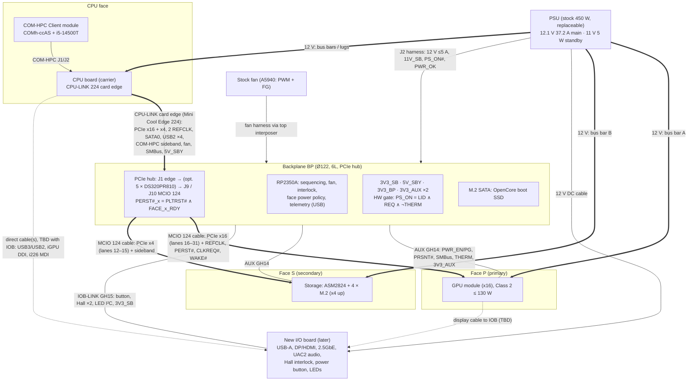

# MacPro6,2: System Architecture Specification, v0.2 (DRAFT)

| | |
|---|---|
| Document | `macpro62-architecture-spec-v0.2.md` |
| Status | **Draft v0.2, for review.** Supersedes v0.1. Nothing here is frozen. |
| Date | 2026-10-01 (America/Detroit) |
| Owner | Aidan Winkler |
| Builds on | v0.1 (`/workspace/macpro62-architecture-spec-v0.1.md`), `/workspace/macpro61-stock-hardware-reference.md` (**[REF-Sx]**), `/workspace/macpro62-lineup-options.md` (**[LO-x]**), Fusion board geometry `/workspace/macpro62-cad/` (**[CAD-v1]**, **[CAD-v2]**) |
| New sources | §12, cited as **[Nx]** (N1–N38 as in v0.1, N39–N68 new) |
| Companion files | KiCad backplane project `/workspace/kicad/macpro62-backplane/` (HUB floorplan **rev A-fp3** `backplane.kicad_pcb`, from Aidan's measurements M1/M2; fp2 kept in `variants/hub_fp2_d30_assumed/`; DIRECT variant `backplane_direct.kicad_pcb`) and `/workspace/kicad/macpro62-backplane.zip` |

## Changelog

**v0.2 (2026-10-01)**
1. **Card edges / SFF-TA-1002 removed from the face modules.** The base board must stay small (chassis bottom is filleted; stock base board is Ø122 mm with 2 × Ø4 holes at ±49 mm [CAD-v1]). Face modules now connect **by cable**: one **MCIO (SFF-TA-1016) 124-position "16i"** cable per face for PCIe + PCIe sideband, plus one small low-speed **AUX** cable to the backplane. v0.1 §4.3 (Compute Edge), §5.4–5.6 (FE-A/FE-B card-edge pinouts) and the Mini Cool Edge socket table are deleted. Apple's MEG-Array flex stays only as a fallback.
2. **Topology decided: HUB** (Aidan, 2026-10-01; replaces the DIRECT topology of the first v0.2 draft). PCIe goes **CPU board → card edge → backplane → MCIO 124 cable → face**. The BP becomes a **6-layer controlled-impedance board (JLC06161H-2116)** that also does power and management (MCU, sequencing, fan, interlock, LEDs, button, OpenCore SATA M.2) and has an optional Gen5 redriver build. DIRECT is kept as a variant (§3.11).
3. **CPU board ↔ backplane: one card edge for everything.** The CPU board tab is free to change (Aidan, 2026-10-01). Chosen: **Amphenol Mini Cool Edge 0.60 mm, 224 positions, vertical SMT (ME1022410103011)** with an **MP62 pinout** ("CPU-LINK", §3.2–3.8): x16 + x4 PCIe, 2 REFCLKs, SATA0, 4 × USB2, COM-HPC sideband, fan, SMBus, 5V_SBY. **12 V for the CPU board stays on the bus bars, not the edge.**
4. **Lane allocation simplified** (rev-A default): Face P x16 (COM-HPC lanes 16–31), Face S x4 (lanes 12–15), both through the BP. No x8/x8 steering, no backplane NVMe, no lane steering, no refclk buffers (a spare REFCLK pair is reserved on CPU-LINK).
5. **Rev-A defaults adopted** (changeable, marked **[Rev-A default]**): no USB4, no 10GbE, S5 only (no S3), USB audio (UAC2, CM6646) instead of HDA, OpenCore on a backplane M.2 SATA device, lanes x16 + x4.
6. **I/O board deferred.** The stock I/O board will not be reused; a new I/O board + plate is a later design. v0.1's I/O link (IOL, ~204 contacts) is replaced by a small backplane↔IOB low-speed link; the IOB's high-speed signals come straight from the CPU board (and display from Face P) by cable.
7. **PSU kept replaceable.** The backplane takes standby/control from a small harness connector (J2) instead of a hard-locked stock connector; face and CPU 12 V inputs accept either the stock bus bars or a cable connector (§5).
8. **Thermal target raised** to D700-class: **130 W sustained per module face** (Class 2), from 120 W provisional.
9. **Manufacturing rule added:** everything is fabbed and assembled by JLCPCB turnkey (Aidan does not solder): JLC parts library where possible, JLC standard stackups, no hand-fit parts in the baseline.
10. **Mechanical data from Fusion** added (base Ø122, PSU 103 × 159, CPU board 156 × 169 with the 8 Ø5 holes **centred** at x = 43.25 / 112.75, GPU board 104 × 166) (§6.1, §7.2).
12. **Hub revision (same day):** §0, §1, §2.4–2.6, §3 (rewritten: connector comparison, fit, lane lengths, SI budget, AC caps, CPU-LINK 224 pinout), §4.1/4.4/4.5/4.8/4.9, §5.1/5.4, §6, §7.4/7.5/7.7, §10, §11 and §12 (N52–N61) updated.
13. **Measurement revision fp3 (2026-10-01, ~13:30 ET):** Aidan measured on the real Mac Pro: **M1** GPU-board bottom edges ≈ **15 mm** above the base board; **M2** GPU-board planes ≈ **55 mm** from the disc centre. Consequences: straight MCIO plugs (15.90 mm) do not fit → **right-angle MCIO receptacles** (J9/J10) with the cable exiting radially under the face-board edge; CPU-LINK J1 moved to the **estimated stock riser-slot chord y ≈ −12.6 mm** (no connector fits a 55 mm chord); floorplan rebuilt (§3.4, §3.12, §4.9); BP lanes now 31–70 mm.
14. **CPU carrier revision fp1 (2026-10-01, ~16:30 ET):** new KiCad project `/workspace/kicad/macpro62-cpu-carrier/` (8L JLC, DRC 0). §6 rewritten: Aidan's corrected stock riser outline; **new Mini Cool Edge 224 tab** (79.89 wide at x = 78, key F x = 57.70, slots 78.36 / 98.57, shoulder and chamfers unchanged); **COM-HPC fit result: Size C (ccAS) does not fit inside the 156 mm outline** (C1: CPU −4.2 mm vs the pedestal, 2 mm overhang per side + lower-corner clash); Size A fits exactly, Size B likely; stack-height deficit ≈ 6–12 mm vs the stock pedestal; 4 core holes blocked by any module → core adapter plate. **Tab pinout cross-check found the BP J1 placeholder mirrored → BP fp3a: J1 rotated 180°, A row (host TX) on the PSU side** (§3.5, §3.8, §6.3). New R18–R22, A12–A14, OD-15–20 (OD-13 resolved), M-CC1–10, N69–N77. ccAS vendor corrected to Kontron.
15. **CPU carrier revision fp2 (2026-10-01, ~17:00 ET): measured core CPU face.** Two new scans (core CPU face; stock board with the Xeon) registered on the 4 heatsink bosses (outer 69.5 × 55 pattern, rms 0.45 / 0.29 mm) [N78][N79]. **Pedestal 40.6 × 41.1 at (78.41, 73.25)**, flush with a flat **124 × 142 black plate**; contact plane **7.5 ± 0.5 mm** above the stock board (Aidan); stock IHS 39.8 × 39.7 at (78.31, 73.38) (aligned within 0.2 mm); ILM screws ≈ 70.6 × 32.5 (informational; inner holes are free). The old outline scan was the board **back** → stock key 69.03 and lugs mirrored to the front view (30.5 / 42.2 / 115.7 / 128.2); the ‘guide posts’ are **core-flange guide pins** (x 28.5 / 126.4, pitch 97.93 ≈ BP Ø4 holes at ±49). Height: every module needs the carrier ≈ 4–8 mm farther from the core plus a Cu spacer (§6.4); a spacer cannot reduce the 6 mm excess. **Recommendation changed to Size A (BGA)**; no LGA1700 Size B module exists [N80]. M-CC1 done, M-CC2 mostly done, new M-CC11–13, R23, N78–N80; carrier floorplan fp2 (DRC 0).
16. **CPU retention: contact frame (2026-10-01, ~17:35 ET).** Aidan's requirement: retain the CPU with a contact frame (Thermal Grizzly / Thermalright style, like Apple's stock frame, which stands just over 7 mm) instead of the ILM latch. New **§6.8**: the ccAS has a standard LGA1700 socket + lever ILM on an LGA1700 ILM backplate, so an aftermarket frame should fit [Inference, M-CC14]; a frame does **not** lower the IHS (Intel Z-stack 6.529–7.532 [N81]) — it only removes the lever/load plate and flattens the IHS, so the module offset Δ of §6.4 stays (now 6.0–7.0 with one SO-DIMM). For the stretch socket board (P6) the IHS lands on the 7.5 ± 0.5 plane **directly**, with an MP62 contact frame carrying the 4 outer 69.5 × 55 holes. §6.4 table updated to the Intel Z-stack; OD-21, M-CC14, N81–N83; carrier fp2 adds the module ILM/contact-frame screw-tip marks. Inner-screw question (31 vs 32.8) dropped.
17. **Primary CPU board = own LGA1700 board (Aidan, 2026-10-01 ~17:30 ET; spec rev ~18:00 ET).** The COM-HPC module path is skipped; the former stretch goal P6 (§6.8 c) becomes the **first CPU board (CB)**. The COM-HPC carrier (§6.1–6.7, `/workspace/kicad/macpro62-cpu-carrier/`) is kept as the **archived fallback (CC-F)**, not deleted. New **§6.0** and the feasibility study `/workspace/macpro62-lga1700-board-plan.md`: **Z790** PCH (B760 pin-compatible, W680 only for ECC), lanes CPU x16 → Face P / CPU x4 → Face S / PCH x4 → M.2 boot / PCH x1 → i226-V / PCH x4 reserved for AQC107; firmware **coreboot + Dasharo (msi/ms7d25 template) + public RPL-S FSP + CSME 16.1 (MFIT, HAP) + EDK2 payload, OpenCore from the BP SATA SSD (embedded = stretch)**; **RP2350 GPIO EC** (no SuperIO/eSPI); VRM **RT3628AE 6 + 1 phases, SiC654 + Eaton FP4 5.0 mm, front side** under the plate; **2 × DDR5 SO-DIMM on the back in the stock DIMM strips**; **JLC 10L 1.6 mm POFV**; socket **Foxconn PE17007-11NK0-1H (LCSC C38520273)**; **iGPU UHD 770 enabled** with DDI-B native DP + DDI-C into the IOB USB-C DP-alt mux (Windows/Linux and bring-up only; macOS has no Xe iGPU driver). New KiCad floorplan `/workspace/kicad/macpro62-lga1700/` (10L, LGA1700 and PCH lands from Intel's public ballouts, DRC 0). Cost ≈ $1.5k–2.6k (2 boards) / $2.6k–4.4k (5) [Estimate]. **Go/no-go: GO for de-risk phase P6-0, conditional GO for the rev-A order at gate G-A** (§10). OD-15/16/17/21 superseded (fallback only); new OD-22–OD-30, A15–A17, R24–R29, M-CC15, N84–N116.
18. **CB memory = 4 × DDR5 UDIMM vertical, stock-like (2026-10-01, ~18:30 ET; Aidan question + correction ~18:10 ET).** The stock Mac Pro 6,1 DIMMs stand vertically (Apple's socket assembly only tilts to release them), so standard vertical 288-pin sockets work. CB floorplan **fl2**: 4 × **UMAX 90414 short-latch** DDR5 UDIMM SMT sockets (body 141.7 × 6.3, seat ≤ 2.0; LCSC stocks the long-latch C2922443, $4.44, which does not fit the outer slots) at the **stock card centrelines x 6.5 / 15.8 / 140.55 / 149.85**, 2DPC daisy chain (J6/J7 CH-A near/far, J9/J10 CH-B). Intel: DDR5 2DPC **4000 (2 × 1R) / 3600 (2 × 2R) / 4400 (1 DIMM per channel)** vs 5600 at 1DPC; DDR4 3200 either way; up to **192 GB**. Firmware matches the ms7d25 reference 1:1 (`BOARD_TYPE_DESKTOP_2DPC`, SPD 0x50–0x53). Height: DIMM top **≤ 33.25 mm** off the back vs stock DDR3 30.0 + seat → **≈ +1–2 mm**, gated on **M-CC15 (≥ 34.5 mm)**; fallbacks VLP 18.75 mm UDIMMs or the fl1 2 × SO-DIMM variant (kept in `docs/fl1_sodimm_variant/`). VRM power stages moved to x 11.15 (via corridor between the back pad rows), bulk 12 V caps moved out of the strips. DRC 0. Plan §4 rewritten; A16, OD-23/24, M-CC15 updated; new R30, N117–N124.
18. **Scan measurements (2026-10-01, ~18:30 ET), new §3.13.** Base board traced: Ø122.07, holes ∓49.13 (pitch 98.25), hole axis 0.6 off the disc centre; **M2b resolved: stock CPU slot at −12.5 ± 0.3, J1 at (0, −12.6) stays**; six small holes S1–S6 → **change request CR-BP-1** (Ø6 keep-outs, move U4: S2 inside its courtyard) — backplane KiCad not edited; stock GPU connector axes ±46.6° → face-angle hypothesis 42°/138° (M2c). Core standoff screws at G1/G2 protrude 18.4 ± 1.5 mm (BP seats on the tips; M1b partial, M8 mostly answered; face spec C-16 vs M1 → M1c). Mirrored GPU lugs → dual lug sites on every face module (MP62-FACE v0.1 update 1). PSU board, I/O plate, I/O-plate carrier frame and the PSU-side I/O-board carrier frame traced (§3.13, §8.2); new M2c, M1c, M5b, M-IOF1, M-IOF2.
19. **Storage face module SM-1 (2026-10-01, ~20:20 ET; Aidan: "go for the SSD board").** Face S = CPU PEG60 Gen4 x4, which cannot bifurcate, so the module uses an **ASMedia ASM2824** Gen3 switch (x8 upstream wired to J_PCIE lanes 0–7, 4 × x4 down; JLC C9900092023, price TBD) on the die pad with a 3 mm gap pad. **4 × M.2 2280 on the outer side**: 3 columns + 1 across the top, LOTES APCI0107-P001A H4.2. This needs a **bracketless** module (screws + washers; face spec C-19) and J_AUX moved to (16.5, 20.5). Power: lugs → LM74700 reverse block → TPS259824 eFuse 5 A → TPS56C215 12 A → 3V3_SSD; ≈ 35.6 W worst sustained / 41.5 W 10 ms peak, declared 40 W Class 1. Bandwidth Gen3 x4 ≈ 3.5 GB/s shared (≈ 7 GB/s if the host later gives x8, OQ-7). **RAID:** no driverless, macOS-bootable hardware RAID part is orderable (Marvell 88NR2241 is NDA-only; macOS unverified). Boot from one SSD (each is individually bootable behind the switch); use AppleRAID/SoftRAID for data; a future SM-1R variant is possible. Cost for 5 PCBs / 2 assembled ≈ $330–600 [Estimate]. Plan `/workspace/macpro62-storage-board-plan.md`; KiCad `/workspace/kicad/macpro62-storage-face/` (floorplan DRC 0/0, schematic ERC 0/0, not routed); face spec update 3 (§11.3, C-19–C-21, MF-13/14). No host change: BP J10 stays x4 in rev A.
20. **SM-1 bracketless approved (Aidan, 2026-10-01, ~20:27 ET).** D1: no X-bracket on Face S; 4 × M.2 2280 fitted; the module is secured to the core with low-head screws (wafer / ultra-thin head, **head + washer ≤ 1.6 mm**, so the SSD0/SSD2 edges clear the heads with any 2280 SSD; D4 resolved). Face spec C-19 updated (update 3a). The screw part number follows once MF-13 gives the thread and length. No host change.
21. **CB single 12 V entry + side check from stock photos (Aidan, 2026-10-01 ~21:03 ET; rev ~21:15 ET; plan fl2.1).** Aidan: the stock CPU board takes 12 V **only on the left side** (CPU-side view), at the two copper lugs top-left next to the VRM. Lug positions measured on his photo (homography on the 4 core holes, outline check ≈ 1 mm): **LUG1 centre x 27.95 (legs 24.05–31.85), LUG2 centre x 40.75 (legs 36.85–44.65), feet y ≈ 157, footprint y 159.8, ±0.8 mm**; 2 × 2 soldered pins per lug (back photo); no lugs at the right notch. KiCad: LUG3/LUG4 and eFuse U12 removed, U11 TPS259851 feeds the whole CB (ILIM ≈ 25 A), 12 V plane L5+L6 ≥ 20 mm from U11 down the left to the VRM, ≥ 8 mm across the top band (≈ 12 A sustained / 20 A peak, [Estimate]); DRC 0 / 0. The **two-pair assumption (85.6 vs the PSU's 74.7, 5 mm jog) is void**: one CB pair (12.8) matches one PSU terminal pair (12.75 / 12.55) directly (§3 PSU board). **Sides confirmed:** the back photo shows the 4 DIMM slots and the socket backplate on the back; fl2 already had the DIMMs on B and socket/VRM on F (no fix). Stock core side: VRM along the top (7 inductors y ≈ 119–131), polymer input caps at y ≈ 157–168, frame on the 4 outer holes. Our left-column VRM is intentional (LGA1700 land groups); holes agree. **Open:** M-CC16 (scan shows 4 tabs vs 2 in the photo; photo matches the scan's left lugs unmirrored although §6.1 calls the scan a back view; which PSU pair feeds the CB), M-CC7 polarity, M-CC11 plate relief over the stock cap row. Photos: [N125].
22. **CB right notch = GPU bus-bar pass-through (Aidan, 2026-10-01 ~21:19 ET; rev ~21:21 ET).** The CPU board's right-hand notch (x 108–132, y 163.5–169.5) has no lugs; it only lets the GPU power bus bars/lugs pass. The outline scan's right-hand tab pair is therefore part of the GPU power path → **that part of M-CC16 is closed**. KiCad: rule area `GPU_BUSBAR_PASSTHROUGH` (notch + 3 mm, x 105–135, y 160.5–169.5, all copper layers, both sides; no footprints, pads, tracks, vias or pour); DRC 0 / 0. Required clearance [Proposal]: ≥ 3 mm from the notch walls to any CB copper or part (mechanical/tolerance margin; 12 V itself needs ≈ 0.1–0.6 mm), bar cross-section and offset to confirm under M5. **Still open:** which PSU terminal pair feeds the CB and what the other pair feeds (M-CC16), lug polarity (M-CC7), scan view (M-CC16).
23. **IOB rev A0 + I/O plate v2 (2026-10-01, ~22:20 ET; plan `/workspace/macpro62-io-board-plan.md`).**
    - **Ports:** stock layout kept. 6 × USB-C with DP alt mode (3 per old Thunderbolt rectangle), 4 × USB-A 10 G, HDMI (Face P link 2 via TDP158), 1 × 2.5GbE (i226-V moves from the CB to the IOB). ETH2 is a DNP site for the rev-B AQC107. The stock audio jack flex runs on a CM108B; the stock speaker on a PAM8302A. The coin cell sits in the stock spot.
    - **Display:** C1/C2 = Face P links 0/1 (4-lane); C3/C4 = links 3/4 (2-lane). C5/C6 = iGPU DDI-B/DDI-C, each on its own USB-C. This supersedes the CB 2:1 DP mux idea in §8: no HD3SS215 needed.
    - **Board:** 6-layer JLC06161H-2116, 113 footprints, DRC 0 / ERC 0. Not routed yet.
    - **CR-CB-IO1:** new CB J3 (MCIO 124) pinout: 10 × USB3, i226 PCIe x1 plus REFCLK/sideband, 2 × DDI, 1 × USB2, VBAT_RTC from the IOB. CB BT1 becomes DNP; USB2 on J3 goes from 4 to 1. **Z790 is required** for 10 × 10 G.
    - **CR-BP-IOB:** IOB-LINK GH15 pinout fixed (IOB plan §5.5). PSU signals pass through IOB J5 (Micro-Fit 2×4) to BP J2.
    - **Power budget:** IOB worst case ≈ 116–126 W at 12 V. The USB-C 5 V pool is capped at 45–60 W by BP firmware (D-IO1).
    - **Ports are angled about 7° per column**, fanning outward to follow the case cylinder. They are handled by straight connectors and a curved printed plate with flat port lands; the metal frame is unchanged (D-IO6).
    - **Power button:** it is on the I/O-wall flex 821-2222 (14P 0.5 mm ZIF, shared with the port illumination; pins provisional). The IOB adds J31 (C7502869) at the stock spot plus an on-board SW1.
    - **Stock connectors identified:** the stock 6-pin is the PSU data cable. CONN_C is the fan/AirPort interposer ribbon and is not reproduced in rev A (D-IO9; fan via BP J5).
    - **Port lights:** motion-triggered through the LIS2DH12 INT1 → BP MCU.
    - **Open decisions:** D-IO1–D-IO11. Pinouts of the PSU headers, audio flex and I/O-wall flex are UNCONFIRMED; see the IOB plan §9 for probing.
24. **IOB D-IO2 resolved: 2 × 2.5GbE on rev A0 (Aidan, 2026-10-02 ~08:05 ET; rev ~08:30 ET; IOB plan §5.1.1).**
    - **Ports:** a second i226-V (U52, plus NVM U53, Y6, L45) drives ETH2. Both RJ45s are HanRun HR913790A vertical 2.5G/5G magjacks (16.2 × 17.0, 16.9 tall). The H-side frame slot is 15.6 × 13.0, so the ETH2 jack sits **set back behind the frame** and only the plug passes; ETH1 shares the same plane. The plate's ETH2 opening is open (`io_plate_v2_A0.step`). AQC107 10 G becomes a later variant (PCIe x4 RP5–8 on a new IOB-HS2 cable).
    - **PCH lanes (Z790 Flex-I/O, Intel 743835):** i226 #1 = RP3 / HSIO 12 (CLKOUT_SRC12). **i226 #2 = RP4 / HSIO 13** (PCIe 3.0, CLKOUT_SRC11 [Proposal]). RP1–4 run as 4 × x1. No conflict with the 10 × USB3 ports (HSIO 0–9 are USB-only) or with the M.2 / AQC107 groups.
    - **Cable conflict resolved (CR-CB-IO1 rev):** CB J3 / IOB-HS1 had no free pairs. **DDI-C drops to 2 lanes**: k14 becomes i226 #2 PCIe, REFCLK2 goes on B26/B27, CLKREQ2# on A29, and PERST#/WAKE# are shared. C6 (iGPU, non-macOS) is limited to 2-lane HBR2. HS1 now has no spare sideband contacts. Pinout `docs/mp62-iob-hs1_mcio124_pinout_v0.2.csv`.
    - **Cost:** about +$9–14 per board (≈ $115 parts). IOB power +≈ 1 W.
    - **Checks:** DRC 0 / ERC 0, 117 footprints.
    - **Open items:** HR913790A is not stocked at LCSC (global sourcing or consign). M-IOF2 must confirm the jack set-back (D0 ≥ 16.9 + frame-back depth + 0.3).
25. **IOB plate v2 reworked for the stock I/O-wall flex 821-2222; D0 re-estimated (Aidan photos, 2026-10-02 ~08:34–08:43 ET; rev ~09:10 ET; IOB plan §4.5, §4.7).**
    - **Plate:** constant 1.2 wall (inner face concentric). Flat lands stay, with their bosses ramped 60–72° inboard. 0.2 glue pocket for the traced 821-2222 outline; foam allowance 1.0 (TO MEASURE). Light windows over the six flex light-guide pads. Locating pins at frame HOLE_C1 / PIN_C3. Rim notch for the flex neck. No collars or light-pipe bosses; one mirrored clip dropped. Flex trace `flex_821-2222_trace.dxf`.
    - **D-IO10 revised:** port lighting comes from the flex on J31. D21–D26 are DNP, because the metal frame centre bar blocks 5 of the 6 board-side pipe positions. J31 stays the primary path for button and lights; SW1/D20 are the no-flex fallback.
    - **D-IO12 (new):** the ports clear the flex cut-outs in plan view; the USB-C shells are marginal (−0.11…+0.32; shift ≈ 0.25 inboard if confirmed). The land bosses stand 1.2–2.0 proud and overlap the flex rims, so the stock flex can only be fit-tested gently. The fix is an A1 replacement flex (same outline, cut-outs = bosses + 0.3), ≈ $40–90 for 5.
    - **D-IO13 (new):** no insulating shroud. Use the stock 1 mm foam, or a 0.25 Formex/foam die-cut from `io_flex_foam_insulator_A0.dxf`.
    - **M-IOF2 [Estimate]:** stock board ≈ 2.0 thick; stock port stack ≈ 20–23 above the board, so D0 ≈ 22–25. The ETH jacks then sit ≈ 1.8–4.8 behind the frame back plane (gate passes) and ≈ 3.2–6.2 below the land. **New top risk:** the required vertical-connector heights (USB-C ≈ 20.5–23.5) exceed typical parts. Caliper D0 before any connector choice.
26. **IOB plate v2 for the reused stock flex 821-2222-A, measured D0 (Aidan flatbed scan + caliper, 2026-10-02; rev ~10:15 ET; IOB plan §4.1, §4.7.1–4.7.4).**
    - **Flex trace from the scan:** ruler-calibrated at 7.894 / 7.874 px/mm (0.24 % apart, no perspective), then idealised (straight edges, arcs, symmetric groups). The black tab is ignored. Against the photo trace: TB cut-outs 9.83 × 6.10 (up to +0.75 wider, +0.1…0.4 in Y); HDMI (+1.22, −0.34) and 5.83 tall; audio holes Ø8.05; button ring Ø15.57 at +1.54 X; 19 LEDs on the plate side. Full table: `flex_821-2222_scan_vs_photo_deltas.md`.
    - **Plate:** no lands, bosses or ramps. The inner face is smooth so the stock flex lies flat in a 0.2 glue pocket. Bosses cannot fit inside the cut-outs (≤ 0.45 per side). There are LED and button-carrier pockets (0.7 deep, wall 0.35), Ø2.4 locating pins, Ø1.4 ear pins and USB-C outer spot-faces. **Port grid = flex cut-out centres**: USB-C columns X 43.09 / 63.69 (+0.49 / −0.21), so the shells clear the cut-outs by +0.44 per side.
    - **D0 measured:** 18.0 at the crown and 16.5 at the edges (assumed |u| = 15.5, TO CONFIRM). That gives R_outer 82.03, board top 19.2 below the crown, and replaces the 22–25 estimate. **Required board-to-mouth heights:** USB-C 17.90 / 17.82, USB-A 17.49 / 17.38, HDMI 17.24; RJ45 face ≤ 13.6.
    - **Parts:** USB-C FG-ST-C-24P-VT-SMT-15.0 (C51911913, 15.0), USB-A KH-3.0AF180WJ-15JB (C2979045, 15.0), HDMI JLC C9900153431 (H 15). **D-IO14 (new): port risers** of +2.2…+2.9 on a high-speed board-to-board stack. **D-IO15 (new): RJ45 = non-magnetic vertical ≤ 13.0 + Jansum V24P05S magnetics**, because HR913790A (16.9) no longer fits.
    - **KiCad:** ports moved; SW1, D20 and D21–D26 DNP (the flex provides the button and lights). DRC 0. **Open:** M-IOD0, M-IOS1/S2, M-IOW4, M-IOH2, M-IOC2 plug test.
11. **New: MCIO connector data** from TE/JPC/Molex drawings, OCP M-XIO sideband conventions, a per-face sideband table, a module-face power budget, a cable/connector count, a measurement list, and an updated open-decision list.

**v0.1 (2026-09-30):** first draft (card-edge architecture).

## How to read this document

Every statement is tagged with one of these:

| Tag | Meaning |
|---|---|
| **[Sourced]** + citation | A fact from a cited source. The citation is next to it. |
| **[Proposal]** | A design decision this spec proposes. Change it freely. |
| **[Estimate]** | A number derived from sources or arithmetic, with the method stated. Not measured. |
| **[Inference]** | Engineering reasoning that no source states directly. Verify it before relying on it. |
| **[Unverified]** | A source exists but is weak (aggregator, forum, search snippet) or conflicts with another. |
| **TBD** | Unknown. It needs measurement (mostly on the donor 6,1 with D700s), a quote, or a test. |

"Shall" and "must" are requirements in the proposed open standard. "Should" is a recommendation. "May" is optional.

**Rev-A default** = a decision adopted for rev A that can change later without breaking the architecture.

---

## 0. Executive summary (all items are [Proposal] unless tagged)

1. **Boards.** A new round **Backplane (BP)** replaces the Apple logic board (Ø122 mm disc, 2 × Ø4 holes at ±49 mm, from Aidan's Fusion model [CAD-v1]). On the thermal core: the **CPU board (CB)** = **our own LGA1700 socket board** on the stock riser outline (Z790 PCH, i5-14500T, **4 × DDR5 UDIMM vertical on the back like stock (2DPC)**, MP62 contact frame, CPU-LINK 224 tab; §6.0, decided 2026-10-01; the COM-HPC carrier is the archived fallback CC-F, §6.1–6.7), **Face P** (primary module face, reference: single GPU) and **Face S** (secondary module face, reference: 4 × M.2 storage behind an ASM2824). Later: a new **I/O board (IOB)** and plate. PSU: stock 450 W for now, replaceable.
2. **Topology: HUB (decided).** The CPU board plugs into the BP with **one vertical card edge (CPU-LINK, Mini Cool Edge 224)** carrying x16 + x4 PCIe plus all sideband. The BP routes the lanes (31–70 mm) to **two right-angle MCIO 124 receptacles** whose cables exit radially under the Face P (x16) and Face S (x4) board edges. It generates PERST# per face and is also the power-and-management board (RP2350A MCU, standby rails, PSU enable gate, fan, lid interlock, LEDs, power button, OpenCore SATA M.2). Each face gets one MCIO cable and one small **AUX cable** from the BP.
3. **Why it fits (§3.2–3.4):** a single 224-position 0.60 mm card edge is 85.56 mm long and fits the **estimated stock CPU riser-slot chord (d ≈ 12.6 mm, 113 mm long inside R58)** with 27 mm to spare, and any chord up to d ≈ 35.9 mm; CEM x16 + x4 (≈ 134 mm) cannot. **No card edge fits at the measured face distance of 55 mm** (36.8 mm chord), so the CPU board must keep the stock inner-chord position (§3.12). Everything fits on the Ø122 disc (DRC 0 violations): 2 × MCIO, MCU, M.2 2242, power, PSU input, fan, AUX, IOB link, LEDs, buttons and 5 optional redriver sites. No disc cutout is needed. **SI (§3.6):** Gen4 needs no redriver. Gen5 is marginal and has an optional build with 5 × TI DS320PR810 on the BP.
4. **CPU board ↔ BP:** **Amphenol Mini Cool Edge 224 vertical SMT, ME1022410103011** ($6.14 @ 20, 1,620 in stock [N53]), 1.57 mm card 79.89 mm wide. MP62 pinout: 80 lane pins, 2 REFCLK, SATA0, 4 × USB2, 26 sideband, 6 × 5V_SBY, 2 × 3V3_SB, 80 GND, 14 reserved (§3.8).
5. **Power.** 12.1 V main goes **PSU → CPU board and both faces directly** (stock bus bars, or cable lugs/connectors with a future PSU), **not through CPU-LINK**. The BP takes only a small harness (12 V for fan/local rails ≤ 5 A, 11 V standby, PS_ON#, PWR_OK). The BP makes 3V3_SB, 5V_SBY (module suspend well), 3V3_BP and per-face 3V3_AUX. Sustained S0 budget ≈ 335 W of 450 W (§5.4).
6. **Faces (open MP62-FACE spec v0.2).** Per face: MCIO 124 receptacle + JST GH 14-pin AUX + 12 V lug input. Class 2 = **≤ 130 W sustained** (D700-class). No module fans. The spec is published for the community (Framework-16-style).
7. **Firmware.** CB: **coreboot/Dasharo + EDK2** (CC-F fallback: module AMI UEFI) → default boot entry "MP62 OpenCore" on the **BP M.2 SATA SSD** (`LauncherOption = Full`), SMBIOS MacPro7,1 [LO-22][LO-18]. True OpenCore-in-UEFI stays a research track.
8. **Fab.** All boards JLCPCB turnkey. BP: **JLC06161H-2116, 6 layers, 1.6 mm, controlled impedance** (§4.9).

---

## 1. System overview

### 1.1 Board inventory

| ID | Board | Location | Key contents | Fab/assembly | Status |
|---|---|---|---|---|---|
| **BP** | Backplane (PCIe hub) | Round board under the core (stock logic-board position) | CPU-LINK Mini Cool Edge 224; PCIe x16 + x4 routing to 2 × MCIO 124 (Face P / Face S); PERST# generation; optional 5 × DS320PR810 (Gen5 build); RP2350A MCU; standby + aux power; PSU-enable safety gate; fan; interlock/button/LED interface; temperature sensors; M.2 SATA OpenCore SSD; AUX connectors to both faces; IOB low-speed link | JLC 6-layer 1.6 mm JLC06161H-2116, turnkey | [Proposal] |
| **CB** | **CPU board: own LGA1700 board (primary, §6.0)** | CPU face | LGA1700 socket (Foxconn PE17007) + MP62 contact frame; Z790 PCH; 6 + 1 phase VRM (RT3628AE); 4 × DDR5 UDIMM vertical (back, stock strips); RP2350 EC; 32 MB SPI (coreboot/Dasharo); PCIe x16 + x4 to the **CPU-LINK 224 fingers**; M.2 2280 boot; i226-V; J3 IOB-HS (USB3/USB2/MDI/2 × DDI) | **JLC 10-layer 1.6 mm POFV**, turnkey + consigned PCH | [Proposal] |
| CC-F | *Archived fallback:* CPU board (COM-HPC Client carrier) | CPU face | Samtec COM-HPC connector pair (ASP-214802-01, $42.65 [LO-45b]); 12 V input (bus-bar lugs + optional cable connector); PCIe x16 + x4 to the **CPU-LINK 224 card-edge fingers (1.57 mm)**; host-TX AC caps if the module lacks them; optional M.2 2280 (lanes 8–11, TBD fit) | JLC 8-layer class (TBD), turnkey | [Proposal] |
| **FM-P** | Face module, primary | Face P (stock GPU face, which one TBD) | Reference: single GPU module (MXM carrier interim; Navi 23 salvage research) | JLC turnkey (+ BGA rework shop for salvage only) | [Proposal] |
| **FM-S** | Face module, secondary | Face S | Reference: ASM2824 (x4 up) + 4 × M.2 2280 | JLC turnkey | [Proposal] |
| **IOB** | New I/O board + plate | Rear, behind the I/O wall | Deferred (§8). Rev-A port defaults below. | JLC turnkey | Later |
| **TOP** | Interposer (stock or new) | Top, under the fan | Fan connector; possibly Wi-Fi near the antennas | TBD | TBD |
| **PSU** | Stock 450 W (replaceable) | Stock | 12.1 V / 37.2 A main; 11 V / 5 W standby [REF-S2][REF-S1 p.22]; board ~103 × 159 mm [CAD-v1] | Kept for now | [Sourced] |
| **FAN** | Stock fan (Nidec, Allegro A5940) | Top | PWM 0.1–100 kHz; 100 kΩ pull-up → **max speed if PWM floats** [N28] | Kept | [Sourced] |

### 1.2 Block diagram



### 1.3 Design principles [Proposal]

1. **PCIe crosses the backplane, nothing else high-speed does.** The BP is the PCIe hub (passive routing, optional linear redrivers; no switch). Display and USB3 travel point-to-point by cable between the boards that source and sink them.
2. **Every board makes its own rails from 12 V.** Only 12.1 V main (bus bars / lugs), 11 V standby (PSU → BP), 5V_SBY (BP → module), 3V3_SB and 3V3_AUX (BP → IOB / faces) cross boards.
3. **Safety lives in hardware.** `PSU_EN = INTERLOCK_CLOSED AND MCU_PS_REQ AND NOT THERM_LATCH` in discrete logic; THERMTRIP# latches the PSU off; the fan fails safe to max speed [N28].
4. **PCIe is validated at Gen4** (no redriver needed, §3.6). Gen5 on Face P needs the optional BP-G5 redriver build. Every face module shall work at Gen3.
5. **No hot-plug.** The housing interlock kills 12 V when the shell is off [REF-S1 pp.20, 22, 164].
6. **GPU-agnostic, open face standard** (MetalGPUDrivers-compatible): nothing assumes AMD, Navi or MXM.
7. **Turnkey-manufacturable.** JLC parts library first, JLC standard stackups, SMT wherever practical; THT only for high-retention connectors (JLC THT assembly).
8. **Don't lock the PSU.** The PSU only has to provide 12 V main at lugs/connectors plus a 4-wire standby/control harness.

---

## 2. PCIe lane budget

### 2.1 Consumers (rev A) [Proposal]

| Consumer | Rev A | Later | Notes |
|---|---|---|---|
| Face P (primary) | **x16**, Gen4 by policy (Gen5 best effort) | x16 Gen5 | First GPU targets (MXM RX 6600, Navi 23) are **PCIe 4.0 x8** [LO-40]; they train x8 in the x16 port. |
| Face S (secondary) | **x4** Gen4 | x8 (if a host provides it) | Storage reference module: ASM2824 upstream is x8 Gen3 max [N7]; at x4 Gen4 host → link trains x4 Gen3 (≈3.9 GB/s **[Estimate]**). |
| OpenCore boot device | **SATA0** (0 lanes) | – | BP M.2 SATA (§9.2). |
| Main OS NVMe | On the Face S storage module, and/or an optional M.2 2280 on the CPU board from lanes 8–11 (**fit TBD**) | – | v0.1's BP NVMe is dropped (the BP M.2 is SATA-only for OpenCore). |
| USB4 | **None** [Rev-A default] | ASM4242 / JHL8540 on IOB rev B | |
| 10GbE | **None** [Rev-A default] | AQC113 on IOB rev B | |
| Wi-Fi/BT | IOB or TOP (later) | – | PCIe x1 Gen3 from lanes 0–5 + USB2. |
| 2.5GbE | Module i226 MDI → IOB (direct cable) | – | 0 lanes. |

### 2.2 COM-HPC lane numbering (applies to all modules) [Sourced]

COM-HPC Client groups PCIe lanes as follows [N6]:
- **Group 0 Low:** lanes 0–7, plus one extra lane for a BMC
- **Group 0 High:** lanes 8–15
- **Group 1:** lanes 16–31, the PEG group
- **Group 2:** lanes 32–47

The module provides reference clocks per group (PCIe_REFCLK0_LO/HI, REFCLK1, REFCLK2) [N6]. In v0.2 the CPU board routes them over CPU-LINK to the BP, which passes them into the MCIO cables (one per face). The CPU board buffers only if a module has too few refclk outputs.

### 2.3 Per-module lane inventory

| Module | CPU lanes (as exposed) | PCH / other lanes (as exposed) | Bifurcation | USB4 on module | Display | Audio bus | Source |
|---|---|---|---|---|---|---|---|
| **Kontron (ex-JUMPtec) COMh-ccAS** + i5-14500T | 16× Gen5 (COM-HPC lanes 16–31, Group 1) | 8× Gen4 + 6× Gen3 in total. The block diagram shows Gen4 on lanes 8–11 and 12–15, and Gen3 on lanes 0–5 (+6, +7 as connector options). **Which x4 is CPU vs PCH is not stated.** [Inference]: 12–15 is probably the CPU's x4 Gen4 and 8–11 the PCH. | i5-14500T CPU: "1×16+4, 2×8+4" [LO-33]. **Module BIOS 2×8 support unverified** [LO §3]. | No | 3 × DDI + eDP | Datasheet lists SoundWire/DMIC; **HDA not listed** | [N1] |
| **Portwell PCOM-B887** (Arrow Lake-S) | Gen5 x16 (lanes 16–31); Gen5 x4 (lanes 12–15, "only x4"); Gen4 x4 (lanes 8–11, "only x4") | Gen4: lanes 32–35 (default 1×4), 36–39 (default 1×4), 40–41 (x2), 0–3 and 4–7 (default 4×x1 each) | PEG 2×8 **[Unverified]** (Arrow Lake CPU capability plus module BIOS TBD) | **1 × USB4** (CPU TCP) | 3 × DDI (HBR3) + eDP | HDA/I2S/SoundWire | [N3] |
| **congatec conga-HPC/cRX1** (Strix Halo) | Strix Halo SoC: **16 usable PCIe 4.0 lanes in total** [N4] | Block diagram: lanes 0–3, 4, 5, 6 (opt), 7 (opt), 8–11, 12–15 native. Lanes 16–19 and 20–23 are shown behind an **optional on-module PCIe switch** ("up to 24× Gen4, assembly option"). | **No x8/x16 group is shown.** Whether 8–15 can train as one x8 is **TBD** (module manual). | SoC has 2 × USB4 natively [N4], but **the module datasheet lists none** | 3 × DDI + eDP (4 independent displays) | **HDA** | [N2][N4] |
| **Own LGA1700 board CB (primary since 2026-10-01)** (Raptor Lake + Z790 PCH) | CPU: 16× Gen5 (1×16 or 2×8) + 4× Gen4 | Z790: up to 20× Gen4 + 8× Gen3; DMI 4.0 x8. (B760: 10 + 4; DMI x4.) | CPU per ARK/brief | Needs discrete controller (not in rev A) | iGPU UHD 770: DDI-B DP + DDI-C USB-C DP-alt → IOB (§6.0) | USB audio on the IOB (HDA codec DNP) | [N5][N84][N85] |

Module caveats:
- **B887:** the datasheet dated January 2025 shows ordering status "In Development" [N3]. Confirm availability.
- **cRX1:** the datasheet is "Preliminary Rev 0.3, 2026-07-08" [N2].
- **Own LGA1700 board:** now the **primary** CPU board (§6.0). PCH parts are only available loose from brokers and PDGs are CNDA-only [LO-24]; the feasibility study (`macpro62-lga1700-board-plan.md`) works around both (public datasheets + ballouts, coreboot ms7d25, reference MSI board) and gates the order (§10).

### 2.4 Allocation per module [Proposal]

#### 2.4.1 COMh-ccAS + i5-14500T (rev A) [Rev-A default]

> **Superseded for rev A (2026-10-01):** the CPU board is now our own LGA1700 board (§6.0). The lane use is the same: **Face P = CPU PEG x16 (CPU-LINK 16–31), Face S = CPU Gen4 x4 (12–15)**; PCH lanes feed the CB M.2 (x4), i226-V (x1) and a reserved AQC107 x4. The ccAS table below is kept for the CC-F fallback.

| COM-HPC lanes | Gen | → Consumer | Width | Notes |
|---|---|---|---|---|
| 16–31 | Gen5 (Gen4 by policy) | **Face P** via CPU-LINK → BP → MCIO J9 | x16 | One link, one PERST# (made on the BP), one REFCLK (PCIe_REFCLK1). No steering. |
| 12–15 | Gen4 | **Face S** via CPU-LINK → BP → MCIO J10 | x4 | REFCLK0_HI. J10 on the BP is wired x4 (cable/receptacle are x16-capable). |
| 8–11 | Gen4 | Optional M.2 2280 on the CPU board (if it fits) or spare for IOB rev B (USB4) | x4 | TBD. |
| 0–5 | Gen3 | Spare: Wi-Fi (x1) on IOB/TOP later; rest spare | – | Rev A: unrouted or to test points. |
| SATA0 | 6 Gb/s | **BP M.2 SATA** (OpenCore) via CPU-LINK | – | The module has 2 × SATA [N1]. |
| i226 #0 MDI | – | IOB 2.5GbE RJ45 (direct cable, later) | – | |
| USB2 (3 ports) | – | BP MCU telemetry; Face P USB2; Face S USB2 | – | Face USB2 primarily inside MCIO if the pinout allows, else via CPU-LINK → BP → AUX (§7.5). |

**Can:** GPU x16 + storage x4 + (optional) CPU-board NVMe x4, no switch, no 2×8 BIOS dependency.
**Can't (rev A):** storage x8, USB4, 10GbE. The 2×8 question (LO §3) no longer gates anything.

> The tables below are kept from v0.1 for reference. Read "BP NVMe" as "CPU-board M.2 (if fitted) or spare", and ignore "steer": v0.2 has no lane steering. Face P is x16 and Face S takes the next free x4 on every module.

#### 2.4.2 Portwell PCOM-B887

| COM-HPC lanes | Gen | → Consumer | Width |
|---|---|---|---|
| 16–31 | Gen5 | Face P (x16), or steer x8/x8 (if BIOS allows) | x16 |
| 32–35 | Gen4 (PCH) | Face S (default when Face P is x16) | x4 |
| 12–15 | Gen5 (CPU, "only x4") | BP NVMe (links Gen4 by policy; Gen5 possible only on a short, low-loss path, TBD) | x4 |
| 8–11 | Gen4 ("only x4") | IOB USB4 host (ASM4242) | x4 |
| 0 | Gen4 x1 | IOB AQC113 (Gen4 x1 = full 10GbE) | x1 |
| 1 | Gen4 x1 | IOB Wi-Fi | x1 |
| 36–39, 40–41, 2–7 | Gen4 | Spare: second NVMe x4, etc. | – |
| On-module USB4 #1 | – | **Not routed in rev A** [Proposal]. USB4 PHY signals over two more connectors would need retimers. Revisit in rev B. | – |

**Can:** everything, with x16 on Face P **and** x4 on Face S, without a switch. **Can't:** nothing material. The limit is Face S x4 unless you use x8/x8.

#### 2.4.3 congatec conga-HPC/cRX1

| COM-HPC lanes | → Consumer | Width | Notes |
|---|---|---|---|
| 16–19 | Face P lanes 0–3 | x4 | **Only if the on-module switch option is fitted** [N2]. Otherwise Face P has no PCIe on this module. |
| 20–23 | Face P lanes 4–7 (unused: the link trains x4) | – | [Inference]: these are separate x4 ports behind the module switch, so Face P cannot train x8 here. |
| 12–15 | BP NVMe **or** (steer) Face S | x4 | |
| 8–11 | IOB USB4 host | x4 | |
| 4 | AQC113 (Gen4 x1) | x1 | |
| 5 | Wi-Fi | x1 | |
| 0–3 | Spare x4 (second NVMe) | x4 | |

**Can:** one GPU at Gen4 x4 (about 7.9 GB/s per direction **[Estimate]**), NVMe, USB4, 10GbE and Wi-Fi.

**Can't:**
- x8 or x16 to any face.
- Two face modules plus NVMe plus USB4 at the same time. Face S only gets lanes by giving up the BP NVMe.

**Positioning:** the 40-CU iGPU [N2] makes a dGPU optional on Linux/Windows. macOS still needs a supported dGPU (RDNA 3.5 is unsupported) [LO-15].

#### 2.4.4 Future LGA1700 socket board (Z790-class)

| Source | → Consumer |
|---|---|
| CPU Gen5 x16 (or 2×8) | Face P x16 (or x8/x8 steer) |
| CPU Gen4 x4 | BP NVMe |
| PCH Gen4 x4 | Face S x4 (or second NVMe) |
| PCH Gen4 x4 | USB4 host |
| PCH Gen4 x1 ×2 | 10GbE, Wi-Fi |
| PCH remaining (about 11 Gen4 + 8 Gen3) | Spare |

**Can:** everything. **Requirement:** the socket board shall present the **same CPU-LINK 224 card edge** (§3.8, §6.3) so it works with the unchanged BP and faces.

### 2.5 Lane steering: removed in v0.2

v0.1's Steer-1/Steer-2 (0 Ω / TMUXHS4412) are deleted. If a later module needs x8/x8, split it **on the BP** (CPU-LINK reserves a second REFCLK pair; the BP can generate a second PERST#), feeding either one 148-pin M-XIO cable or two MCIO 74 cables (OD-1).

### 2.6 Signal-integrity budget: see §3.6

### 2.7 Backplane PCIe switch: verdict (unchanged from v0.1, now moot) [Proposal]

| Candidate | Lanes / gen | Availability / price (checked 2026-09-30) | Power | Verdict |
|---|---|---|---|---|
| **ASMedia ASM2824** | 24 lanes, Gen3; x8 upstream; 16 downstream lanes, up to 12 ports; LFBGA 21 × 21, 492 balls [N7] | JLCPCB part page shows **0 in stock** [N7]. Broker prices range widely ($0.88–$90, search snippet) **[Unverified]**. | "Low power" (vendor). Watts **not published** in the sources found. | **Not on the BP.** Gen3 x8 upstream would throttle a Gen4/Gen5 root. **Good for the storage module** (§7.12). |
| **Broadcom PEX88024 / PEX88032 / PEX88048** | 26 / 34 / 50 lanes, Gen4 [N8] | Not listed with price at DigiKey/Mouser. Quote only (search). | SerDes "under 90 mW per lane" [N8]: about 2.3 W SerDes-only for 26 lanes **[Estimate]**. Totals are not public. Broker pages claim 11.4 W / 18.8 W **[Unverified]**. | **No** for rev A: quote-only, large BGA, SDK/firmware model, cost. |
| **Microchip Switchtec PFX PM40028** | 28 lanes, Gen4 fanout, "In Production" [N9] | microchipDIRECT showed no product/price [N9]. Quote. | Not published in sources found | **No** for rev A. Same reasons. |

**Recommendation:** **no switch on the backplane.**
- ccAS, B887 and the socket board have enough lanes for every consumer in §2.1 (§2.4).
- cRX1 is the only module that would gain, and it has its own optional on-module switch [N2].
- A 4-drive storage module carries its own switch (ASM2824).
- Revisit a BP switch only if a future module needs more than two faces' worth of lanes.

---

## 3. Interconnect architecture: CPU board, backplane hub and faces

> **v0.2 topology = HUB (Aidan, 2026-10-01).** PCIe for both faces goes **CPU board → card edge → backplane → MCIO cable → face**. The CPU board plugs into the backplane with a vertical card-edge connector, as in the stock design. The DIRECT topology from the first v0.2 draft is kept as an alternative (§3.11, KiCad `backplane_direct.kicad_pcb`).

### 3.1 Constraints [Sourced / Proposal]

- **Base board:** Ø122.000 mm disc, 2 × Ø4 mounting holes at (±49, 0) mm [CAD-v1]. **Scan (§3.13): Ø122.07, holes ∓49.13 (pitch 98.25), hole axis 0.6 mm +y of the disc centre; six small stock holes S1–S6 at r ≈ 54 (CR-BP-1).** Usable radius **R58** (3 mm edge ring) and **r6 keep-outs** around the holes **[Proposal, verify: M1]**.
- **Cutouts in the disc are allowed** (Aidan, 2026-10-01). None is needed for fit (§3.4). An airflow/cable relief at the apex is drawn as optional only (§4.9).
- **CPU board tab is free.** Non-standard but off-the-shelf edge connectors are acceptable.
- **No card edges on face modules.** Faces take MCIO 124 cables (unchanged).
- **SI target:** Gen4 is the baseline for every link. Gen5 is desired on Face P (and possible on Face S).
- **Face geometry (measured, Aidan 2026-10-01):** GPU-board planes ≈ **55 mm** from the disc centre (M2), so the face boards' bottom edges sit near the rim (chord 36.8 mm inside R58, 52.8 mm at the R61 disc edge); their bottom edges are ≈ **15 mm** above the base board (M1). Faces P/S are at ±120° from the CPU side (normals at +30° / +150°) **[Assumption: angle, not measured]**. The stock GPU connector fields on the base board run at ±46.6° (§3.13), which hints at normals ≈ 42° / 138° **[Hypothesis, M2c]**.
- **CPU board plane (slot measured on the base-board scan, §3.13: −12.5 ± 0.3; M2b resolved):** stock CPU riser slot ≈ **12.6 mm** from the hole axis on the PSU side (−y), parallel to the hole axis, centred in x **[Measured ±0.3 on the base-board scan, §3.13; originally estimated ±3 mm from the service-guide photo, §3.12]**. At d = 12.6 the chord is **113.2 mm** inside R58.

### 3.2 CPU-LINK connector candidates (vertical card edge, 20 lanes + sideband) [Sourced unless tagged]

**Pin budget [Estimate].** The connector has to carry x16 + x4 + sideband. Host TX goes on one card side and host RX on the other, with a GND–S–S–GND pattern.
- **Side A (host TX):** 23 pairs (16 Face P TX + 4 Face S TX + 2 REFCLK + SATA TX). That needs about 72 positions.
- **Side B (host RX):** 25 pairs (16 + 4 RX + SATA RX + 3 × USB2 + 1 spare). That needs about 78 positions.
- **Low-speed + standby power:** about 31 positions:
  - 11 COM-HPC state/sideband signals
  - fan PWM/tach
  - 7 bus pins (SMBus, I²C, UART)
  - 2 presence
  - 4 GPIO
  - 5V_SBY / 3V3_SB
- **Total ≈ 181 positions** with GNDs.

| # | Connector (vertical, SMT) | Pitch | Positions | Outer length × width × height | Gen rating | 20 lanes + SB in one part? | Price / availability (checked 2026-10-01) | Source |
|---|---|---|---|---|---|---|---|---|
| **1** | **Amphenol Mini Cool Edge 0.60 mm, 224 pos, board lock: ME1022410103011** | 0.60 | **224** (4 bays × 28 per side) | **85.56 overall, body 83.76 ± 0.08**; PCB keep-out ≥ 85.86 × 6.30; height ≈ 6 class **[Inference: 4C+ part is 5.95 max; read on drawing]** | Family 32–56 GT/s NRZ, upgradeable to PAM4 [N16] → **PCIe 5.0 class** | **Yes.** 224 vs ≈ 181 needed (draft §3.8 uses 210, 14 reserved) | **$6.14 @ MOQ 20, 1,620 available, 12–16 days** (Unikeyic) | Drawing CME102241010301X rev A [N52], [N53] |
| 2 | Amphenol Mini Cool Edge 196 pos: ME1019610101011 | 0.60 | 196 | ≈ 75–76 long **[Estimate: drawing not retrieved]** | same family | Yes, but only ~15 spare (GND pattern thinned) | Mouser 125 in stock, ~$5–17 **[Unverified: aggregator]** | [N16], [N54] |
| 3 | Amphenol Mini Cool Edge **4C+** (SFF-TA-1002, OCP NIC 3.0 4C+): ME1016810101011 | 0.60 | 168 | **69.32 max, body 67.52 × 6.00, 5.95 max high** | 32+ GT/s, OCP NIC 3.0 Gen5 | **No** (~13 short) → needs a second connector | $10.45 (qty 1), 52 in stock, 14-week lead (Unikeyic) | Drawing CME101681010X01X rev 9 [N55], [N18] |
| 4 | 4C+ **plus** 1C (ME1005610101011, 56 pos) | 0.60 | 168 + 56 | 69.3 + ≈ 25 **[Estimate]** + gap ≈ **98 mm** on one chord; two parts to align with one card | Gen5 | Two connectors | 1C ≈ $2.07 (Newark), 722–15 k in stock (Farnell/Avnet) **[Unverified: search]** | [N16], [N54] |
| 5 | TE Sliver 2.0 4C+ vertical (2333799-x, e.g. -6) | 0.60 | 168 | SFF-TA-1002 4C+ (≈ same as #3) | Gen5 (OCP NIC 3.0) | No (same as #3) | Not priced here | [N56] |
| 6 | Samtec HSEC6-DV | 0.60 | 28/42/70/84 per row → **max 168** | SFF-TA-1002 1C/2C/4C/4C+ sizes | **PCIe 6.0 / CXL 3.2** (32 Gb/s NRZ / 64 Gb/s PAM4) | No (max 168) → two parts | Quote | [N57] |
| 7 | Samtec HSEC8-DV | 0.80 | 18–200 per row | ≈ n_row × 0.8 + 7.8 (100/row ≈ 88 mm) **[Estimate]** | 28 Gb/s NRZ: **PCIe 4.0 yes, PCIe 5.0 "No"** (Samtec table) | Yes (e.g. 2 × 100), Gen4 only | Quote / Samtec direct | [N58] |
| 8 | PCIe CEM x16 Gen5, e.g. Amphenol 10146070-113Y0LF | 1.00 | 164 | 88.40 body / 90.70 with tabs (Samtec PCIE-G5 equiv. [N47]) | 32 GT/s, 85 Ω | **No** (164 < 181). x16 + x4 CEM needs ≈ 131–134 mm > 99 mm chord | $6.55, 1,042 in stock (Unikeyic) | [N59], [N47] |
| 9 | Amphenol Mini Cool Edge 280 pos ("Gen-Z"): ME1028040101011 | 0.60 | 280 | ≈ 103 **[Estimate]** | Gen5 | Yes, lots spare | 12-week lead | [N16] |
| 10 | Amphenol PCIe Gen4 CEM 230/280 pos (10139595) | 1.00 | 230 / 280 | > 115 mm **[Estimate]** | Gen4 only | Pins yes, chord no | – | [N59] |

**Findings:**
- **One connector can carry all 20 lanes plus sideband and standby power** only with **≥ 196 positions**. In practice that means the Mini Cool Edge **224** (comfortable) or the 196 (tight).
- Everything at ≤ 168 positions needs **two connectors**: 4C+/HSEC6 + 1C, or CEM x16 + x4. The CEM x16 + x4 pair does not fit the chord at all.
- HSEC8 fits the pin count but is not rated for PCIe 5.0.

**Recommendation [Proposal]: Amphenol Mini Cool Edge 224, vertical SMT, ME1022410103011 (with board lock), as a single CPU-LINK connector.**
- It is the only part that carries x16 + x4 + all sideband and 5V_SBY in one Gen5-class part.
- It is cheap and stocked ($6.14, 1,620 pcs).
- It fits the estimated stock-slot chord (d ≈ 12.6, 113.2 mm) with 27 mm to spare, and any chord up to d ≈ 35.9 mm (§3.12).
- The card is a normal 1.57 mm PCB (recommended card width **79.89 ± 0.10 mm**), which JLC can make with ENIG gold fingers and a bevel.

**Fallbacks:**
1. 196 pos, if the CPU plane turns out to be at d ≈ 36–40 mm (chord shorter than ~91 mm).
2. 4C+ + 1C (two alignments, ~98 mm).

### 3.3 Mini Cool Edge 224 key data [Sourced: N52 unless tagged]

| Item | Value |
|---|---|
| Overall / body length | 85.56 / 83.76 ± 0.08 mm |
| Bays | 4 bays of 28 contacts per side (112 per side), bay pitch ≈ 20.30 mm, 1.41 mm webs between bays |
| PCB footprint | 224 SMT pads 0.35 × 1.20 mm at 0.60 mm; overall pad span ≈ 82.93 mm; 2 × NPTH Ø1.10 (pegs); 4 × PTH Ø1.10 (board locks); keep-out ≥ 85.86 × 6.30 mm |
| Card | 1.57 ± 0.13 mm thick, recommended width 79.89 ± 0.10 mm (key and bay slots per drawing) |
| Current | 1.1 A per pin (up to 12 pins energised) |
| Mechanical | Mating force ≤ 123.2 N; unmating ≥ 11.2 N; 200 cycles; LLCR Δ 15 mΩ max |
| Speed | Family 32–56 GT/s NRZ [N16] (vendor-level; no channel S-parameters in hand) |
| Price / stock | $6.14 @ MOQ 20, 1,620 available (Unikeyic, 2026-10-01) [N53] |

KiCad placeholder: `MP62_CPULINK_MiniCoolEdge_224P_Vertical_SMT_PLACEHOLDER` (fab body, 86.4 × 7.5 courtyard, 224 pads, pegs, board locks). **Pad-row spacing and bay offsets are approximate.** Draw the production footprint from page 2 of the drawing.

### 3.4 Fit check (KiCad, DRC-clean, floorplan fp3) [Estimate]

| Item | Value |
|---|---|
| J1 position | Centre **(0, −12.6)** mm, long axis parallel to the hole axis, on the **estimated stock riser-slot chord** (§3.12). Straight centred tab; no offset or L-shape needed. |
| J1 courtyard | Corners r = **46.2 mm** (limit 58); **10.6 mm** from the nearest hole centre (courtyard-polygon distance). |
| Chord margin | 85.86 keep-out vs **113.2 mm** chord at d = 12.6 → 27 mm spare. Max chord offset for the 224: **d ≈ 35.9 mm** (R58) / 40.2 mm (R61). |
| MCIO outputs | **Right-angle** MCIO 124 (placeholder `MP62_MCIO_124P_RightAngle_SMT_PLACEHOLDER`): J9 Face P at (29.8, 22.5) rot −60°, J10 Face S at (−29.8, 22.5) rot +60° (courtyard centres). Mating faces point radially out along the face normals (+30° / +150°); courtyard incl. 13.1 mm plug zone ends at r ≈ 50 (corners r 57.0), **6.4 mm** from the holes. The cable leaves the plug at ~9–10 mm height **[Estimate]**, passes under the face-board bottom edge (15 mm, M1) at r 55 and turns up on the board's outer side. |
| Everything else | All 29 placed parts (plus 2 holes) within R58 (max r 57.9, J3/J4) and ≥ 6 mm from a hole centre. DRC **0 violations, 0 unconnected** (`drc_report.txt`); `fitcheck_floorplan.txt` "ALL OK". The fit script now measures the true courtyard-polygon distance to each hole (fp2 used a bounding box). |
| Cutouts | **Not needed for fit.** |

### 3.5 Lane routing on the BP [Estimate]

- **Layer use:**
  - **fp3a:** host RX (side B row, core side) is routed on **L1** microstrip toward the hub.
  - Host TX (side A row, PSU side) drops through one via per line at the pad and is routed on **L6** microstrip under J1. On a 6-layer 1.6 mm through-via board, a via that changes from L1 to L6 has **no stub**, so no back-drilling is needed.
  - Both reference solid GND (L2 / L5).
- **Face P** (J1 bays 1–2 → optional redriver block U10–U13 → J9) and **Face S** (bay 3 → U14 → J10) corridors are drawn on Dwgs.User. In fp3 the whole PCIe hub sits on the core side of J1 (y > −9); nothing high-speed passes under the M.2 (now on the PSU side).
- **Lengths** (octilinear J1-pad → redriver area → MCIO-pad × 1.15, `lane_length_estimate.txt`):
  - Face P **31–70 mm** (mean 49 mm, 1.2–2.8 in) (fp2: 63–95 mm)
  - Face S **36–42 mm** (fp2: 70–75 mm)
  - Pair-to-pair skew is not critical (PCIe deskews lanes). Intra-pair matching ≤ 5 mil per TI layout guidance [N60].

### 3.6 Signal-integrity budget (hub) [Estimate]

**[Sourced]** PCIe 4.0 budget is 28 dB @ 8 GHz; PCIe 5.0 is 36 dB @ 16 GHz [N23]. DS320PR810: "total channel loss … up to 36 dB at 16 GHz. With the DS320PR810 … extended up to 58 dB at 16 GHz" [N60].

Assumptions:
- JLC NP-155F standard FR-4: ≈ 0.5–0.6 dB/in @ 8 GHz and ≈ 1.0–1.5 dB/in @ 16 GHz for 0.35 mm microstrip.
- Cable 30 AWG twinax ≈ 1–2 dB per 0.3 m @ 16 GHz.
- These are typical values, **not sourced**. Get vendor IL data and simulate.

| Segment | Gen5 dB @ 16 GHz | Gen4 dB @ 8 GHz | Note |
|---|---|---|---|
| Root package + module trace + COM-HPC connector | 8–12 | 4–6 | Module vendor's share; **TBD** (module manual / COM-HPC carrier design guide) |
| CPU board, COM-HPC → edge fingers, 2–4 in | 2–6 | 1–2.4 | |
| CPU-LINK Mini Cool Edge | ~1 | ~0.5 | Vendor S-parameters TBD |
| BP, 1.2–2.8 in (31–70 mm, fp3) | 1.2–4.1 | 0.6–1.7 | §3.5 |
| MCIO receptacle × 2 | 0.5 | 0.3 | −0.25 dB @ 16 GHz each [N42] |
| MCIO cable 0.2–0.4 m | 1–2 | 0.6–1.2 | M4 |
| Face board, 1–3 in | 1–4.5 | 0.5–1.8 | |
| Endpoint package | 3–5 | 2–3 | |
| **Total** | **≈ 18–35 dB** | **≈ 9–18 dB** | Plus reflection/crosstalk penalties from **4 separable interfaces** (COM-HPC, edge, 2 × MCIO) |

**Verdict:**
- **Gen4: no redriver or retimer needed.** 10–19 dB of margin at 8 GHz. Rev-A baseline.
- **Gen5: marginal.** The worst case still reaches ~35 dB of the 36 dB budget before reflection penalties (the shorter fp3 BP saves only ~1.5 dB). A Gen5 build needs a **linear redriver on the BP** (or a retimer). Plan:
  - 4 × **TI DS320PR810** for Face P x16, plus 1 for Face S x4. Each part has 8 one-direction channels = 4 TX + 4 RX of one x4 link.
  - Package WQFN-64 10 × 5.5 mm; CTLE up to 22 dB @ 16 GHz; ≈ 160 mW/channel → **≈ 6.4 W total** on 3V3.
  - Position: just after J1, which splits the channel roughly in half. Upstream ≈ 11–19 dB, downstream ≈ 8–17 dB.
  - Cost: LCSC C6539580 $22.99 (1) / $18.75 (100+) → ≈ **$95–115 per BP**. **Only 4 in stock at LCSC on 2026-10-01** [N61].
  - **Retimers** (PCIe 5.0, e.g. Astera Aries / Montage / TI) are BGA, NDA/firmware parts; not pursued for rev A **[Unverified]**.
- **Build options [Proposal]:**
  - **BP-G4** (rev A): lanes routed straight through; redriver areas reserved but empty.
  - **BP-G5**: same floorplan with the 5 redrivers + AC caps fitted, routed through them. A DNP redriver cannot be bypassed cleanly at 32 GT/s, so these are two routings of one floorplan (OD-10).

### 3.7 AC coupling capacitors [Proposal]

PCIe needs exactly **one** 220 nF series cap per line per channel segment, near the transmitter side of that segment. DS320PR810 guidance: 220 nF, ≤ 0402 (0201 shown), GND-plane void under the pads, "near the receiver end of each channel segment" [N60].

| Build | Host TX (CPU → face) | Device TX (face → CPU) | Caps on the BP |
|---|---|---|---|
| **BP-G4 (no redriver)** | On the COM-HPC module, if it carries them. Otherwise on the CPU board, close to the COM-HPC connector **[verify in the COM-HPC spec / module manual]** | On the face module (MP62-FACE §7.5) | **None** |
| **BP-G5 (redriver)** | Module/CPU-board caps feed the redriver input. **New caps at the redriver output** on the BP (→ face RX) | Face caps feed the redriver input. **New caps at the redriver output** on the BP (→ host RX) | 20 lanes × 2 directions × 2 = **80 caps 0201/0402** next to the redrivers |

Redriver DC common modes: RX 1.4 V, TX 1.0 V [N60]. Both sides of each redriver must therefore be AC-coupled, which is why a G5 BP adds its own output caps.

### 3.8 CPU-LINK pinout draft (Mini Cool Edge 224) [Proposal]

Full pin list: `/workspace/kicad/macpro62-backplane/docs/cpulink_224_pinout_draft.csv`, generated by `tools/cpulink_pinout.py`.
- Positions A1–A112 / B1–B112. A1 is at the +x end of the BP footprint (toward hole H2).
- **Side A** carries **host TX**, **side B** carries **host RX**. **fp3a (CC cross-check, §6.3):** in the real part (top view, A row up) A1 is at −x, so BP J1 is placed at **180°**: A1 stays at BP +x, the **A row faces the PSU side (−y)** and the B row faces the core. On the CPU carrier, side B = front (module/core side) and side A = back; finger geometry in §6.2.
- Bays 1–3 use **G-S-S** repeating (9 pairs per bay side, GND at both bay ends).

| Bay | Side A (host TX, BP L6 after fp3a) | Side B (host RX, BP L1 after fp3a) |
|---|---|---|
| **1** (A1–A28, outer +x) | A1 **CC_PRSNT1#**; Face P **PET15…PET7** | Face P **PER15…PER7** |
| **2** (A29–A56) | Face P **PET6…PET0**, **FP_REFCLK±**, RSVD_REFCLK2± | Face P **PER6…PER0**, **USB2_FACEP±**, RSVD pair |
| **3** (A57–A84) | Face S **PET0…PET3**, **FS_REFCLK±**, **SATA0_TX±**, 2 RSVD pairs, GND | Face S **PER0…PER3**, **SATA0_RX±**, **USB2_MCU±**, **USB2_FACES±**, USB2_SPARE±, RSVD pair |
| **4** (A85–A112, −x end) | PWRBTN#, RSTBTN#, SUS_S3#, SUS_S4_S5#, RSMRST_OUT#, VIN_PWR_OK, PLTRST#, THERMTRIP#, CARRIER_HOT#, WAKE0#, BIOS_SEL, GPIO0–1, RSVD, **5V_SBY × 4**, A112 **CC_PRSNT2#** | SMB_CLK/DAT/ALERT#, I2C0_CLK/DAT, UART0_TX/RX, FAN_PWMOUT, FAN_TACHIN, GPIO2–3, RSVD × 3, **3V3_SB × 2**, **5V_SBY × 2** |

**Counts (224):**

| Group | Pins |
|---|---|
| PCIe lane pins (x16 + x4, TX + RX) | 80 |
| REFCLK | 4 |
| SATA | 4 |
| USB2 (4 ports incl. spare) | 8 |
| Low-speed sideband | 26 |
| 5V_SBY | 6 (6.6 A at 1.1 A/pin) |
| 3V3_SB | 2 |
| Reserved (incl. a spare REFCLK pair for future x8/x8) | 14 |
| GND | 80 |

**Rules:**
- **12 V main does NOT go through CPU-LINK.** The CPU board takes 12 V from the PSU by the **stock bus bars** (2 × T8 lugs), or by an optional cable input (§5.1). Its ~8 A + module (≈ 92–120 W) would need ≥ 10 pins at 1.1 A, with heat in the connector, and it would put the BP in the 12 V path.
- **PERST#, CLKREQ#, WAKE# and PRSNT# for the faces are not on CPU-LINK.** The BP generates PERST#_P/S = PLTRST# ∧ FACE_x_RDY locally. CLKREQ#_x terminates on the BP (refclk free-running in rev A). WAKE#_x is OR'd on the BP into WAKE0#.
- CC_PRSNT1#/2# are **short (last-mate) fingers** at both ends, tied to GND on the card, so the MCU sees full insertion before it enables 5V_SBY.
- CPU board at the tab: **1.57 mm**, 79.89 mm wide, ENIG hard-gold-style fingers with a 45° bevel (JLC gold-finger option [N21]). Lane and refclk pairs are 85 Ω on the CPU board too.
- Lane order is mirror-free: Face P lane 15 sits at the outer end so the BP fan-out to J9 does not cross. Lane reversal is allowed by PCIe, so the CPU-board side may also reverse.
- The CPU board needs no MCIO receptacles in the hub topology.

### 3.9 Connector and cable count (hub, rev A) [Proposal]

| Board | Connector | Count |
|---|---|---|
| CPU board | CPU-LINK fingers (224, Mini Cool Edge card) | 1 (no part) |
| CPU board | 12 V: 2 × bus-bar lug (stock T8) + optional 8-pin EPS footprint | 1 set |
| BP | J1 Mini Cool Edge 224; J9/J10 MCIO 124 **right-angle**; J2 PSU-IN; J3/J4 AUX GH14; J5 fan; J6 IOB-LINK; J7 M.2; J8 SWD | 10 |
| Face module | MCIO 124 receptacle + GH14 AUX + 12 V lugs | 1 + 1 + 1 set |
| **Cables** | 2 × MCIO 124↔124 (BP → faces); 2 × GH14 AUX; fan; IOB-LINK; PSU harness; display (TBD) | 7 + TBD |

MCIO parts per system: **4 receptacles + 2 cables**, the same count as the direct topology, because the CPU side is a card edge. Cables run **BP → radially out under the face-board bottom edge → up the board's outer side → module receptacle**, so they are short (estimate 100–200 mm, M4). Cable: **straight-plug MCIO 124 ↔ MCIO 124**, both ends into RA (BP) / RA or vertical (module) receptacles.

### 3.10 MCIO 124 data [Sourced]

| Item | Value | Source |
|---|---|---|
| Receptacle, vertical SMT, 124 pos, 0.60 mm | TE 1-2381578-9 (SFF-TA-1016, 1.1 A/contact, Gen5); cables 2366557-x / 2366783-x | [N40] |
| Body | 42.00 × 8.62 mm (8.77 with latches), 7.40 ± 0.30 high | [N39][N42] |
| Footprint | 124 pads 0.35 × 1.20 at 0.60, 2 × NPTH Ø1.30 at 40.50, 5 shell pegs | [N39][N41] |
| Keep-out | 44.75 mm long, height limits 0 / 3.15 / 7.40 mm | [N39] |
| Host PCB | ≥ 1.42 mm (BP 1.6 mm OK) | [N41] |
| Insertion loss | −0.25 dB @ 16 GHz, 85 Ω | [N42] |
| Straight plug MCIO-124ST-01 on a vertical receptacle | **15.90 mm** mating height above the PCB; plug 44.75 W × 8.68 T × 13.10 L | [N62] (now verified; replaces [N44] snippet) |
| Right-angle plug MCIO-124RA-01 on a vertical receptacle | **13.95 mm** above the PCB (H1 11.15), 44.75 W × 12.82 L; cable exits parallel to the PCB | [N62]; TE: "13.95 mm height (vertical receptacle, right angle plug)" [N63] |
| Side-exit plug MCIO-124LS-01 | 25.70 mm (too high) | [N62] |
| **Right-angle receptacles, 124 pos** | **Molex 2173463021** (series 217346, RA SMT, PCIe 5.0 x16) [N64]; **Amphenol G97R24332HR** (Mini Cool Edge IO RA, 85 Ω, 124 pin) [N65][N67]; **TE 2323321-1** (RA PCB connector 124 pos, 92 Ω generation; 74 pos 2292069-1 / 2360196) [N63]; JPC "MCIO 16X 124 Pin Right Angle" (Gen5) [N66] | Height **not retrieved**; estimate **≈ 9–10 mm** with a straight plug lying flat (plug thickness 8.68 [N62] + standoff) **[Estimate; read the drawing]** |
| OCP M-XIO | 124-pin "not recommended" for 2x8; one x16 + one sideband set is fine | [N45][N46] |

### 3.12 Mechanical measurements and fit (fp3, Aidan 2026-10-01)

**Measured [Sourced: Aidan, real Mac Pro, 2026-10-01]:**
- **M1:** GPU-board bottom edges ≈ **15 mm** ("just over") above the base board.
- **M2:** GPU-board planes ≈ **55 mm** ("just over") from the base-board centre → bottom edges near the rim (chord 36.8 mm in R58, 52.8 mm at R61).

**Stock CPU slot (estimated) [Estimate/Inference].** The service guide confirms the CPU riser card plugs into the logic board by an edge connector [REF-S1 p.21]. From the logic-board overview photo (`/workspace/macpro61-refs/svc_logic_board_interconnect_overview.jpg`, scale ≈ 3.98 px/mm from the 98 mm hole pitch) the riser slot is parallel to the hole axis, centred in x, frame ≈ 77 mm (opening ≈ 72 mm for the stock tab: 65.66 mm in the corrected outline [N77], 68 in the older Fusion model), and its centreline is **≈ 11–13 mm (±3) from the hole axis on the PSU / I/O-flex side**. The riser card photo labels its back "facing power supply" and front "facing thermal core" [REF-S1, `svc_CPU_riser_card_overview.jpg`]; the PSU sits between the riser and the IOB (§6.4).
- Cross-check: the Fusion CPU board is **156 mm wide** (§6.1). A 156 mm board fits the round case only near a diameter. At d = 55 the case chord (inner R ≈ 80 [Estimate]) is ≈ 116 mm, so the CPU board **cannot** stand at the GPU distance; at d ≈ 12.6 the chord is ≈ 158 mm and the board's bottom chamfers (24 × 14) clear the base fillet **[Inference]**.
- Core picture **[Inference]:** the three board planes (55 / 55 / 12.6) bound an equilateral "plane triangle" (incentre (0, 28.3), inradius ≈ 41, corners truncated by the case). The **disc centre lies under the open core interior / air path**, 12.6 mm inside the CPU board. The core standoffs at the holes (±49, 0) sit inside this triangle (12.6 mm from both the CPU and the GPU planes). Height of the core bottom above the BP is **not measured over the centre** (M1b); at the holes the core end face is ≈ 18.4 mm above the BP top (standoff screws, §3.13).

**What a CPU face at ~55 mm would mean.** If the CPU board stood at 55 mm like the GPU boards, its edge connector would have to lie on a 36.8 mm chord (R58). **No candidate fits** (even a CEM x4 is 38–41 mm); and an L-shaped or offset tab cannot help, because a tab in the board plane always enters at the plane's own radius. The only options at 55 mm would be a cable (MCIO from the CPU board, i.e. the DIRECT topology §3.11) or a perpendicular adapter card. Since the stock board itself demonstrates an inner chord, fp3 keeps the hub with the edge at the stock slot.

**Maximum chord offset per connector** (keep-out L × W centred on the chord, outer corners ≤ R58; R61 in brackets) [Estimate]:

| Connector | Keep-out L (mm) | Max d (R58) | Max d (R61) | Fits stock slot d ≈ 12.6? |
|---|---|---|---|---|
| **Mini Cool Edge 224** (ME1022410103011) | 85.86 [N52] | **35.9** | 40.2 | **Yes, 27 mm spare** |
| Mini Cool Edge 196 (ME1019610101011) | ≈ 77.6 [Estimate] | ≈ 40.0 | 43.9 | Yes |
| Mini Cool Edge 4C+ (ME1016810101011) | ≈ 69.6 [N55] | ≈ 43.2 | 46.9 | Yes (but 168 pos → needs a 2nd part) |
| 4C+ + 1C on one chord | ≈ 98 [Estimate] | ≈ 27.9 | 33.2 | Yes |
| CEM x16 Gen5 (alone, 164 pos) | 90.7 [N47] | ≈ 32.4 | 37.0 | Yes (pins short) |
| Mini Cool Edge 280 | ≈ 103.5 [Estimate] | ≈ 23.0 | 29.1 | Yes |
| any of the above | – | – | – | **None fits at d = 55** (36.8 mm chord) |

**CPU-LINK recommendation [Proposal]:** keep the **Mini Cool Edge 224 (ME1022410103011)** at **(0, −12.6)**, parallel to the hole axis, centred, on the PSU side of the disc centre, with a **straight centred 79.89 mm tab** (no L-shape, no offset). It tolerates the CPU plane anywhere from d = 0 to ≈ 35.9 mm, so the ±3 mm photo error is harmless; J1 only has to move with the measured value.
**Update (§3.13): (2) and (3) are confirmed by the base-board scan (−12.5 ± 0.3, centred, parallel).** **Assumptions to verify (M2b):** (1) the new CPU board stands in the stock riser plane; (2) slot centreline offset from the hole axis ±1 mm, and the direction (PSU side); (3) slot is centred in x and parallel to the hole axis; (4) shoulder height (M3) leaves room for the 224's ≈ 6 mm body.

**MCIO receptacle choice vs the 15 mm gap [Sourced heights, Proposal choice]:**

| Option | Height above BP | Fits under 15 mm face edge? | Notes |
|---|---|---|---|
| Vertical receptacle + **straight** plug (MCIO-124ST-01) | **15.90 mm** [N62] | **No** | Only possible where nothing is overhead (core interior), and the core-bottom height there is unknown (M1b). |
| Vertical receptacle + **right-angle plug** (MCIO-124RA-01 / TE 2366783-x STR-RA) | **13.95 mm** [N62][N63] | Marginal (~1 mm) | Keeps the TE 1-2381578-9 vertical footprint. Cable exits horizontally at ~11 mm (H1 11.15). Fallback. |
| **Right-angle receptacle** + straight plug (Molex 2173463021 / Amphenol G97R24332HR / TE 2323321-1 / JPC RA) | **≈ 9–10 mm [Estimate]** | **Yes (≈ 5 mm margin)** | **fp3 choice.** Mating face points radially out; plug + cable lie flat and pass under the face edge. Height and footprint to confirm from the drawing (R16). |
| Straddle-mount MCIO | – | – | Not found for 124-pos MCIO at the vendors checked; would need a BP edge notch at r 55–61 anyway. Not pursued. |
| Side-exit plug (MCIO-124LS-01) | 25.70 mm [N62] | No | – |

**Above the BP (summary):** face-board bottom edges at r ≈ 55, 15 mm high (measured); open core interior / air path over the centre (height TBD); PSU behind the CPU board (−y side; height under the PSU TBD, M7b). Parts on the PSU side are kept low (M.2 2242 ≈ 4 mm, Micro-Fit ≈ 9.9 mm [Estimate]).

### 3.13 Flatbed-scan measurements (Aidan's scans, traced 2026-10-01 ~17:00–18:30 ET) [Sourced: scans; ±0.5 mm unless noted]

All traces are in `/workspace/bracket/<part>/`, each with a DXF, an overlay PNG and a README. The scans are ≈100 dpi with the same pair of rulers (3.951 / 3.935 px/mm, ±0.2 %). **Backplane changes below are change requests only.** The backplane KiCad was not edited (another workstream owns it).

**Base board (`bracket/base_board`)**
- Disc **Ø122.07**. Gold mounting holes G1/G2 at **∓49.13** (pitch **98.25**).
  - The hole axis sits **0.6 ± 0.3 mm on the +y side** of the disc centre.
  - BP holes H1/H2 at (±49, 0) are fine: the Ø4 holes and screw float absorb +0.25 pitch. Proposal: ±49.1, and add the 0.6 offset if the outline is ever re-referenced to the disc.
- **M2b resolved:** the stock CPU-riser slot centreline is **−12.5 ± 0.3** from the hole axis (PSU side), centred (Δx −0.02), parallel. Key at x +8.94. **J1 at (0, −12.6) needs no move.**
  - In the disc-centre frame the slot is at y ≈ −11.9, still within J1's tolerance.
- **Six small plated holes S1–S6** (pad Ø≈3.3, purpose unknown), mirror-symmetric on r ≈ 54:
  - S1 (−52.64, 13.81), S2 (−26.57, −46.65), S3 (26.49, −46.64), S4 (−18.12, 50.70), S5 (18.49, 50.72), S6 (52.80, 13.88).
  - **Change request CR-BP-1:**
    - Add Ø6 keep-outs at S1–S6 until their purpose is known.
    - **S2 lies inside the U4 courtyard (1.15 mm). Move U4.**
    - S3 is 1.9 mm from J6, S4/S5 are 1.4/1.2 mm from J4/J3, and S1/S6 are 2.9/3.0 mm from J10/J9. Check these after the keep-outs go in.
- **Stock GPU connector fields** (MEG-Array, 1.27 pitch):
  - GPU_L at (−35.76, 31.89), axis 46.5°; GPU_R at (35.63, 32.26), axis −46.7°.
  - Both tangential at r ≈ 48, i.e. at polar angles 138° / 42°.
  - **Hypothesis:** the GPU face normals are at ≈ 42° / 138°, not the assumed 30° / 150° (§3.1). That would rotate J9/J10 by ≈ 12° each. **Measurement request M2c**; no change made.
- **PSU-side stock field:** (−1.73, −48.74), 44.3 × 17.3 (x −23.4…19.1, y −57.4…−40.2). Probably the I/O-flex / PSU link [Inference].

**Core standoff screws (`bracket/core_photo`, from Aidan's core photo)**
- The base board mounts on **two long standoff screws** protruding **18.4 ± 1.5 mm** from the core's bottom end face.
  - Shaft Ø4.6 ± 0.6, tip collar Ø≈5.7 × 1.4.
  - They sit **at G1/G2 (±49)**. The S1/S6 alternative would need an impossible 6.90 px/mm scale.
- The BP Ø4 holes are smaller than the shaft, so the BP seats on the standoff tips. Core end face → BP top ≈ 18.4 mm. **M1b partly answered** (at the holes only, not over the centre).
- **M8 (screw stack):** the 1.6 mm BP sits on the tips like the stock board. Only screw length or engagement is open.
- The core end frame reaches ≈ 5 mm further out near the GPU-face ridge.
- The GPU-face module frame puts the BP top at ≈ 23.5 below the GPU-board edge, against M1 = 15. This is **face spec conflict C-16**. Re-measure as **M1c**.

**Mirrored GPU bus-bar lugs (Aidan)**
- The stock GPU 2 board is mirrored to GPU 1 in its 12 V lug positions. MP62-FACE v0.1 update 1 (§6.4.1) puts **both lug sites on every module, in parallel**:
  - Site A: J20/J21 at X ≈ 97.
  - Site B: J22/J23 at X ≈ 6.9.
- One module SKU then works on either face. Polarity by Y order is assumed; measure it per face (M5).

**PSU board (`bracket/psu_board`)**
- Outline matches the Fusion CAD (103 × 159) within ≈1 mm.
- **The lug/12 V output end is the CAD +y end** (top tab, holes at y 59). An earlier stage had it end-for-end.
- 6 holes at x ≈ ±47.6, y −69.8 / −5.1 / 59.1.
- **12 V output terminals:** 4 terminals of 2 × 2 pins in 2 rows (y 70.9 / 65.4), centres x −42.95 / −30.2 / 31.8 / 44.35.
  - In-pair spacing 12.75 / 12.55 matches the CPU board's **single** lug pair (12.8, CB LUG1/LUG2 at x 27.95 / 40.75, change 21).
  - **Void (change 21):** "pair centres 74.7 vs the CPU board's 85.6, bus bars jog ≈ 5 mm per side". The CPU board has only one (left) pair, so one PSU pair feeds it straight. Which PSU pair (x −42.95/−30.2 or 31.8/44.35) feeds the CB, what the other pair feeds, and the polarity are open (M-CC16, M-CC7).
  - This assumes the CAD is a component-side view; otherwise x flips.
- **Harness:**
  - A 22.6 × 7.4 body with ≈10 wires, 1.41–1.5 pitch (Pico-SPOX / ZH class, possibly 1.25).
  - A small 8.4 × 7.3 body with 3–4 wires.
  - Both leave at the 12 V end. Confirm by eye (M6).

**I/O plate (`bracket/io_plate`)**, in the I/O-board back-view frame
- Plate 51.9 ± 1 × 163.1, R ≈ 11.3–12, X 27.2–79.2, Y −4.5…158.6.
- **Openings:**
  - AC 34.55 × 24.65 at (52.08, 129.95)
  - power button Ø12.4 at (63.02, 108.03)
  - HDMI 15.06 × 5.59 at (41.92, 107.05)
  - ETH ×2 ≈13 × 10.6 at Y 91.4–91.7
  - TB ×6, 8.35–8.6 × 5.46–5.59, in columns X 42.7 / 63.8 at Y 75.7 / 65.8 / 56.0
  - USB-A ×4, 13.3–13.5 × 5.85, at Y 42.6 / 32.6
  - audio ×2, Ø4.56, at Y ≈19.2
- Inner face: icon light windows, 4 edge clips, and the illumination flex (3 ICs) at X 76.7–93.9, Y 31.9–68.3.

**I/O plate carrier frame (`bracket/io_frame`, scan 8)**
- A rounded frame **51.66 × 164.0, R 11.8**, the same footprint as the plate. Registered to the plate openings (rms 0.22).
- **Openings:**
  - top L: AC, plus a leg for the power button and ETH_O
  - HDMI slot 18.3 × 9.0
  - ETH_H slot 15.6 × 13.0
  - TB columns 12.2–12.4 × 30.2
  - USB pairs 17.6 × 20.0 / 22.7 × 20.1
  - audio Ø6.4
  - a bottom slot 46.9 × 10.4 for the plate's bottom clip
- 4 corner holes Ø3.2–3.5 (pattern ≈44.2 × 135.3) and 2 centre holes (Ø3.2 / Ø4.8) between the TB columns.
- Every stock plate opening has 0.4–1.7 mm clearance; AC is flush.

**I/O-board carrier frame on the PSU side (`bracket/psu_frame`, scan 7)**
- A sheet-metal frame 104.5 × 176.0 with an open window (≈77 × 147). The PSU is visible behind it.
- **Its 6 bosses (face Ø5.45, bore Ø2.7) match the I/O-board holes (rms 0.28)**. The PSU-board holes do not match.
- Foam rails ≈11.5 wide along both long edges press on the I/O board's back. There are black pads around the bosses.
- The frame extends 9.5 below the board's bottom edge. The board's MEG-Array end extends 7.1 beyond the frame top.

**New I/O board mapping (rev-B reference, §8):**
- USB-A ×4 fit the stock openings.
- TB slots → **USB-C**: the receptacle sits behind the plate and the frame slot (12.2 × 30.2) passes the shell. Check plate thickness and plug engagement (M-IOF2). Mini-DP is the alternative.
- RJ45 → **2.5GbE fits the plate**, but the H-side frame slot is 15.6 wide. That is tight for a 15.9 mm shell, so use a narrow RJ45 or keep the jack behind the frame.
- HDMI, audio and the power button stay.
- Keep the 6 mounting holes at the stock positions. Keep the back side clear in the foam-rail strips (X 0…11 / 90…101) and Ø8 around each hole.

### 3.11 Alternative considered: DIRECT topology (kept as a variant)

The first v0.2 draft routed PCIe **CPU board → faces by MCIO** and kept the BP PCIe-free (4-layer JLC04161H-7628, CEM x8-size 98-pin low-speed CPU-LINK). It is saved as `backplane_direct.kicad_pcb` with `variants/fitcheck_direct.txt`, `variants/drc_direct.txt` (0 violations) and `variants/floorplan_direct.png`.

| Criterion | **Hub (chosen)** | Direct (variant) |
|---|---|---|
| Separable HS interfaces per link (excl. COM-HPC) | 3 (edge, BP MCIO, face MCIO) | 2 (CC MCIO, face MCIO) |
| MCIO receptacles / cables | 4 / 2 | 4 / 2 |
| BP | 6 L controlled impedance, ~40 pairs, optional redrivers | 4 L, no PCIe |
| CPU board | No MCIO; one card edge carries everything | 2 MCIO receptacles + cable plugs on the CPU board |
| Cable path | BP → face bottom edge (short) | CPU board → around the core → face (longer) |
| Gen5 | Marginal → redriver option on the BP | Plausible without redriver |
| Service | CPU board unplugs like stock | CPU board unplug also needs 2 MCIO cables unplugged |

An earlier all-MCIO hub (MCIO in and out on the BP) is archived in `variants/fitcheck_hub_allMCIO_cable_variant/`.

---

## 4. Backplane (BP)

### 4.1 Role and functions [Proposal]

The BP is the **PCIe hub and the power-and-management board**. It carries **no display and no USB3**.

0. **PCIe hub:** J1 CPU-LINK (Mini Cool Edge 224) → x16 to J9 MCIO (Face P) and x4 to J10 MCIO (Face S), with REFCLKs. It generates PERST#_P/S = PLTRST# ∧ FACE_x_RDY, terminates CLKREQ#_x, ORs WAKE#_x into WAKE0#, and reads CBL_PRES#. Optional Gen5 build: 5 × DS320PR810 linear redrivers with output AC caps (§3.6–3.7).

1. **System management MCU** (RP2350A): power sequencing and PSU enable, power button and LEDs, fan control, interlock monitoring, thermal monitoring, module/face presence, face ID EEPROM checks and power-class policing, telemetry to the OS (USB2 via CPU-LINK), event log.
2. **Standby and aux power:** 3V3_SB (MCU, EEPROMs, sensors, IOB Hall/button), **5V_SBY** to the COM-HPC module (over CPU-LINK), switched **3V3_AUX** per face (over AUX), 3V3_BP for local loads (M.2 SATA).
3. **Hardware safety gate** for PS_ON (firmware-independent, §4.3).
4. **Face management:** FACE_x_PWR_EN / PWR_GOOD handshakes, SMBus (ID EEPROM + temperature), THERM_ALERT#/THERM_TRIP#, PRSNT#, and FACE_x_RDY (gates the BP's own PERST# outputs).
5. **OpenCore boot device:** M.2 M-key socket wired SATA-only (SATA0 from the module via CPU-LINK).
6. **Core-base temperature sensors** (2 × TMP1075 placeholders).
7. **Removed vs v0.1:** lane steering, refclk buffers, DP muxes, BP NVMe, the IOL high-speed link. (Pass-through PCIe routing is back, via the CPU-LINK card edge.)

### 4.2 MCU choice

**Recommendation: Raspberry Pi RP2350A (A4 stepping), with an external QSPI flash of 16 MB (W25Q128-class; exact part TBD from the JLC basic/extended list).** The RP2354A (2 MB stacked flash, +$0.20 [N29]) is acceptable if LCSC stocks it. LCSC stock for RP2354A was **not verified**.

| Criterion | RP2350A | STM32G4-class (alternative) |
|---|---|---|
| Assembler availability | **LCSC C42411118: 7,739 in stock, $1.299 (qty 1), QFN-60 7 × 7** [N15]. JLC boards are reported using A4 [N29, comments]. | Widely stocked (not checked in this pass) |
| Unbrickable update from any OS | **Yes:** ROM USB bootloader (UF2 drag-and-drop mass storage + PICOBOOT) **[Sourced: RP2350 family feature, N29 product brief]** | ROM DFU (needs a DFU tool on each OS) |
| USB device for OS telemetry | USB 1.1 FS host/device [N29] | USB FS |
| Fan tach / PWM-capture / LED timing | 3 PIO blocks (12 state machines) + 24 PWM channels [N29] | Timers |
| 5 V-tolerant inputs | GPIO 0–25 officially 5 V-tolerant with IOVDD powered (A4) [N29] | Varies by pin |
| Known errata | **E9 (GPIO pull-down leakage) fixed in A4.** A2 is withdrawn from the channel [N29]. | – |
| ADC | 4 channels (60-pin); **use I²C power monitors instead** | More ADCs |
| Pin count | 30 GPIO: **tight.** Use an I²C GPIO expander for slow signals, or the RP2350B (80-pin, 48 GPIO; LCSC stock not verified). | LQFP-64/100 |

The reasons: price, JLC stock, a ROM bootloader that updates from macOS/Linux/Windows with no drivers (critical for a community project), PIO for tach capture and module-FAN_PWMOUT measurement, and a large TinyUSB ecosystem **[Proposal]**.

### 4.3 Hardware safety that does not depend on firmware [Proposal]

- `PS_ON = INTERLOCK_CLOSED AND PS_ON_REQ AND NOT THERM_LATCH`. Discrete logic, powered from 3V3_SB.
- `THERM_LATCH` is set by module THERMTRIP#, face THERM_TRIP#, or a BP over-temp comparator. It is cleared only by MCU reset **and** AC cycle (TBD).
- The fan PWM output is open-drain / tri-stated at MCU reset, so the A5940 pull-up forces maximum speed [N28].
- A hardware watchdog (external, TBD) resets the MCU if it stops kicking.

### 4.4 Power tree (BP view) [Proposal]

**Sources [Sourced]:** PSU 12.1 V main, 37.2 A (450 W); 11 V standby, 5 W [REF-S2][REF-S1 p.22].

| Rail | Generated where | From | Feeds | Budget |
|---|---|---|---|---|
| 12V_MAIN (BP) | PSU harness, J2 pins 1–2 (Micro-Fit 3.0, 2 × 12 V) | PSU 12 V | Fan (J5), PS2 main-rail buck(s) → 3V3_BP | **≤ 5 A** on 2 pins (Micro-Fit 3.0 at ≤ 5 A per contact with 18 AWG is within the family rating **[Inference: check the Molex 43045 derating for the chosen wire]**). Expected ≤ 2 A. |
| 11V_SB | PSU → J2 (pin 7) | PSU standby | PS1 standby bucks only | 5 W total [Sourced] |
| 3V3_SB | BP buck (PS1) | 11V_SB | MCU, flash, EEPROMs, sensors, safety gate logic, IOB (J6) | ≤ 0.5 W in S5 |
| 5V_SBY | BP buck (PS1) | 11V_SB | COM-HPC VCC_5V_SBY via CPU-LINK | Measure module S5 draw (TBD) |
| 3V3_AUX_P, 3V3_AUX_S | BP load switches | 3V3_SB in S5; 3V3_BP in S0 | Face AUX (EEPROM, sensor, presence; ≤ 1 A per face in S0) | S5 ≤ 50 mW per face; **S0 ≤ 3.3 W per face** |
| 3V3_BP | BP buck (PS2) | 12V_MAIN | M.2 SATA SSD (≤ ~2 W **[Estimate]**), face 3V3_AUX in S0, **redrivers (BP-G5 only, ≈ 6.4 W)** | ≈ 10 W (G4) / ≈ 17 W (G5) max |
| 12 V for CPU board and faces | **Not via the BP** | PSU bus bars / lugs | §5 | – |

**Standby budget (S5) [Estimate]** against 5 W at 11 V:

| Load | Estimate |
|---|---|
| MCU plus sensors, EEPROMs, logic | ≤ 0.3 W |
| Face 3V3_AUX (2 faces) | ≤ 0.1 W |
| COM-HPC 5V_SBY in S5 | **TBD** (assume ≤ 1.5 W until measured) |
| IOB Hall sensors / button, LEDs off | ≤ 0.05 W |
| Conversion loss (about 15 %) | ≈ 0.3 W |
| **Total** | **≈ 2.3 W**, leaving about 2.7 W of margin |

**S3: not supported in rev A [Rev-A default].** S0/S5 only. S3 can be revisited after measuring the module's S3 draw against the 5 W standby rail (v0.1 §3.3 method).

### 4.5 Power states and sequencing [Proposal]

COM-HPC signal names and pins are from a Kontron COM-HPC Client user guide [N6]: PWRBTN# B02, VIN_PWR_OK C06 ("can be driven low to prevent module from powering up until the carrier is ready"), SUS_S3# B08, SUS_S4_S5# C08, PLTRST# A12, RSMRST_OUT# B86, THERMTRIP# B04, CARRIER_HOT# C04, FAN_PWMOUT C11, FAN_TACHIN C12. **Verify the pin numbers against each module's own manual.** All of these reach the BP over CPU-LINK (§3.8).

| State | Entry condition | What is on | MCU actions |
|---|---|---|---|
| **G3** | No AC | Nothing | – |
| **SB-INIT** | AC applied; 11V_SB present | 3V3_SB, MCU | Self-test. Check CC_PRSNT#. Read the interlock. Enable 3V3_AUX (S5 level) and read both face ID EEPROMs over AUX (§7.10). Validate power class vs the budget (§5.3). Enable 5V_SBY to the module (ATX mode). |
| **S5** | Module RSMRST_OUT# high | + 5V_SBY | Wait for the power button (IOB-LINK or bench SW2). LED shows standby. |
| **S5→S0 (1)** | Button pressed | – | Pulse module PWRBTN# (typical 400 ms, allowed 50 ms ≤ t < 4 s [N6]). |
| **S5→S0 (2)** | Module drives SUS_S3# high | – | If the interlock is closed: assert PS_ON_REQ → hardware gate → PSU PS_ON# (**polarity and pin TBD**, M6). |
| **S5→S0 (3)** | PSU PWR_OK and 12V_MAIN ≥ 11.4 V (monitor) within 500 ms (TBD) | 12 V main | Enable 3V3_BP, then FACE_x_PWR_EN in class order. Wait for FACE_x_PWR_GOOD ≤ 200 ms (TBD). |
| **S5→S0 (4)** | All PG good | – | Assert FACE_x_RDY for each face that is powered and good. Release **VIN_PWR_OK** to the module. |
| **S0** | Module releases PLTRST# | All | The **BP** drives PERST#_x = PLTRST# ∧ FACE_x_RDY into each MCIO cable (J9/J10). Run the fan loop. Stream telemetry. |
| **S0→S5** | SUS_S3# low | – | Drop FACE_x_RDY (→ PERST# asserted). Drop FACE_x_PWR_EN. Drop VIN_PWR_OK. Deassert PS_ON_REQ within 20 ms (TBD). |
| **FAULT** | Interlock opens, THERMTRIP#, face THERM_TRIP#, 12 V UV/OV, PG timeout, EEPROM/class violation | Standby only | Hardware drops the PSU (interlock/thermal). MCU logs the event and shows a blink code. Recovery needs a button press (thermal also needs an AC cycle, TBD). |

Other rules:
- **Face power-up rule:** no signal (PCIe, USB, SMBus driven high) is driven into a face before FACE_PWR_GOOD (MXM precedent [LO-52]). The BP holds PERST# low and keeps the MCIO sideband (WAKE#/CLKREQ# pull-ups) on 3V3_AUX-referenced or isolated nets. The BP isolates the face SMBus until FACE_PWR_GOOD (except the S5 EEPROM read on 3V3_AUX).
- **12 V on the bus bars is not switched by the BP.** Each face module shall gate its own 12 V input (eFuse/load switch) with FACE_PWR_EN (§7.11).
- **AT / single-supply mode:** a BP jumper or EEPROM flag. The MCU skips 5V_SBY, holds VIN_PWR_OK low until 12 V is good, and treats the button as a PSU toggle.

### 4.6 Fan control

**[Sourced]** facts about the fan's A5940 driver [N28]:
- PWM input range 0.1–100 kHz.
- Duty ON threshold 9% (8.7–9.3%). Duty OFF threshold 7.6%.
- Internal 100 kΩ pull-up: **the fan runs at max speed if PWM is disconnected.**
- FG is open-drain, one period per *electrical* revolution.
- Your measurement: max 1,900 RPM. At max fan, the CPU ran 65–70 °C under Cinebench versus 85 °C on the stock curve (130 W Xeon + 2 × D300).

**[Proposal]:**
- PWM 25 kHz, open-drain from the MCU through a buffer powered from the fan supply side (level TBD; the input tolerates up to 6 V [N28]).
- **Minimum commanded duty 12%**, which stays above the 9% ON threshold with margin. 0% only when explicitly requested (never in S0).
- RPM = f_FG × 60 / pole-pairs. **Pole-pair count TBD** (measure FG against a strobe or optical tach).
- **Fan curve inputs.** Each input maps to a fan demand. Fan = **max(demands)**, followed by a slew limiter: up at 200 RPM/s, down at 30 RPM/s, with 3 °C hysteresis.

| Input | Source | Default mapping (TBD after tests) |
|---|---|---|
| Core base temperature | 2 BP digital sensors U3/U4 near the core bottom (TMP1075 placeholder, LM75-compatible) | 35 °C → floor RPM; 55 °C → 1,900 RPM |
| Module thermal demand | Module **FAN_PWMOUT** (C11) duty, measured by PIO. The MCU synthesizes **FAN_TACHIN** (C12) so the module BIOS sees a fan. | Duty mapped linearly to RPM |
| Face temperatures | Mandatory face sensor (§7.9) | Per face EEPROM: T_target → 60% RPM; T_warn → 100% |
| Host-reported temperatures | Userspace daemon over USB (CPU package / GPU die from the OS) | Optional. Ignored after a 5 s timeout. |
| NVMe temperature | Optional (NVMe-MI basic management over SMBus; support TBD) | – |
| Failsafe | Any sensor missing, daemon misbehaving, or MCU fault | 100% |

- **Floor RPM:** TBD. Measure the stock idle RPM on your working 6,1 via SMC tools [REF-S4 §10].
- **Module FAN_PWMOUT/FAN_TACHIN and CARRIER_HOT# reach the BP over CPU-LINK. CARRIER_HOT# (C04):** asserted by the MCU when any face or BP sensor exceeds T_crit − 5 °C, so the module throttles [N6].
- **Profiles:** "Stock-like", "Balanced" (target CPU ≤ 75 °C sustained) and "Max". Selected via the host tool; stored in MCU flash.

### 4.7 Housing interlock, button, LEDs

- **Interlock [Sourced]:** a dual Hall sensor on the stock I/O board disables 12 V main when the shell is off. A magnet near the power button overrides it for diagnostics [REF-S1 pp.20, 22, 164].
- **[Proposal]:**
  - The new IOB places its Hall sensor(s) at the stock location. **Position and magnet polarity TBD** (donor measurement).
  - Output: `INTERLOCK_CLOSED` (open-drain, IOB-LINK J6) to the BP hardware gate and an MCU GPIO.
  - The MCU also cuts 3V3_AUX when the interlock opens.
  - A "bench mode" (jumper on the BP **plus** an MCU USB command, both required) allows open-housing operation for bring-up.
- **Power button:** stock on the I/O wall [REF-S1 p.22]. The community claims pins 3 and 6 of the I/O-wall flex [REF-S4 p.19, unverified]. On the new IOB it is a GPIO to the MCU (IOB-LINK J6).
- **Diagnostics:**
  - BP rev A: 4 LEDs (11V_SB, 12 V main, S0, FAULT) + bench power button SW2 + BOOTSEL SW1.
  - IOB (later): 8 LEDs plus a DIAG button, equivalent to the stock I/O board LEDs #1–#8 [REF-S1 pp.19–20]: "cables seated (PRSNT/CBL_PRES)"; 11 V SB; 12 V main; PLTRST released; S5; S0; fault; PCIe link-up (Face P), driven over the IOB-LINK I²C.
  - Plus a blink code on the front LED.

### 4.8 Backplane connectors (rev A floorplan) [Proposal]

| Ref | To | Part (placeholder) | Pins | Notes |
|---|---|---|---|---|
| **J1** | CPU board (CPU-LINK) | **Amphenol Mini Cool Edge 224 vertical SMT, ME1022410103011** (board lock) | 224 | MP62 pinout §3.8. Footprint is a **placeholder** with correct outer dimensions. |
| **J9 / J10** | Face P / Face S PCIe | **MCIO 124 right-angle SMT** (Molex 2173463021 / Amphenol G97R24332HR / TE 2323321-1 class; fp3, §3.12). Fallback: vertical TE 1-2381578-9 + RA plug (13.95 mm) | 124 | x16 / x4 wired; logical pinout §7.5. Mating face radial, toward the face edge. |
| U10–U13 / U14 | Face P / Face S | TI DS320PR810 (BP-G5 build only) | 64 | Areas reserved in BP-G4. |
| **J2** | PSU harness | Molex Micro-Fit 3.0 43045-0812, 2 × 4, THT | 8 | 1–2: 12V_MAIN; 3–5: GND; 6: PS_ON#; 7: 11V_SB; 8: PWR_OK. Adapter harness to the stock PSU (pinout TBD, M6). |
| **J3 / J4** | Face P / Face S AUX | JST GH 14-pin (BM14B-GHS-TBT) | 14 | Pinout §7.6. |
| **J5** | Fan harness (to top interposer) | JST GH 4-pin | 4 | 12V, GND, PWM, FG (stock fan pinout TBD, M7). |
| **J6** | IOB-LINK | JST GH 15-pin | 15 | 3V3_SB, PWRBTN#, HALL_A#, HALL_B#, I²C (LED/illumination), IOB_PRSNT#, USB2 spare, GND ×4. |
| **J7** | OpenCore SSD | M.2 M-key socket, 2242 (2230 standoff option), SATA-only | 67 | Accepts B+M-key SATA cards. fp3: on the PSU side (under the PSU, height TBD M7b). |
| **J8** | Debug | JST SH 4-pin SWD (3V3, SWCLK, SWDIO, GND) | 4 | UART on test pads. |
| SW1 / SW2 | – | BOOTSEL; bench power button | – | |
| D1–D4 | – | 0603 LEDs: 11V_SB, 12V main, S0, FAULT | – | Diagnostics; the 8-LED stock-style set moves to the IOB later. |

### 4.9 Floorplan and stackup [Proposal]

**Floorplan (HUB, rev A-fp3, from M1/M2):** `/workspace/kicad/macpro62-backplane/backplane.kicad_pcb`, rendered as `floorplan.png`. (fp2 with d = 30 assumed: `variants/hub_fp2_d30_assumed/`.)
- Disc coordinates: origin at the centre, +x toward hole H2 (+49, 0), +y "up" = core / GPU side, −y = PSU side.
- Built by `tools/build_pcb.py` + `tools/hub_floorplan.py` + `tools/postprocess.py`.
- DRC: **0 violations, 0 unconnected** (`drc_report.txt`).
- Fit script: `fitcheck_floorplan.txt` "ALL OK" (R58 limit; courtyard-polygon distance ≥ 6 mm from the holes).
- Lane lengths: `lane_length_estimate.txt`.

| Zone | Parts (centre, rotation) | Notes |
|---|---|---|
| **CPU board plane (y = −12.6, estimated)** | **J1** Mini Cool Edge 224 at (0, −12.6), 0° | Stock riser-slot position (§3.12, M2b). **fp3a: J1 at 180°**: side A row (−y, PSU side) = host TX → via → L6; side B (+y, core side) = host RX → L1. Bays 1–2 (+x) = Face P, bay 3 = Face S + SATA/USB2, bay 4 (−x) = sideband/power. |
| **Hub trapezoid (core side, y −8…+28)** | Redriver sites U10 (6.75, −3.5), U11 (20.25, −3.5), U12 (1.0, 6.0), U13 (14.5, 6.0) for Face P; U14 (−13.5, −3.5) for Face S; **U1** RP2350A (0, 17.5), **Y1** (−8, 17.5), **U2** flash (0, 26) | Under the open core interior. Redriver sites empty in BP-G4. |
| **Face sides (+30° / +150°)** | **J9** RA MCIO 124 Face P (29.8, 22.5) −60°; **J10** RA MCIO 124 Face S (−29.8, 22.5) +60° | Mating faces radial; plug zone ends at r ≈ 50; cable passes under the 15 mm face edge at r 55. Exit zones drawn on Dwgs. |
| **Apex (+y)** | **J3** AUX GH14 Face P (15.6, 44.6) +30°; **J4** AUX GH14 Face S (−15.6, 44.6) −30°; **SW1** BOOTSEL (0, 33); **U3** temp sensor (0, 40); **J8** SWD (0, 51) | AUX cables run alongside the MCIO cable of the same face. |
| **PSU side (y < −16)** | **J7** M.2 2242 (0, −30), 0°; **PS1** standby/safety (−37.3, −24.5); **PS2** main rails (38, −24.5); **J2** PSU-IN Micro-Fit 2×4 (−13, −48); **J6** IOB-LINK GH15 (13, −48.8) 180°; **J5** fan GH4 (−33, −40); **U4** temp sensor (−27, −46.5); **SW2** bench power (30, −40); **D1–D4** LEDs (37.5, −33…−42) | Behind the CPU board, under the PSU (heights TBD, M7b). Power, PSU harness, IOB and fan harness all enter on this side. |

**Drawn on Dwgs.User / Cmts.User:**
- the CPU board plane (estimated, y = −12.6) and the Face P / Face S board planes at 55 mm (measured), with the 104 mm board width and the 70 mm flat bottom edge
- MCIO cable-exit zones (r 50 → 62) under each face edge
- the Face P / Face S PCIe corridors
- the R58 keep-out ring

**J1 follows the measured CPU-slot offset (M2b); J9/J10 follow the measured face angle.**

**Stackup: JLCPCB JLC06161H-2116, 6 layers, 1.6 mm, controlled impedance** [N50] (material NP-155F):

| Layer | Material | Thickness | Use |
|---|---|---|---|
| L1 (F.Cu) | Cu 1 oz | 0.035 mm | Components; **host-TX PCIe microstrip**; USB2/SATA |
| Prepreg | 2116 (εr 4.16) 0.127 + 2313 (εr 4.1) 0.0964 | 0.2234 mm | |
| L2 (In1) | Cu 0.5 oz | 0.0152 mm | **Solid GND** (reference for L1) |
| Core | FR-4, εr 4.6 | 0.30 mm | |
| L3 (In2) | Cu 0.5 oz | 0.0152 mm | Power (3V3_BP, 5V_SBY, 3V3_SB) + low-speed |
| Prepreg | 7628 × 2 (εr 4.4) | 0.4168 mm | |
| L4 (In3) | Cu 0.5 oz | 0.0152 mm | 12V_MAIN / 11V_SB pours + low-speed |
| Core | FR-4, εr 4.6 | 0.30 mm | |
| L5 (In4) | Cu 0.5 oz | 0.0152 mm | **Solid GND** (reference for L6) |
| Prepreg | 2313 0.0964 + 2116 0.127 | 0.2234 mm | |
| L6 (B.Cu) | Cu 1 oz | 0.035 mm | **Host-RX PCIe microstrip**; low-speed |

**Why this stackup:**
- It is a JLC standard impedance stack.
- Its 0.2234 mm outer dielectric allows **wide, lower-loss 85 Ω pairs**. The start value is **0.35 mm / 0.20 mm gap** (IPC-2141 estimate ≈ 85 Ω; **confirm with the JLC impedance calculator**). JLC06161H-3313 (0.0994 mm) would force ≈ 0.13 mm traces.
- An L1 → L6 through-via is stub-free, so it needs no back-drill.
- The MCIO's ≥ 1.42 mm board requirement is met [N41].

**KiCad project settings:**
- Netclasses `PCIE_85R` (0.35 / 0.20) and `USB2_SATA_90R` (0.30 / 0.20), both start values
- Default rules 0.127 / 0.2 mm, vias 0.6 / 0.3
- ENIG finish
- `${STACKUP}` text variable

**Routing rules:**
- 85 Ω ± 10 %
- intra-pair skew ≤ 5 mil [N60]
- GND stitching vias next to every signal via
- no reference-plane splits under pairs
- 0201/0402 AC caps with a plane void (BP-G5 only)

**DIRECT variant:** `backplane_direct.kicad_pcb`, 4-layer JLC04161H-7628, no PCIe, DRC 0, `variants/floorplan_direct.png`.

### 4.10 Mounting

2 × T8 onto the core standoffs, as the stock logic board (923-0711, 0.35 N·m) [REF-S1 p.342], through the plated Ø4 holes at (±49, 0) [CAD-v1]. Scan (§3.13): the standoffs are long screws protruding **18.4 ± 1.5 mm** from the core end face (shaft Ø4.6 ± 0.6, tip collar Ø≈5.7); the BP seats on the tips; stock hole pitch 98.25 (±49.13). Holes are unconnected in the placeholder; tie them to GND (chassis) once the stock grounding path is confirmed (TBD).

---

## 5. Power distribution and budgets

### 5.1 Power path [Proposal]

| Path | From | To | How | Notes |
|---|---|---|---|---|
| 12 V main → CPU board | PSU | CC 12 V input | Stock CPU bus bars (2 × T8) [REF-S1 pp.298–299, 342] **or** cable lugs / 8-pin EPS-style input on the CC. **Not through CPU-LINK** (§3.8). | CC fuses/eFuses its module VIN; never back-feeds the BP. |
| 12 V main → Face P | PSU | Face P | Stock bus bar A (2 × T8) **or** 8-pin PCIe-style Mini-Fit Jr input (optional footprint, §7.8) | Module gates its own input with FACE_PWR_EN. |
| 12 V main → Face S | PSU | Face S | Stock bus bar B **or** same optional input | Same rule. |
| 12 V main → BP | PSU | BP J2 pins 1–2 | Small harness (Micro-Fit 3.0 2 × 4) | Fan + 3V3_BP. ≤ 5 A. |
| 11 V standby | PSU | BP J2 pin 7 | Same harness | Only standby source in the system. |
| PS_ON# / PWR_OK | BP / PSU | J2 pins 6 / 8 | Same harness | Polarity and levels TBD (M6). |
| 12 V main → IOB | PSU | IOB (later) | PSU DC cable (stock path [REF-S1 p.250]) or harness | IOB makes USB VBUS etc. |
| 5V_SBY | BP | COM-HPC module | CPU-LINK (6 pins, 6.6 A) | |
| 3V3_SB / 3V3_AUX | BP | IOB (J6) / faces (AUX) | Cables | |

### 5.2 Keeping the PSU replaceable [Proposal]

- The system needs from any PSU only: **12 V main** at three lug/connector points (CC, Face P, Face S) plus the IOB feed, and a **4-signal harness** (12 V, 11 V or 12 V standby, PS_ON#, PWR_OK) into J2.
- The stock PSU connects via its bus bars plus an adapter harness from its DC/signal cable to J2 (stock connector types and pinout TBD, M6).
- A future PSU (e.g. a small 12 V-only server/SFX-L-class unit or a custom board on the 103 × 159 mm PSU footprint [CAD-v1]) connects via ring lugs or 8-pin connectors on the same three boards. **Requirement:** 11V_SB pin accepts 10.8–12.6 V so a 12 V standby (ATX12VO-style 12VSB) also works **[Proposal]**.

### 5.3 Module-face power budget [Proposal]

| Item | Face P (reference GPU) | Face S (reference storage) | Rule |
|---|---|---|---|
| Class | **Class 2** | Class 1 | §7.8 |
| Sustained 12 V | **≤ 130 W** (D700-class thermal target) | ≈ 35 W **[Estimate]** (4 × NVMe ≈ 7 W + ASM2824 + regulators) | Declared in the face EEPROM; BP refuses to enable a face whose class exceeds the remaining budget. |
| 12 V current | **≈ 10.8 A** at 12.0 V | ≈ 2.9 A | Bus bar / lug / connector must carry it (bus-bar ampacity TBD, M5). The 8-pin PCIe-style input is rated 150 W, so it covers Class 2. |
| Peak (≤ 10 ms) | ≤ 1.3 × sustained (≈ 170 W) **[Proposal]** | ≤ 1.3 × | |
| 3V3_AUX | ≤ 3.3 W (S0), ≤ 50 mW (S5) | same | From BP via AUX. |
| Heat into the core face | ≤ 130 W | ≤ 35 W | Thermal test module validates (§7.3). |

### 5.4 System main power budget (sustained, S0) [Estimate]

| Load | ccAS + i5-14500T | cRX1 (120 W cTDP) | Note |
|---|---|---|---|
| CPU module | 92 W (i5-14500T max turbo [LO-33]) | 120 W [N2] | |
| CPU board (regulators, NVMe option) | ≈ 8 W | ≈ 8 W | Optional M.2 2280 included |
| Face P (Class 2) | **130 W** | 130 W | |
| Face S (storage) | 35 W | 35 W | |
| BP (MCU, 3V3_AUX ×2, SATA SSD) | ≈ 10 W | ≈ 10 W | BP-G5 adds ≈ 7 W (redrivers + conversion) |
| Fan | ≤ 10 W (TBD) | same | Measure |
| IOB rev A (4 × USB-A at 4.5 W, USB-C at 5 V/3 A, 2.5GbE PHY, UAC2 audio, controllers) | ≈ 40–50 W | same | No USB4/10GbE in rev A |
| **Total** | **≈ 325–335 W** | **≈ 353–363 W** | Against 450 W [Sourced]: **≥ 19 % margin**. Design rule: ≤ 405 W (90 %) sustained. |

---

## 6. CPU board — own LGA1700 board CB (primary) · COM-HPC carrier CC-F (archived fallback)

### 6.0 Primary CPU board: own LGA1700 board "CB" rev A, floorplan fl2 [Proposal; decision Aidan 2026-10-01]

**Decision:** skip the COM-HPC module and build our own LGA1700 socket board first (the former P6 stretch, §6.8 c). §6.1–6.7 below describe the **COM-HPC carrier, now the archived fallback CC-F**; its KiCad project stays untouched. Its outline, tab, hole, lug and contact-frame data are reused by the CB.

- **Feasibility study and plan:** `/workspace/macpro62-lga1700-board-plan.md` (chipset, firmware, VRM, memory, stackup, mechanics, iGPU, floorplan, cost, risks, go/no-go).
- **KiCad:** `/workspace/kicad/macpro62-lga1700/`:
  - `macpro62_lga1700.kicad_pcb`: 10 layers, **DRC 0**, `floorplan.png` / `floorplan_notes.png`, `fitcheck_floorplan.txt`, rebuilt by `tools/`.
  - LGA1700 lands (1700) and PCH balls (1045) are generated from Intel's **public** ballout spreadsheets [N84][N85]; pad sizes are estimates.

| Block | Rev-A choice | Source / status |
|---|---|---|
| CPU | i5-14500T (35 W, PL2 92 W, VCCCORE IccMax ≈ 120 A, GT 30 A, VCCIN_AUX 33 A, VDD2 4 A) | [N85] |
| Socket | **Foxconn PE17007-11NK0-1H**, LCSC C38520273, $5.79, 32 in stock; centred on the pedestal (78.41, 73.25), package X (45) along board x | [N108] |
| Retention | MP62 contact frame 71 × 54 × ≤ 6.0 + ears on the 4 fixed core holes; 4 own seat screws into PEM nuts in our backplate (81.5 × 67, back); spring clamp to the core (§6.8 c) | [Proposal] |
| PCH | **Z790 FH82Z790 SRM8P** (RCP $57; loose €45–48, unverified sellers); B760 SRM8V is pin-compatible (RCP $31); W680 only for ECC (OD-23). FCBGA 28 × 25, 1045 balls, **0.50 mm min pitch**. JLC: consigned BGA, ≥ 0.35 mm pitch OK | [N84][N87][N90][N92]–[N94] |
| Lanes | CPU PEG x16 → Face P (CPU-LINK 16–31), CPU x4 → Face S (12–15), PCH x4 → M.2 2280 boot (back), PCH x1 → i226-V, PCH x4 reserved for AQC107, SATA0 + 4 × USB2 → CPU-LINK, USB3 × 4 + USB2 × 4 → IOB | [Proposal] |
| VRM | **RT3628AE** (LCSC C3249940, $2.18) 6 core + 1 GT phases, **7 × SiC654 50 A** (C1852094, $1.02), **Eaton FP4-150-R 10.2 × 6.8 × 5.0**; VCCIN_AUX 2 phases (PCH VID); all front-left/right ≤ 6.0 mm, thermal pads to the core plate | [N102]–[N104][N114] |
| Memory | **fl2: 4 × DDR5 UDIMM vertical, like stock**: UMAX 90414 **short-latch** SMT sockets (C-90414: body 141.7 × 6.3, h 21.3, seat ≤ 2.0; closed 142 / open-latch keep-out 152) on the **back at the stock card centrelines x 6.5 / 15.8 / 140.55 / 149.85**, y 24.6–166.6. **2DPC daisy chain**: J6 → J7 (CH-A near → far), J9 → J10 (CH-B); populate the far slots first. Intel speeds: **4000 (2 × 1R) / 3600 (2 × 2R) / 4400 (1 per channel)**; up to 4 × 48 GB. Module top **≤ 33.25 mm** off the back (stock DDR3 30.0 + seat) → M-CC15. 5 V VIN_BULK (~6 A) for the module PMICs. Firmware = ms7d25 2DPC config. Fallbacks: VLP 18.75 mm UDIMMs; fl1 2 × SO-DIMM (UMAX 90415-4015SR, 5600) | [N117]–[N123], plan §4 |
| PCB | **JLC 10L 1.6 mm**, ENIG + hard-gold bevel, POFV via-in-pad, impedance ±10 %; L1 S / L2 G / L3 S / L4 G / L5 P / L6 P / L7 G / L8 S / L9 G / L10 S | [N106] |
| Firmware | coreboot/Dasharo (msi/ms7d25 template), RPL-S FSP (public), CSME 16.1 Consumer via MFIT (HAP; Win-Raid / vendor image, grey), EDK2 payload; OpenCore from the BP SATA SSD (rev A), embedded in the payload FV as the stretch | [N95]–[N100] |
| EC | **RP2350** on the CB: PCH power sequencing (DSW_PWROK, RSMRST#, PWRBTN#, SLP_Sx#, PCH_PWROK, SYS_PWROK, VR enables/PGOOD), fan/thermal, SMBus, CB ID EEPROM 0x57; no SuperIO, no eSPI device; console on the PCH LPSS UART | [Proposal] |
| iGPU / display | UHD 770 **enabled**: **DDI-B → IOB native DP**, **DDI-C → IOB 2:1 DP mux with the Face P GPU's DP → USB-C DP-alt**, HBR2 (HBR3 needs a retimer). Firmware: primary display **Auto (PEG first, iGPU fallback)** via ONBOARD_VGA_IS_PRIMARY-style priority + a setup option {Auto, iGPU, iGPU off}; own VBT. **macOS: no Xe iGPU support at all** (no display, no QuickSync) → hide it (`class-code` / `-wegnoigpu`); the iGPU serves bring-up, firmware UI and Windows/Linux | [N85][N110]–[N112] |
| IOB link J3 | MCIO 124 RA on the **back** (too tall for the front): USB3 × 4 (8 pairs) + USB2 × 4 (4) + i226 MDI (4) + 2 × DDI (10) = **26 of 32 pairs**; HPD × 2 and the mux select on sideband | [Proposal] |
| Front height | **≤ 6.0 mm (5.5 rec.)** under the plate x 16.2–140.4, y 22.5–164.4; no polymer cans, MCIO or memory sockets on the front | §6.8 |
| 12 V input | **Single entry (change 21):** LUG1 / LUG2 only, left notch, centres x 27.95 / 40.75, y 159.8 (photo ±0.8) → one TPS259851 U11 (36, 146), ILIM ≈ 25 A → 12 V on L5+L6 (≥ 20 mm down the left to the VRM, ≥ 8 mm across the top band); ≈ 12 A sustained / 20 A peak; polarity M-CC7, PSU pair M-CC16. Right notch: GPU bus-bar pass-through, keep-out x 105–135, y 160.5–169.5, all layers, both sides, ≥ 3 mm clearance [Proposal] (change 22) | [Sourced: photo N125; Aidan] positions; [Estimate] current |

**Land-group layout (from the public ballout, drawn on Dwgs.User):** DDR0/DDR1 at the top edge (→ J6/J7 left/right), PCIe x16 + x4 bottom-right (→ J1 directly below), DMI right (→ PCH top-right), DDI bottom-left, VCCGT left and VCCCORE left/bottom of the cavity (→ VRM front-left). Orientation assumes a top-view ballout. **Verify** (R28).

**Go/no-go [Proposal]:** GO for **P6-0 de-risk** now (firmware on a used MSI PRO Z690-A DDR5 / Z790-P, PCH sourcing + JLC confirmation, PCH/DDR5 routing study, measurements M-CC3/7/8/15). Rev-A order only after gate G-A (§10.1). Cost ≈ $1.5k–2.6k (5 PCBs, 2 assembled) / $2.6k–4.4k (5 assembled) + CPU/RAM; plan for a rev B [Estimate].

### CC-F (archived fallback): COM-HPC carrier, floorplan fp2


KiCad project: `/workspace/kicad/macpro62-cpu-carrier/` (`cpu_carrier.kicad_pro/.kicad_sch/.kicad_pcb`, rebuilt by `tools/`: `make_placeholders.py` → `build_pcb.py` → `postprocess.py` → DRC → `render.sh`; `build_sch.py`). DRC 0 (`drc_report.txt`), floorplan `floorplan.png` (board) and `floorplan_notes.png` (with legend), fit numbers in `fitcheck_floorplan.txt`, finger table in `docs/cc_tab_fingers.csv`. Zip: `/workspace/kicad/macpro62-cpu-carrier.zip`.

**Carrier frame** (used throughout §6, CB and CC-F): the stock riser CAD frame. Origin bottom-left, x to the right (0–156), y up from the board bottom (tab tip y = 1.722, top edge y = 169.5). **Front = socket/module side = thermal-core side.**

### 6.1 Mechanical [Sourced: corrected outline, Aidan 2026-10-01]

- **Outline:** `/workspace/bracket/cpu_board/cpu_board_outline_corrected.dxf`, layer OUTLINE_CORRECTED. Aidan confirmed it as the true stock riser outline (it supersedes the Fusion v1/v2 numbers in v0.2 rev 1).
  - Board 156 × 167.8 (tip → top) and 156 wide.
  - Shoulder flat at y 12.982 from x 19.69 to 136.31.
  - Lower chamfers run from (0, 26.5) to (18.0, 13.0) at a 3:4 slope, with R7.5 / R5 fillets (mirrored on the right).
  - Top lug notches: x 24–48 and x 108–132, from y 163.5 to 169.5. Top corners R5. **CB (changes 21/22):** left notch = CB 12 V lugs LUG1/LUG2; right notch = **GPU bus-bar pass-through, no CB lugs**, kept clear (notch + 3 mm keep-out, all layers, both sides).
  - Thickness: the CAD model is 2.0 mm. **The carrier is 1.6 mm**, which the 224 card needs (1.57 ± 0.13).
  - **View (fp2):** the scan behind this outline shows the board **back** (raised DIMM housings, LGA2011 backplate). In the carrier frame (front = core side) x → 156 − x. Every outline feature is symmetric about x = 78 except the stock key notch (86.97 → **69.03**); the Xeon scan shows the finger gap at x 68.6 in the front view, which confirms this [N79].
- **Stock tab (removed):** x 44.979–110.636 front view (45.364–111.021 in the back-view scan; 65.66 wide), 11.26 deep. Key notch 2.12 wide centred at x **69.03 (front view; 86.97 in the back-view scan)**, round end at y ≈ 8.7.
- **Holes:**
  - **4 × Ø5 core-mount (stock heatsink) holes at (43.25 / 112.75, 46 / 101), pitch 69.5 × 55: kept (H1–H4, plated, Ø9 pad, Ø12 track/via keep-out).** They mount the board to the thermal core; the stock board has knurled standoffs ≈ Ø8.4 there.
  - The 4 stock ILM holes (43.25 / 112.75, 58 / 89) are **dropped**. They belong only to the LGA2011 bracket. Measured on the Xeon scan: ILM screws at ≈ (43.0 / 113.2, 57.5 / 90.0), spacing ≈ 70.6 × 32.5 (informational only: **the only holes that must match stock are the 4 outer heatsink holes 69.5 × 55, Ø5, which press the CPU to the core; every other hole — ILM, module mounts, contact-frame screws — is free**, Aidan 2026-10-01); ILM frame body ≈ x 47.6–108.5, y 39.4–108.6 [N79]. The 4 white holes on that scan are the outer heatsink holes, not the ILM screws.
- **Thermal target (measured fp2, [N78][N79]):**
  - **Copper pedestal 40.6 × 41.1 mm, centre (78.41, 73.25)** (x 58.1–98.7, y 52.7–93.8), corner R ≈ 8 (rough). Offset from the stock socket centre (78, 73.5): +0.41 / −0.25.
  - **Stock IHS 39.8 × 39.7 at (78.31, 73.38)**: the pedestal and the IHS coincide within 0.2 mm.
  - **The pedestal is flush with a flat black plate** (x 16.2–140.4, y 22.5–164.4, **124 × 142**, centre notch at the tab end). The whole plate is the contact plane, **7.5 ± 0.5 mm above the stock board front** at the bosses (Aidan). The stock ILM stands ‘just over 7 mm’, i.e. just below it.
  - Registration: the core-face bosses match the **outer 69.5 × 55 heatsink-hole pattern** (rigid fit rms 0.45 mm, −1.11°); the Xeon-scan holes rms 0.29 mm. Both scans ≈ 100 dpi (3.95 / 3.94 px/mm). The core scan is a vertical flip of the front view; the Xeon scan is the front rotated 180°.
  - Files: `/workspace/bracket/core_cpu_face/core_cpu_face_registered.dxf` (+ `.json`, `measurements.txt`, `overlay_core.png`, `overlay_board.png`, `overlay_combined.png`).
- **Other stock features:**
  - **Core-flange guide pins** (fp2): x **28.5 / 126.4** (pitch **97.93**; the old ‘Ø6 posts’ at 29.05 / 126.98 were the same pins seen from the back), shaft ≈ Ø2–2.5, from the flange edge y ≈ 17.5 to the tip y ≈ −1.5. They belong to the **core**, not the board, and their pitch matches the BP's 2 × Ø4 holes at ±49 [CAD-v1] → most likely the core's locating pins into the logic board [Inference; depth M-CC12]. Core flange side slots at ≈ (5.2, 146.3) and (151.7, 145.5), 6 × 15.5; flange rails at x ≈ −2.3…1.5 and 152…157.9 [M-CC11].
  - The DIMM slots (x 2.5–18.5 / 137–153) are **gone**: the COM-HPC Client module carries its own SO-DIMMs. *(CC-F only. The primary CB fl2 reuses these strips for 4 vertical DDR5 UDIMMs at the stock centrelines, §6.0.)*

### 6.2 New CPU-LINK tab (Mini Cool Edge 224) [Sourced: Amphenol CME102241010301X rev A p.2 "Recommended AIC card", N52]

| Item | Value (carrier frame) |
|---|---|
| Card | **79.89 ± 0.10 wide, 1.57 ± 0.13 thick**, centred at x = 78 → **x 38.055–117.945** |
| Tip / shoulder | tip y **1.722** (stock), shoulder y **12.982** (stock) → depth **11.26** (drawing: shoulders ≥ 6.00 above the tip) |
| Key F (2.40 ± 0.05, A1 side) | centre x **57.70** (C − 20.30), x 56.50–58.90 |
| Slots (1.85 ± 0.05) | centres x **78.36** (C + 0.36) and **98.57** (C + 20.57) |
| Slot depth | **7.5** from the tip (drawing ≥ 7.00), full-round ends; inside corners R0.30 |
| Edges | 8 × 0.75 × 45° chamfers on the segment tip corners; 30° leading-edge bevel; hard gold |
| Fingers | 224 pads, **0.38 wide at 0.60 pitch**; level 1 (GND, first mate) 0.88 → 3.00 from the tip; level 2 (signals, power) 1.28 → 3.00; **CC_PRSNT1#/2# 1.68 → 3.00 (last mate) [Proposal: confirm with Amphenol]**; no vias or pour below y = 6 |
| Sides | **front (F.Cu, module/core side) = side B = host RX; back (B.Cu) = side A = host TX**. Seen from the front, the A1/B1 end is at low x |
| Pad x | A_n x = 78 − off(n), with off: A1 +38.96 … A28 +22.76, A29 +17.85 … A56 +1.65, A57 −2.36 … A84 −18.56, A85 −22.575 … A112 −38.775. **B_n = A_n + 0.27** (B row staggered toward the A112 end). A1 x = 39.04, A112 x = 116.775. Pad-to-slot ≥ 0.62, pad-to-side ≥ 0.71 |

- **Shoulder check:** the new tab (79.89) is 14.2 mm wider than the stock one but still lies inside the stock shoulder flat (19.69–136.31), leaving an 18.4 mm shoulder each side (stock: 25.7).
  - The **lower chamfers and fillets are unchanged**. No shoulder change is needed.
  - The core guide pins (x 28.5 / 126.4, Ø ≈ 2.5) clear the tab by ≈ 8.3 mm per side.
  - The BP-side J1 body (85.56) spans x 35.2–120.8 and clears the pins by ≈ 5.4 mm.
- **Seating [Assumption, M-CC5]:** fp1 keeps the stock tip y. The 224 housing is ≈ 6 mm tall and the card shoulders sit 11.26 above the tip, so up to ≈ 5 mm of the shoulder stays above the housing. The real tip y follows from the BP-top-to-carrier geometry (M3 / M-CC5); only the outline moves if it changes.

### 6.3 Tab pinout cross-check (CC fingers vs BP J1) [Inference from the Amphenol drawing]

- **Finding:** in the real connector (top view), with the A row toward +y, contact A1 is at **−x**. The BP placeholder (fp3) put A1 at +x with the A row toward +y (the core). **No real part has that combination.**
- **Fix (adopted, BP fp3a):**
  - The BP placeholder is corrected to the real layout: A1 at local −x, A row at local −y, using the real finger offsets incl. key F.
  - **BP J1 is rotated 180°.**
  - Result: A1 stays at BP **+x** (toward H2), so the bay → face mapping of §3.8 is unchanged, and the **A row (host TX) now faces the PSU side (−y)** while the **B row (host RX) faces the core side**.
  - BP layer use swaps accordingly (§3.5): host RX (B, core side) on L1, host TX (A, PSU side) via → L6, still stub-free on the 6L through-via board.
- **The carrier is consistent with this:**
  - Front = B side faces the core.
  - Viewed from the front, the A1 end is at low x. Viewed from the BP top (the card goes in tip-down with its front toward the core), the A1 end is at +x.
- **CSV check (docs/cpulink_224_pinout_draft.csv, shared):**
  - 224 rows, 80 GND, 6 × 5V_SBY, 2 × 3V3_SB.
  - All host-TX (FP_PET*, FS_PET*, SATA0_TX) are on side A (back), all host-RX on side B (front).
  - Bays 1–2 = Face P lanes 15…0 + FP_REFCLK (module PEG lanes 16–31 from **P2**, right behind the tab); bay 3 = Face S lanes 0–3 (module lanes 12–15 from **P1**, ≈ 125 mm on the carrier), FS_REFCLK, SATA0, USB2 × 3; bay 4 = sideband + standby power.
  - CC_PRSNT1#/2# are at A1 / A112, so the extreme ends mate last. **No change to the CSV is needed.**
- **Open items:**
  - Lane order: module PEG 16 → FP0 or FP15 is a layout choice (lane reversal is allowed by PCIe; prefer straight). Settle it at routing.
  - 12 V for the module does **not** pass through the tab (5V_SBY × 6 at 1.1 A/pin is ≤ 6.6 A, ample for VCC_5V_SBY ≤ 2 A inrush).

### 6.4 Module fit: COM-HPC Client Size C (ccAS) vs the pedestal [Inference; module data from the Kontron ccAS UG (N69), ±2 mm]

**Correction:** the COMh-ccAS is a **Kontron** module (ex-JUMPtec), not congatec. **Module data** (Size C 160 × 120, module top view, origin bottom-left):

| Item | Position |
|---|---|
| Mounting holes | (20, 6), (20, 114), (100, 14), (100, 106), (156, 4), (156, 116) |
| LGA1700 socket centre | **(75.8, 60.2)**, socket ≈ 42.6 × 49.7 (long axis along the 120 side) |
| J1 (rows A–D) | centred ≈ (60, 113) |
| J2 (rows E–H) | centred ≈ (60, 7) |
| SO-DIMMs | top side at x ≈ 125–155 (4 mm and 8 mm sockets) |
| Backplate | CPU backplate on the bottom side |

**Fit results** (`fitcheck_floorplan.txt`; allowed area = the outline above):

| Option | Module rectangle (carrier frame) | Area outside the outline | CPU vs pedestal (78, 73.5) |
|---|---|---|---|
| **C1 (fp1 baseline):** Size C centred, origin (−2, 13.3) | x −2…158, y 13.3…133.3 | **717 mm²**: 2 mm past each side edge plus both lower chamfer corners (358 mm² each) | **(73.8, 73.5): −4.2 mm in x, 0 in y** vs (78, 73.5); **−4.6 / +0.25 vs the measured pedestal (78.41, 73.25)**. Rotated 180°: (82.2, 73.5) = +4.2 |
| Size C with the CPU exactly on the pedestal | x 2.2…162.2 | 951 mm² (6.2 mm past the right edge) | 0 / 0 |
| C2: Size C raised to clear the chamfers | y 28…148 | 481 mm² (side overhang only) | +14.7 mm in y → needs a copper spreader (≈ 8 K at 35 W over 15 mm, rough) |
| Size C rotated 90° | needs 160 of height, only ≈ 147 free (13 → 160) | 744 mm²; hits the lug notches | — |
| **Size A** 120 × 95 (e.g. Kontron COMh-caRP, CPU at (60.9, 43.8) in its frame) | x 17.1…137.1, y 22.3…117.3 | **0** | **0 / 0** |
| Size B 120 × 120 | x 18…138, y 13.5…133.5 | **0** | 0 / 0 only if the vendor's CPU is near the module centre (vendor-specific) |

**Answer:**
- **A Size C module cannot sit fully inside this outline**: it is 160 mm wide on a 156 mm board.
- Centred (C1), its CPU lands **4.6 mm left of the measured pedestal centre (78.41, 73.25)**, +0.25 in y. An LGA1700 IHS (≈ 29 × 34 [Estimate]) with its long side along y stays **100 % on the 40.6 × 41.1 pedestal (≥ 1.2 mm margin)**; turned 90° it would overhang the left edge by 1.3 mm onto the flush plate (96 % on copper). Rotated 180° (82.2, 73.5): 100 %, 2.0 mm margin. So no rotation is needed.
- **Costs of C1:**
  1. 2 mm overhang past each board edge. Whether the case allows it depends on the housing radius at the module plane: half-width 80 needs R ≥ ≈ 81 at d ≈ 12 [M-CC4].
  2. Both lower module corners clash with the stock chamfer / base-fillet zone, by up to ≈ 15 mm. The module bottom edge (y 13.3) is below the chamfer line near x < 18 and x > 138 [M-CC4].
  3. 2 of the 6 module holes, (154, 17.3) and (154, 129.3), fall off the board or on its edge. Only 4 M2.5 holes are usable: MH1–MH4 at (18, 19.3), (18, 127.3), (98, 27.3), (98, 119.3).
- **The DIMM slots are no longer needed** on any option (SO-DIMMs on the module).
  - On Size C the module's top-side SO-DIMMs (carrier x ≈ 123–153) face the core. **Measured (fp2): the flat plate reaches x 140.4, so 55 % of the SO-DIMM zone is under it.** The 8 mm socket rises ≈ 1.5 mm above the IHS top (≈ 6.5 above the module PCB) → it sets the carrier offset unless only the 4 mm socket is used (table below) [R19].
- **Recommendation (fp2): see ‘Module recommendation’ below — Size A for rev A; C1 stays drawn as the alternate.** [OD-15]

**Stack height vs the measured core face (fp2) [Measured plane N78/N79; module heights Estimate]:**

The pedestal is **flush** with the flat black plate, so the core presents **one flat contact plane, 7.5 ± 0.5 mm above the stock board**, over x 16.2–140.4, y 22.5–164.4. Under the plate lie 72 % of a Size C module at C1, 92.5 % of Size B and 99.8 % of Size A. Consequences:
- The **tallest module part under the plate** (not the CPU) sets how far the carrier must sit from the core. The CPU then needs a **copper spacer** equal to (tallest part + 0.5 clearance) − CPU top.
- A spacer **cannot** cure the excess height: the COM-HPC module is taller than the stock socket, so the carrier has to **move away from the core** (toward the PSU) by Δ.
- Every carrier front part under the plate (top band up to y 164.4: J3 MCIO, eFuses, headers) must stay below 7.5 + Δ − 0.5.

| Assembly (5 mm stack ASP-214802-01, module PCB 2.0 ± 0.2 [N80]) | Tallest part under the plate, above the carrier | CPU top above the carrier | **Δ (carrier offset from the stock plane, away from the core)** | Cu spacer on the CPU |
|---|---|---|---|---|
| Stock board | ILM ‘just over 7’ | IHS = plane, 7.5 ± 0.5 | 0 | — |
| **ccAS, SO-DIMM socket 1 only (4 mm)** | 11.0 | IHS **13.5–14.5** (Intel LGA1700 Z-stack 6.529–7.532 above the module PCB [N81]) | **6.0–7.0 (± 0.7)** | none (TIM only) |
| ccAS, both SO-DIMMs (8 mm socket) | 15.0 → plane ≥ 15.5 | 13.5–14.5 | **8.0 ± 0.8** | **1.0–2.0** (per CPU) |
| ccAS, 10 mm stack | +5 | +5 | 11.0 / 13.0 | as above |
| Size A/B BGA with 4 mm SO-DIMMs (e.g. conga-HPC/cRLP) [Estimate: vendor 3D, M-CC13] | ≈ 11.0 → plane ≥ 11.5 | die ≈ 8–9 | **≈ 4.0** | ≈ 2.5–3.5 |
| Size A/B BGA with an 8 mm SO-DIMM socket | ≈ 15.0 → ≥ 15.5 | ≈ 8.5 | ≈ 8.0 | ≈ 7 |
| COM-HPC with vendor HSP (not planned) | HSP top ≈ 20 (15 above the module PCB bottom [N69 §3.8.2]) | — | ≈ 12.5 | — |

- Copper spacers are thermally cheap: 3 mm of Cu over 30 × 30 mm ≈ 0.008 K/W; 7 mm ≈ 0.02 K/W, plus one extra TIM layer (≈ 0.05 K/W) [Estimate].
- **Options to absorb Δ [OD-16]:**
  - (a) **Move the carrier plane by Δ toward the PSU.** BP J1 moves from y −12.6 to ≈ −(12.6 + Δ): −16.6 (Δ 4), −18.6 (Δ 6), −20.6 (Δ 8); the 224 fits up to d ≈ 35.9. The case must then hold the board half-width 78 at d: R ≥ 79.8 / 80.2 / 80.7; a Size C module (half-width 80) needs R ≥ 81.7 / 82.1 / 82.6 [R21, M-CC3, M-CC4].
  - (b) **Remove / pocket the black plate** if it is a separate cover (material and thickness unknown, M-CC11): the pedestal would then stand proud by the plate thickness, which reduces Δ one-for-one and clears the module parts around the CPU. Machining the copper pedestal itself makes things worse (it is already level with the plate).
  - (c) Run the ccAS with **one SO-DIMM** (socket 1, 4 mm) to save 2 mm of Δ and the spacer (memory then single-channel [Inference]).
- **Normal COM-HPC thermal design uses an HSP. Here the core is the heatsink**, so rev A plans **no vendor HSP**: the CPU goes to the pedestal through TIM, or through the Cu spacer.

**Module recommendation (fp2) [Inference; vendor data N80]:**

| Size | Real modules (checked 2026-10-01) | CPU vs pedestal | Fit | Δ |
|---|---|---|---|---|
| **A 120 × 95 — recommended for rev A** | **congatec conga-HPC/cRLP** (Raptor Lake-P H/P/U, e.g. i7-13800HE 6P + 8E, 45 W; 2 × DDR5 SO-DIMM; PCB 2 mm ± 10 %); **Kontron COMh-caRP** (Raptor Lake-P, CPU at (60.9, 43.8) in its frame); SECO SOM-COM-HPC-A-MTL / -A-ARL (Meteor / Arrow Lake H/U) | caRP: (78, 73.5) = −0.4 / +0.2 vs measured, 100 % on copper (3.3 mm margin) | **0 overhang**, clear of the flange rails and the guide pins (bottom edge y 22.3 > 17.6) | ≈ 4 with 4 mm SO-DIMMs → J1 at d ≈ 16.6, fits R ≥ 79.8 |
| B 120 × 120 | **No LGA1700 Size B exists**; all are BGA: **Portwell PCOM-B883VG2** (Raptor/Alder Lake-P, 15–45 W, 2 × SO-DIMM), **Portwell PCOM-B886** (Core Ultra 200H/U Arrow Lake, up to Ultra 9 285H; SKUs PCOM-B886-285H…-225U, *in development*), **congatec conga-HPC/cTLH** (Tiger Lake-H, e.g. i7-11850HE), **Portwell PCOM-B8800** (Xeon D-1700, DDR4) | vendor-specific (drawing needed) | 0 overhang; bottom edge y 13.5 is below the guide-pin tops (17.6) → pin depth check [M-CC12] | as Size A |
| C 160 × 120 (current C1 drawing) | LGA1700 socketed: **Kontron COMh-ccAS** (i5-14500T plan), **Advantech SOM-C350** (e.g. SOM-C350RC7R-S9A1 i7-13700E, SOM-C350C5R-U9A1 i5-12500E, SOM-C350BC7R-U1A1 Core 7 251E), **IEI HUK-CR680-R10**, **BCM ESM-HRPL**, ADLINK COM-HPC-cBLS (Bartlett Lake-S, preliminary) | IHS 100 % on the pedestal (1.2 mm margin) | 2 mm past each board edge, **over the core flange rails** [M-CC11], lower-corner clash, 2 of 6 holes lost | 6–7 (1 DIMM) / 8 + 1–2 mm spacer → R ≥ 82.1–82.6; contact frame per §6.8 |

- **Why Size A:** it is the only size that sits wholly inside the outline and the flange rails; its CPU lands on the pedestal centre; it needs the smallest offset (≈ 4 mm), which keeps the 156 mm carrier inside an R ≈ 80 case (R21); and an i7-13800HE (14 cores / 20 threads, 45 W) is in the same class as the i5-14500T (14 / 20, 35 W) [Inference]. The cost is BGA (no CPU swap) and a 2.5–3.5 mm Cu spacer.
- **Size B** only pays off for Arrow Lake-H (PCOM-B886, not yet released). **Size C** stays the alternate if Aidan wants a socketed desktop CPU, and only after M-CC3/M-CC4/M-CC11 show room for Δ ≥ 6 and the 2 mm side overhang.
- The fp2 floorplan is still drawn at C1; moving rev A to Size A (connector/hole positions from the caRP or cRLP drawing) is a re-layout once OD-15 is decided.

**Core mounting conflict [Inference]:**
- **Every COM-HPC size covers the 4 required core holes.** The 69.5 × 55 pattern lies inside even Size A, and no COM-HPC or HSP hole matches it.
- The holes stay on the carrier as required (H1–H4) but **cannot take the stock screws through a module**.
- **Proposal [OD-17]: an MP62 core adapter plate** (HSP replacement, aluminium/copper, pedestal opening):
  1. Bolt the plate to the core's 4 stock bosses.
  2. Fit it with threaded standoffs at the 4 usable COM-HPC hole sites.
  3. Screw module + carrier to it from the carrier back (standard COM-HPC stack).
  - The carrier H1–H4 become access/relief holes, or plate-to-carrier screws if the plate reaches the carrier at those points (TBD).

### 6.5 Interfaces and contents (rev A) [Proposal]

| Block | Part / placeholder | Placement (carrier frame) | Notes |
|---|---|---|---|
| Module connectors | **P1, P2: Samtec ASP-214802-01** (5 mm stack, $42.65; 10 mm: ASP-209948-01, $48.01) [N71][LO-45b] | P1 (58, 126.3) = mates module J1 (rows A–D); P2 (58, 20.3) = mates module J2 (rows E–H) | Body 68.62 × 8.75, 4 × 100 BGA at 0.635. Row/pin-1 orientation from the COM.0 R1.x drawing [M-CC9] |
| CPU-LINK | **J1 fingers** (§6.2) | tab, x 38.055–117.945 | PEG lanes from P2 run ≤ 20 mm to bays 1–2 |
| 12 V input | **LUG1–LUG4** (stock bus-bar lug landings, 8 × 6 pad + 6 PTH) | x **30.5 / 42.2 / 115.7 / 128.2** (fp2: mirrored to the front view), y 159.8. **Superseded by change 21 (archived CC-F, KiCad not changed):** the stock board has only the left pair, at x 27.95 / 40.75; LUG3/LUG4 do not exist | Polarity [Assumption]: LUG2/LUG3 = 12 V, LUG1/LUG4 = GND [M-CC7] |
| Protection | **U1, U2: TI TPS259851RQPR eFuse** (4.5–16 V, 0.59 mΩ, 60 A RMS, OVP 16.7 V fixed, 4.5 × 5 VQFN-HR) [N75] + TVS + bulk CB1/CB2 | (34, 147.5), (120, 147.5) | One per lug pair, ILIM ≈ 15 A each. Module ≤ ≈ 120 W peak at 12 V ≈ 10 A. PG gates VIN_PWR_OK; IMON for telemetry |
| Standby | **none required**: 5V_SBY (6 pins) and 3V3_SB (2 pins) arrive from the BP over CPU-LINK | U5 = DNP 3V3 LDO option | Module VCC_5V_SBY optional (2 A inrush, ccAS) |
| IOB high-speed | **J3: MCIO 124 right-angle** (placeholder, Molex 2173463021 class), MP62 pinout TBD | (78, 143), plug exits toward the top edge | Direct carrier → IOB cable per §6.3 rule: USB3 × 4, USB2 × 4, DDI0/1, i226 MDI. [OD-18] |
| M.2 | **J7: M.2 2280 M-key** (lanes 8–11 + REFCLK2), **back side**, DNP/TBD; U4 3V3_M2 buck | socket (74, 108), card down to y ≈ 25 | Back-side height vs PSU [M-CC3]; OD-4 |
| ID / debug | U3 24C02 **CC ID @ 0x57** (mandatory); J4 BOOT_SPI 2 × 5 1.27; J5 eSPI 2 × 5 1.27; J6 JST-SH 6 (UART1, SMB); SW1/SW2 PWR/RST; D1–D4 LEDs; **BT1 CR2032** (back) for VCC_RTC | top band and back | Kontron recommends a carrier RTC battery |
| Keep-outs | front: CPU backplate / load zone x 51.75–104.25, y 38.3–115.3 (no parts); Ø12 around H1–H4 (no tracks/vias); tab y < 6 (no vias/pour) | — | **Black-plate height zone** x 16.2–140.4, y 22.5–164.4 (Cmts.User): front parts under it ≤ 7.5 + Δ − 0.5 mm, incl. the top band up to y 164.4. **Module ILM / contact-frame screw tips** at (55.7, 103.3), (91.7, 103.3), (53.7, 43.5), (93.8, 43.5) lie inside the front keep-out (no parts), marked Ø6 on Cmts.User |

- **AC caps:** COM-HPC module TX caps are on the module; RX caps are not (CDG rev 2.0 §3.6.2 [N70]). With the device-TX caps on the faces, **the carrier has no PCIe AC caps** (closes OD-13 for COM-HPC).
- **Front free area:** with Size C at C1 the only free front area is the top band (y 134–163). Everything except the module, J1 and the holes lives there or on the back.

### 6.6 Stackup [Proposal]

- **JLC 8-layer, 1.6 mm, ENIG + hard-gold fingers, JLC08161H-2116 class.** The exact dielectric table must be taken from JLC's order-page stackup selector; the KiCad file holds placeholder dielectrics that sum to 1.6 mm.
- Layer assignment:

  | Layer | Use |
  |---|---|
  | L1 | signal (B fingers, BGA) |
  | L2 | GND |
  | L3 | stripline |
  | L4 | GND |
  | L5 | 12V_MOD / power |
  | L6 | stripline |
  | L7 | GND |
  | L8 | signal (A fingers) |

- **Why 8 and not the BP's 6:**
  1. 2 × 400-ball 0.635 mm BGA plugs. A 0.4 pad leaves 0.235 between balls, so no track fits between pads. The inner rows need **via-in-pad (POFV, offered free on JLC 6+ layers)** and inner-layer escape.
  2. ≈ 70 differential pairs leave the plugs: 20 PCIe lanes to the tab (40 pairs), 4 lanes to the M.2, USB3 × 4, DDI × 2, MDI × 4.
  3. A ≈ 12 A 12V_MOD plane from the top band to P1 that must not split a GND reference.
  4. Every high-speed layer must sit next to GND.
- With 6 layers (JLC06161H-2116) the power plane would have to share a reference with stripline routing.
- Gen4 routing rule: PEG uses L1 ↔ L8 transitions only (no stub); Face S/M.2 lanes may use L3/L6 (≤ ≈ 1.2 mm stub, acceptable at Gen4; Gen5 would need back-drill, not standard at JLC).
- Net classes: PCIE_85R, USB_DDI_90R, PWR_12V (start values; compute with the JLC calculator).

### 6.7 Partitioning: what lives where [Proposal]

| On the CC | On the BP |
|---|---|
| COM-HPC connector pair; module mounting (Size C at C1; Size A/B fallback, OD-15) and the core adapter plate interface (OD-17) | MCU and all power sequencing logic |
| 12 V lugs → eFuse ×2 → module VCC | Standby rails, 5V_SBY, 3V3_SB (to the CC over CPU-LINK) |
| PCIe x16 + x4 routing to the CPU-LINK fingers (85 Ω), no AC caps | **PCIe hub:** J1 → J9/J10 MCIO, PERST#_x, CLKREQ#/WAKE# termination, optional Gen5 redrivers; face AUX |
| IOB-HS direct cable connector (USB3/USB2/DDI/MDI) | M.2 SATA OpenCore SSD |
| Optional M.2 2280 (lanes 8–11) on the back | Fan/LED/interlock logic |
| Carrier I²C EEPROM 0x57 "CC ID" (**mandatory** for every compute board); RTC battery; BOOT_SPI / eSPI / debug headers | |

**Rule [Proposal]:** a future compute board (own LGA1700 board, other module) shall present the same CPU-LINK 224 edge (§6.2 geometry, pinout §3.8), so it works with the unchanged BP and faces.

---


### 6.8 CPU retention: contact frame instead of the ILM latch [Proposal; Aidan requirement 2026-10-01]

**Requirement:** the CPU is held by a **contact frame** (Thermal Grizzly / Thermalright LGA1700 type, like Apple's stock frame, which stands just over 7 mm above the PCB), not by the standard ILM lever latch, for flatter IHS contact against the rigid flat core pedestal and lower temperatures. **Hole rule:** only the 4 outer heatsink holes (69.5 × 55, Ø5) must match stock; every other hole is free.

**Reference frames [N82][N83]:**

| Frame | Size L × W × H | Material | Fixing |
|---|---|---|---|
| Thermal Grizzly CPU Contact Frame Intel 13/14th Gen (der8auer) | 71 × 51 × **6.0** | aluminium (12th-gen version EN-AW 7075, anodised); "LT" version ABS + 15 % GF | replaces the ILM, **keeps the board's ILM backplate**; 4 × #6-32 UNC pan-head 3/8" supplied (stock ILM screws can be too short on some boards); old version 0.3–0.6 N·m |
| Thermalright LGA1700-BCF | 70.2 × 53.4 × **6.25** | AL6063-T5 | original ILM screws into the original backplate |

- Both need "no components under the frame" and work with IHSs lapped by ≤ 0.2 mm (TG).

**(a) Kontron COMh-ccAS (CPU-less LGA1700 module) [Inference from the UG photos/drawing N69; not stated by Kontron]:**
- **Socket / ILM:** a standard LGA1700 socket with the standard **lever + load-plate ILM** and protective cap (UG Fig. 2 items 1–3).
- **Backplate:** an **LGA1700 ILM backplate** on the module bottom (UG Fig. 3; stamped "LGA-1700 ILM", 4 corner fasteners, window for the CPU-side caps). It is ≈ 51 × 68 in the photo [Estimate].
- **ILM screw pattern** (dots in UG Fig. 6, module frame, ±1 mm): (57.7, 90.0), (93.7, 90.0), (55.7, 30.2), (95.8, 30.2). That is 36.0 / 40.0 apart in x and 59.75 in y, centred on the socket (75.8, 60.2). In the carrier frame at C1: (55.7, 103.3), (91.7, 103.3), (53.7, 43.5), (93.8, 43.5), all inside the CC front keep-out x 51.75–104.25, y 38.3–115.3.
- **So an aftermarket frame should bolt on**: TG/TR frames are made for this standard ILM screw pattern and reuse the ILM backplate. Before ordering, check [M-CC14]:
  1. No module parts inside the frame's ≈ 54 × 71 seat around the socket. The UG photo shows passives close to the ILM.
  2. Screw engagement and tip length through the ≈ 2.0 mm module PCB + backplate. The tips stay inside the CC front keep-out, which already holds no parts. With the 5 mm stack the module bottom is 5 mm above the carrier.
  3. Kontron warranty (removing the ILM may void it, as on motherboards).
- **Heatspreader / cooler parts do not use the ILM:**
  - The Kontron HSP (HCC0A-0000-99-0 threaded / -1 through-hole) is a standard COM-HPC heat spreader. It is screwed to the module mounting holes and presses on the IHS through TIM [Inference: COM-HPC practice; the UG shows no ILM link].
  - The X-Bracket (HCC0A-0000-99-2) adapts 78 × 78 coolers. It clashes with the optional bottom SO-DIMMs, so it sits on the back (the "cooler mounting jacket" -5 replaces it).
  - MP62 uses neither, so a contact frame changes nothing for them.

**(b) Stack height — what a contact frame does and does not change [Sourced N81–N83 / Inference]:**
- The IHS height is set by the socket and package, not by the retention. Intel's LGA1700 Z-stack is **6.529–7.532 mm** from the board top to the IHS top (seating plane 2.7). A contact frame (6.0 / 6.25 tall) sits **0.3–1.5 mm below** the IHS top, as does the stock ILM load plate. So the IHS stays the highest point, and **the frame does not lower it**.
- **On the module (ccAS):** the IHS is still 5 + 2 + 6.5…7.5 = **13.5–14.5 mm** above the carrier vs the 7.5 ± 0.5 plane. The offset **Δ ≈ 6–7 mm** (one 4 mm SO-DIMM; 8 mm + a 1–2 mm Cu spacer with both) of §6.4 is unchanged.
  - **After that offset the IHS does reach the core face directly** (no spacer, one SO-DIMM). The frame is what makes that safe:
    - There is no lever, hinge or load-plate tongue near the IHS plane.
    - The IHS stays flat against a rigid, flat, non-compliant pedestal. A concave ILM-loaded IHS would touch only at its edges.
  - Under the flat plate, the frame must stay ≥ 0.5 mm below the lowest IHS: frame height ≤ 6.0 (TG 6.0 is just OK; TR 6.25 leaves 0.28 mm at a minimum-Z CPU → avoid).
- **On a board in the stock plane (CB, primary):** the IHS top at 6.53–7.53 meets the 7.5 ± 0.5 plane **directly**. This is the Apple case: the stock ILM/frame ‘just over 7’ sits just under the stock IHS. The board-to-plate distance then follows the CPU (see c).

**(c) Own socket board CB (primary since 2026-10-01, §6.0): MP62 contact frame screwed into the core's 4 heatsink holes, like Apple's [Proposal]:**
- **Board:** our own LGA1700 board in the stock CPU-board plane, with the same outline, the CPU-LINK 224 tab (§6.2) and the socket centred under the pedestal at (78.41, 73.25). It uses an Intel-validated LGA1700 socket (vendor TBD) with **no ILM**. The pedestal (40.6 × 41.1) covers any LGA1700 IHS.
- **MP62 contact frame** (7075-T6, hard-anodised, insulating):
  - Inner contour per the Intel package drawing, bearing on the substrate edges (TG-style), with **no lever**.
  - **Body height ≤ 6.0 mm above the PCB** (≥ 0.5 below the minimum IHS).
  - Its 4 corner ears carry the **4 outer holes 69.5 × 55 (Ø5 clearance)** at (43.25 / 112.75, 46 / 101).
  - Seating screws (4 × #6-32 or M3, own pattern) go into PEM nuts in our own backplate and seat the CPU without the core (bench use).
- **Backplate** (steel, insulated, on the board back): it carries the PEM nuts for the frame screws and the 4 outer clearance holes. It takes the core clamping load so the PCB doesn't bend.
- **Core clamping:** 4 shoulder screws from the back through backplate, board and frame ears into the **core bosses** (thread: M-CC8), with compression springs under the heads. Total static load **≈ 450–600 N**, inside Intel's window (static min 534 N / BOL 356 N, EOL max 1068 N [N81]). Final value per the Intel TMSDG.
  - **No hard stop at 7.5:** the board floats on the springs, so the IHS always lands on the pedestal whatever its Z (6.53–7.53) and **no copper spacer is needed**.
  - A safety sleeve stops the board at ≥ 6.3 mm from the plate so nothing else can bottom out.
- **Front height rule under the 124 × 142 plate:** every front part ≤ **6.0 mm** (≤ 5.5 recommended). Desktop VRM inductors are usually taller, so use low-profile inductors or put the VRM on the back (PSU side, M-CC3). The DIMM slots stay on the back, as on the stock board. **CB fl2:** VRM front with Eaton FP4 (5.0 mm); 4 × DDR5 UDIMM vertical on the back strips like stock (§6.0; fl1 had 2 × SO-DIMM).
- **Thermal:** IHS → TIM → copper pedestal directly, no spreader. This is the best case of all options.

## 7. OPEN FACE MODULE SPECIFICATION, v0.2 ("MP62-FACE")

> This section is written as a standalone, publishable standard. Everything in it is a **[Proposal]** unless it is tagged otherwise.
>
> **Terms:** "Host" means the CPU board + BP + CPU module. "Module" means the board on Face P or Face S. "Shall" means required for compliance.
>
> **v0.2 change:** the SFF-TA-1002 card edges (FE-A/FE-B) of v0.1 are withdrawn. A module now has **three** host interfaces: an **MCIO 124 receptacle** (PCIe + PCIe sideband, cable from the backplane), a **JST GH 14-pin AUX receptacle** (management, cable from the BP) and a **12 V input** (bus-bar lugs, optional 8-pin connector).

### 7.1 Scope and goals

- **Any PCIe device class** can use a face slot: GPUs, storage, accelerators, capture, NICs, FPGA. **Nothing depends on a GPU vendor** (MetalGPUDrivers compatibility).
- **Two face slots:** Face P (primary): PCIe up to x16. Face S (secondary): PCIe x4 in host rev A (x16-capable cable; width is host-dependent, §2).
- A module **shall** work in both slots if the lanes and power fit, and **shall** down-train to x8/x4/x1 and to Gen3.
- **Display:** a GPU module may expose up to 4 DP streams on its own display connector, cabled to the IOB (connector and cable **TBD**, OD-2). Display never goes through the BP.
- **No hot-plug** (§7.13).

### 7.2 Mechanical

| Item | Value | Status |
|---|---|---|
| Board outline (reference) | **104 × 166 mm, 1.6 mm**, from the Fusion GPU board model; bottom corners chamfered | [Sourced: CAD-v1]. Compare with a donor D700 board before freezing. |
| Mounting holes | **4 × Ø5 on a 74 × 50 mm pattern** | [Sourced: CAD-v1]. Reuse stock leaf spring + 4 × T10 (923-0708, 1.2 N·m) onto standoffs 923-0690 [REF-S1 p.342]. |
| 12 V bus-bar lugs | Stock bus bars A/B: 2 × T8 (923-0716, 1.2 N·m) per face [REF-S1 p.342] | Lug coordinates, pad size and plating **TBD** (not in the Fusion export; M5). |
| MCIO receptacle | On the module's **outer side, near the bottom edge**. The host cable arrives from the BP passing **under the module's bottom edge** (≈ 15 mm above the BP, M1) and rises on the outer side; a right-angle receptacle with its mating face pointing down is recommended. 44.75 mm keep-out [N39]. | Board plane at ≈ 55 mm from the BP centre (M2, measured). Exact height on the board and outer-side clearance TBD (M4). |
| AUX receptacle | JST GH 14-pin, near the bottom edge | Position TBD. |
| PCB thickness | Free (1.6 mm reference). MCIO SMT needs ≥ 1.42 mm [N41]. | |
| Component height, core side | ≤ gap to core (thermal stack) | **TBD.** Stock D300 and D500/D700 use different pad kits (923-00323 vs 923-00324) [REF-S1]. |
| Component height, outer side | ≤ clearance to the outer shell | **TBD** |
| Keep-outs | Bus-bar slots, core standoffs, adjacent faces, fan-intake path, cable bend radius | **TBD** |
| Mechanical reference | "MP62-FACE-MECH-rev0" STEP/DXF, from the Fusion models + donor checks | TBD |

### 7.3 Thermal

| Item | Value | Status |
|---|---|---|
| Contact area | Module region that may touch the core face (die + VRAM + VRM zones) | **TBD: donor scan** |
| Interface | Thermal grease on bare die (stock practice) or pads | [Sourced]: stock practice [REF-S1] |
| **Max sustained power per face** | **130 W (Class 2), D700-class target** (v0.2 decision) | **[Estimate]** basis as in v0.1: Apple 270 W max wall (D700/12-core) [REF-S7]; AnandTech 437 W avg / 463 W peak at the wall with GPUs at 97 °C on the stock curve [REF-S6]; ~100–130 W per GPU face envelope [REF §4]; Aidan's test showed ~15–20 °C CPU headroom at max fan. **Validate with the thermal test module (P3).** |
| Peak (≤ 10 s) | ≤ 1.3 × sustained | Validate. |
| Temperature reporting | Mandatory LM75-compatible sensor at SMBus 0x48 at the hottest contact zone | |
| Throttle | Reduce power when THERM_ALERT# is asserted by the host or at own T_warn | |
| Fan | **Host-owned.** Modules shall not have fans. | |

### 7.4 Connectors per face

| Interface | Module-side part | Mates | Carries |
|---|---|---|---|
| **PCIe** | MCIO 124-pos receptacle (SFF-TA-1016), vertical or RA (e.g. TE 1-2381578-9 [N40], Molex 217082 [N43], JPC P948X12446X2 [N42]) | MCIO x16 cable from the backplane (J9 / J10) | §7.5 |
| **AUX** | JST GH 14-pin (SM14B-GHS-TB or BM14B-GHS-TBT) | GH14 cable from BP J3/J4 | §7.6 |
| **12 V** | Stock bus-bar lugs; **optional** 8-pin PCIe-style Mini-Fit Jr input (150 W) for non-stock PSUs | PSU | §7.8 |
| Display (GPU only) | TBD (OD-2) | Cable to IOB | DP ×≤4 |

### 7.5 MCIO pinout (logical, per face) [Proposal]

Signals follow the OCP M-XIO / SFF-9402 x16 sideband-set conventions [N45][N46]. **Physical pin numbers are TBD** from SFF-TA-1016 rev 1.3's 124-pin x16 table [N51] (not retrieved in this pass). If OD-1 picks the 148-pin M-XIO x16 pinout instead, map 1:1 onto M-XIO sideband set A (and set B for x8x8).

| Signal (MP62 name) | M-XIO-style name | Dir (host view) | MP62 use |
|---|---|---|---|
| PETp/n[0..15] | PETp/n | Out | Host TX. AC caps on the **host** (COM-HPC module or CPU board; a BP-G5 adds caps at its redriver outputs). |
| PERp/n[0..15] | PERp/n | In | Module TX. AC caps on the **module**. |
| REFCLK0± | REFCLK_A | Out | 100 MHz HCSL, whole link. |
| PERST0# | PERST_A_N | Out | = PLTRST# ∧ FACE_x_RDY (made on the BP). |
| CBL_PRES# | CBL_PRES_A / PESTI_A_N | In | Cable/module present (module end tied low per cable convention). |
| WAKE# | FLEXIO0 | In (OD) | PCIe WAKE#; host pull-up on 3V3_SB-side. |
| CLKREQ0# | FLEXIO1 | In (OD) | Routed; refclk always on in rev A. |
| PERST1# | FLEXIO2 | Out | Optional second link (x8x8) if a host supports it; NC in rev A. |
| PWRBRK# | FLEXIO3 | Out | Emergency power reduction. |
| MOD_PRSNT# | FLEXIO4 | In | Module ties to GND (cross-check vs AUX PRSNT#). |
| RSVD | FLEXIO5–6 | – | Reserved. |
| USB2_D± | USB2_A | Bi | **Primary path for the face USB2 port** (module MCU, firmware update). Module shall not require it. |
| SMB_CLK/DAT (PCIe) | SMSCL/SMSDA | Bi | Host PCIe SMBus segment (NVMe-MI etc.). **Optional, NC in rev A**. Not the management bus (that is on AUX). |
| 3V3_MGMT | 3p3AUX_MGMT | Out | **Not used by MP62** (module shall not draw from it). 3V3_AUX comes over AUX. |
| GND | GND | – | As the connector pinout defines. |

**[Inference]** The 124-pin connector has room for one sideband set; that is why OCP calls it unsuitable for 2x8 [N45]. MP62 rev A needs only one link per face, so this is fine.

### 7.6 AUX pinout (JST GH 14-pin, BP J3/J4 ↔ module) [Proposal]

| Pin | Signal | Dir (host view) | Notes |
|---|---|---|---|
| 1 | 3V3_AUX | Power out | 2 pins: ≤ 1 A per face (S0), ≤ 15 mA (S5) |
| 2 | 3V3_AUX | Power out | |
| 3 | GND | | |
| 4 | FACE_PRSNT# | In | Module ties to GND |
| 5 | FACE_PWR_EN | Out | 3.3 V push-pull; high = module may enable main rails |
| 6 | FACE_PWR_GOOD | In (OD) | Pull-up on host (3V3_AUX) |
| 7 | GND | | |
| 8 | FACE_SMB_CLK | Bi | 3.3 V, 100 kHz (400 kHz optional); management segment owned by the BP MCU |
| 9 | FACE_SMB_DAT | Bi | |
| 10 | FACE_SMB_ALERT# | In (OD) | |
| 11 | THERM_ALERT# | Bi (OD) | Host → module: throttle; module → host: over T_warn |
| 12 | THERM_TRIP# | In (OD) | Module → host: critical; **latches the PSU off** (hardware) |
| 13 | USB2_D+ (fallback) | Bi | Used only if the MCIO pinout cannot carry USB2 (§7.5) |
| 14 | USB2_D− (fallback) | Bi | |

### 7.7 Sideband per face: summary

| Function | Path | Owner |
|---|---|---|
| PCIe data, REFCLK, PERST#, CLKREQ#, WAKE#, CBL_PRES#, PWRBRK# | MCIO cable (BP ↔ module; BP ↔ CPU board over CPU-LINK) | Module root port; BP makes PERST# |
| Power enable / good, presence | AUX (BP ↔ module) | BP MCU |
| ID EEPROM (0x50), temperature (0x48), optional power monitors | AUX SMBus | BP MCU |
| THERM_ALERT#, THERM_TRIP# | AUX | BP MCU + hardware latch |
| 3V3_AUX | AUX | BP |
| USB2 | MCIO (primary) / AUX (fallback) | Module CPU USB port |
| 12 V main | Bus-bar lugs / 8-pin | PSU direct (module-gated) |
| Fan | – | **Host-owned** (BP) |
| FACE_x_RDY (gates PERST# on the BP) | BP-internal | BP MCU |

### 7.8 Power

| Rail | Path | Max | Notes |
|---|---|---|---|
| **12V_BUS** | Bus-bar lugs (stock) or optional 8-pin PCIe-style connector | Class 2: ≤ 130 W sustained (≈ 10.8 A) | PSU-direct, **not switched by the host**. Ampacity TBD (M5). |
| **3V3_AUX** | AUX pins 1–2 | S5 ≤ 15 mA (50 mW); S0 ≤ 1.0 A (3.3 W) | EEPROM and sensor shall run on 3V3_AUX alone. |

v0.1's 12V_EDGE (card-edge 12 V) is gone: anything above 3 W uses 12V_BUS.

| Class | Source | Sustained | Peak (≤ 10 s) | Example |
|---|---|---|---|---|
| 0 | 3V3_AUX only | ≤ 3 W | 3.3 W | Sensor/test card |
| 1 | 12V_BUS | ≤ 40 W | 1.3 × | Storage (4 × NVMe + switch ≈ 35 W), NIC, capture |
| 2 | 12V_BUS | **≤ 130 W** | 1.3 × | GPU (Navi 23: AMD typical board power 132 W (RX 6600) / 160 W (RX 6600 XT) [N38], so a small power limit fits 130 W; a 6600 XT needs a larger cut or Class 3) |
| 3 | 12V_BUS | 130–150 W: **reserved**, enabled only after P3 validation | TBD | Larger GPUs |

**Host budget rule:** `CPU module + CC + Face P class + Face S class + BP + IOB + fan ≤ 405 W` (90 % of 450 W). The MCU refuses FACE_PWR_EN for a module that would exceed it and reports why (§5.4).

### 7.9 Management bus (per face)

- Each face has its **own** SMBus segment on the AUX cable, owned by the BP MCU. So modules never clash on address, and the host CPU never sees module EEPROMs directly unless bridged (§9.4).
- **Required devices:**
  - `0x50`: ID EEPROM (24C32 or 24C64 recommended; 24C02 minimum). Write-protect is strapped on for shipped modules.
  - `0x48`: LM75-compatible temperature sensor (e.g. TI TMP1075 class; part choice is up to the module maker).
- **Optional:**
  - `0x40–0x47`: power monitors (INA-class)
  - `0x20–0x27`: GPIO expanders
  - `0x60–0x6F`: module management controller
  - All other addresses are reserved.
- Voltage 3.3 V. Pull-ups are on the host (2.2 kΩ). The module adds ≤ 50 pF of bus capacitance.

### 7.10 Module ID EEPROM format

- **Container:** **IPMI Platform Management FRU Information Storage Definition v1.0 rev 1.3** [N37]. It contains:
  - a **Common Header** and a **Board Info Area** (manufacturer, product name, serial, part number, FRU file ID)
  - one **OEM MultiRecord** (type 0xC0–0xFF range, OEM) holding the "MP62 Module Descriptor", identified by a manufacturer ID
  - **The IANA PEN is TBD** (apply for one, or use a placeholder in dev).
- **MP62 Module Descriptor v1 [Proposal]** (little-endian):

| Offset | Size | Field | Meaning |
|---|---|---|---|
| 0 | 3 | Manufacturer ID (PEN) | OEM record owner |
| 3 | 1 | Descriptor version | 0x01 |
| 4 | 1 | Module class | 0 = GPU, 1 = storage, 2 = NIC, 3 = accelerator, 4 = test, 0xFF = other |
| 5 | 1 | Power class | 0–3 (§7.8) |
| 6 | 2 | Sustained W (×1) | |
| 8 | 2 | Peak W | |
| 10 | 1 | 12 V source mask | bit0 = 8-pin cable input, bit1 = BUS lugs |
| 11 | 2 | S5 aux mW | |
| 13 | 1 | Max PCIe width | 1/2/4/8/16 |
| 14 | 1 | Max PCIe gen | 3/4/5 |
| 15 | 1 | Bifurcation request | 0 = none (single link), 1 = x8x8 (needs host support, §7.5), 2 = x8x4x4, 3 = x4x4x4x4 (rev-A hosts: 0 only) |
| 16 | 1 | Refclk/CLKREQ use | bitmask |
| 17 | 1 | DP stream count (display connector) | 0–4 |
| 18 | 1 | Max DP rate | 0 = RBR … 3 = HBR3, 4+ = UHBR (future) |
| 19 | 1 | Stream-3 mode | 0 = DP, 1 = HDMI TMDS, 2 = HDMI FRL |
| 20 | 1 | Flags | USB2 used, display connector present, needs THERM_ALERT, dev-only |
| 21 | 1 | T_target °C | Fan-curve knee |
| 22 | 1 | T_warn °C | |
| 23 | 1 | T_crit °C | |
| 24 | 2 | Mechanical revision | MP62-FACE-MECH revision it complies with |
| 26 | 1 | N PCI IDs | |
| 27 | 4 × N | PCI VID:DID list | Used by the host tool/OpenCore config generator (§9.3) |
| … | 2 | CRC-16/CCITT over the descriptor | Plus the FRU record checksums |

- **Validation:** the host MCU refuses to power a module whose EEPROM is missing or invalid, unless "dev mode" is set (BP jumper + host command).

### 7.11 Power-up behaviour required of modules

1. With only 3V3_AUX present, the module shall draw ≤ 50 mW and answer on SMBus (EEPROM plus sensor).
2. After FACE_PWR_EN rises, the module brings up its rails within **≤ 150 ms** (TBD) and then releases FACE_PWR_GOOD.
3. The module shall not drive any PCIe, DP, AUX, HPD, USB or MCIO sideband signal before FACE_PWR_GOOD (MXM precedent [LO-52]).
4. When FACE_PWR_EN falls, the module shuts down within 10 ms (TBD). It shall tolerate 12V_BUS staying up while FACE_PWR_EN is low: bus-bar power is **not** switched by the host in rev A, because the PSU main output feeds the bus bars directly [REF-S1]. **So every Class 1+ module shall have its own 12 V input switch/eFuse gated by FACE_PWR_EN** [Proposal].
5. THERM_TRIP# is asserted in hardware (no firmware dependency) at T_crit.

### 7.12 Reference modules

| Module | Face | Class | Key parts | Status |
|---|---|---|---|---|
| **MXM carrier** (interim GPU) | P | 2 | MXM 3.1 Type B socket JAE MM70-314B1-2-R300 [LO-45]; PWR_SRC from 12V_BUS (MXM 7–20 V [LO-52]); MCIO 124 + AUX; DP to the display connector (OD-2). MXM RX 6600 is PCIe 4.0 x8 [LO-40]. | [Proposal]. DP-port count and EFI GOP TBD [LO-40][LO-19b]. |
| **Navi 23 salvage GPU board** | P | 2 | Donor RX 6600/6600 XT die + 8 GB GDDR6 on a new PCB; VRM, VBIOS SPI | **Research-grade** (no public reference schematic; BGA rework shop). |
| **Storage module** | S (or P) | 1 | **ASM2824** (Gen3, x8 up, 4 × x4 down [N7]) + 4 × M.2 2280. On Face S rev A the uplink trains **x4** (Gen3). | [Proposal]. ASM2824 sourcing risk (JLC 0 stock [N7]). |
| **MCIO ↔ PCIe CEM x16 bench adapter** | P/S | – | MCIO 124 receptacle → CEM x16 slot + 12 V input + AUX header emulator | Dev only. |
| **Thermal test module** | P/S | 2/3 | Resistive/MOSFET load 0–150 W on a copper spreader + sensors | For P3 validation. |

### 7.13 Hot-plug policy

- **None.** Modules are inserted and removed only with AC disconnected.
- The housing interlock (§4.7) and presence checks enforce this: if FACE_PRSNT#, MOD_PRSNT# or CBL_PRES# changes while in S0, the MCU treats it as FAULT.
- PCIe hot-plug capability bits shall not be advertised.

### 7.14 Compliance checklist for module makers (v0.2)

1. [ ] Outline, holes and height keep-outs match MP62-FACE-MECH (rev per EEPROM).
2. [ ] MCIO 124 receptacle (SFF-TA-1016) at the MECH position, footprint and keep-out per the connector drawing; PCB ≥ 1.42 mm under it [N41].
3. [ ] JST GH 14-pin AUX receptacle at the MECH position, pinout §7.6.
4. [ ] FACE_PRSNT# (AUX) and MOD_PRSNT# (MCIO) tied to GND.
5. [ ] ID EEPROM at 0x50 with a valid FRU header and MP62 descriptor; write-protect on for production.
6. [ ] LM75-compatible sensor at 0x48 at the hottest contact zone.
7. [ ] Aux draw ≤ 50 mW in S5, ≤ 3.3 W in S0.
8. [ ] Power class declared honestly; sustained and peak measured and documented.
9. [ ] Class 1+: on-module 12 V input switch/eFuse gated by FACE_PWR_EN, inrush ≤ TBD A/ms.
10. [ ] No signal driven before FACE_PWR_GOOD.
11. [ ] FACE_PWR_GOOD open-drain, released ≤ 150 ms after FACE_PWR_EN.
12. [ ] THERM_TRIP# asserted in hardware at T_crit.
13. [ ] Responds to THERM_ALERT# by reducing power within 100 ms (TBD).
14. [ ] PCIe: AC caps on module-TX lanes; links at Gen3 at least; trains down to the host's width.
15. [ ] Uses only one PERST#/REFCLK set unless the host declares x8x8 support; RSVD/FLEXIO pins not re-purposed.
16. [ ] Does not draw from the MCIO 3p3AUX_MGMT pin.
17. [ ] Display (if any): HBR3-capable, AC-coupled at the source, AUX/HPD 3.3 V, stream-3 mode declared; no display through the BP.
18. [ ] No fan on the module.
19. [ ] No hot-plug capability advertised.
20. [ ] UEFI GOP / UEFI driver in the option ROM if it is a boot display.
21. [ ] Documentation published: pin usage, power measurements, EEPROM image.
22. [ ] Bench-tested on the MCIO ↔ CEM adapter, then in a reference host.

---

## 8. I/O board (IOB) and I/O plate: deferred

> **IOB rev A0 update (2026-10-01, ~22:20 ET):** the IOB is now designed. See `/workspace/macpro62-io-board-plan.md` and `kicad/macpro62-io-board/`.
> - It supersedes §8.1 "type TBD": the high-speed link is the CB J3 MCIO 124 under CR-CB-IO1.
> - DDI-B and DDI-C each feed their own USB-C port (C5/C6). The DP mux in the CB update below is not needed.
> - Audio is CM108B (UAC1) for rev A, with CM6646 deferred (D-IO5).
> - Power budget: ≈ 116–126 W worst case at 12 V, with the USB-C pool capped at 45–60 W.
> - **2026-10-02 (item 24):** 2 × 2.5GbE (2 × i226-V on PCH RP3/RP4). DDI-C on J3 is now 2-lane; k14 carries i226 #2.
> - **2026-10-02 (item 25):** plate v2 carries the stock 821-2222 flex (port lights via J31, D21–D26 DNP). D0 is re-estimated at 22–25 mm, which puts the vertical-connector heights at risk (IOB plan §4.7).

> **CB update (2026-10-01):** the IOB high-speed link from the CB (J3, MCIO 124 RA, back side) now also carries **2 × CPU DDI** (DDI-B native DP, DDI-C into a 2:1 DP mux with the Face P GPU's DP in front of the USB-C DP-alt path): 26 of 32 pairs used (§6.0). The IOB needs the DP mux (TI HD3SS215 class [Unverified]) and the DP++ receptacle.

### 8.1 Status [Proposal]

The stock I/O board will not be reused. A new IOB + plate is designed **after** the BP, CPU board and Face P. v0.2 only fixes its interfaces:

| Interface | Path | Contents |
|---|---|---|
| IOB-LINK | BP J6, JST GH 15-pin | 3V3_SB, power button, dual Hall interlock, LED/illumination I²C, IOB_PRSNT#, USB2 spare |
| High-speed I/O | **Direct cable(s) from the CPU board** (type TBD) | USB 3.x / USB2, iGPU DDI, i226 MDI |
| Display from Face P | Direct cable from the GPU module (OD-2) | DP ×≤4 |
| 12 V | PSU DC cable / harness | USB VBUS, controllers |

### 8.2 Stock constraints [Sourced]

- The stock I/O board carries the PSU mounting, the dual Hall interlock, 8 diagnostic LEDs + DIAG button, the port-illumination LED flex (I²C MCUs) and the power button [REF-S1 pp.19–22, 234–262].
- Stock ports: 4 × USB 3, 6 × Thunderbolt 2, 2 × GbE, HDMI 1.4, optical/analog line out, headset jack, speaker [REF-S5].
- PSU → I/O board via a large DC-out cable and a small signal cable; both pinouts **unknown** [REF-S1 p.250][REF-S4].
- **Measured stock mechanics (§3.13 scans):** I/O plate 51.9 × 163.1 R≈11.5 with the opening map in §3.13; plate carrier frame 51.66 × 164.0 R 11.8 (`bracket/io_frame`); I/O-board carrier frame 104.5 × 176.0 on the PSU side whose 6 bosses take the I/O board's 6 holes (`bracket/psu_frame`); PSU harness ≈ 10-wire 1.25–1.5 pitch + 3–4-wire connectors at the PSU's 12 V end (`bracket/psu_board`). New-board rules: keep the 6 stock holes, back-side keep-out strips X 0…11 / 90…101 (foam rails) and Ø8 around the holes; front connectors must pass the carrier-frame openings (ETH_H slot 15.6 wide).

### 8.3 Rev-A port defaults [Rev-A default]

- **No USB4, no 10GbE** (lanes 8–11 / 0–5 stay spare).
- USB-A ×4 (module USB 3.x), USB-C 5 V/3 A data port(s), 2.5GbE (module i226), DP/HDMI from Face P and/or the iGPU.
- **Audio: USB Audio Class 2 (C-Media CM6646)** instead of HDA; works driver-free on macOS/Linux/Windows **[Inference: UAC2 class-compliance]**.

### 8.4 v0.1 candidate port list (rev B reference)

Kept from v0.1 with path terms updated ("IOL" and "CE-B" no longer exist; high-speed IOB signals come by direct cable from the CPU board or Face P).

| # | Port | Controller / source | Host lanes / signals | Notes / sourcing |
|---|---|---|---|---|
| 1–2 | **2 × USB4 40 Gb/s (USB-C)**, DP alt mode, TB3 compatible | **ASMedia ASM4242** [N10] | PCIe Gen4 x4 (COM-HPC lanes 8–11) + 2 DP-in (4-lane each, HBR3) + USB 2.0 for the Type-C ports (**whether the ASM4242 needs host USB2 is TBD** from its datasheet) | 11 × 11 mm FCBGA. Firmware on an external SPI ROM. I²C master to an external PD controller (**PD part TBD**; candidate: a TI TPS659xx-class dual-port PD, compatibility **TBD**). Rails: 3.3/1.8/1.1 V main plus 3.3/1.1 V standby [N10]. **Not found at LCSC/JLC** [N10]. **Inbox drivers are listed for Windows 11 and Linux only; no macOS support found** [N10, Unverified]. Alternative: **Intel JHL8540 (Maple Ridge)**, PCIe 3.0 x4, 2 DP-in; Rutronik lists a 4-week lead time; about $17.87 aggregator price **[Unverified]**; Intel expects discontinuation in Q4 2027 [N11]. Maple Ridge works in macOS with an SSDT + custom NVM firmware (community) [N12]. |
| 3–4 | **2 × DisplayPort 1.4** (full-size) | GPU streams 0/1, or iGPU DDI1/DDI2 (source selection moves to the IOB / display cable, OD-2) | 2 × (4 ML + AUX + HPD) by direct cable | DP_PWR 3.3 V at 0.5 A per the connector convention [Inference: check the VESA pin 20 rating]. |
| 5 | **HDMI** (2.1 FRL if the GPU module declares it; otherwise HDMI 2.0 TMDS) | **TI TDP1204** (12 Gb/s DP++ / AC-coupled → HDMI 2.1 level shifter/redriver) [N25] | GPU stream 3 (native HDMI mode) or iGPU DDI0 (DP++ TMDS) via mux | A DP-only GPU module (no HDMI mode) gives HDMI only from the iGPU unless an active DP→HDMI PCON is added (part TBD, rev C). |
| 6–9 | **4 × USB-A 10 Gb/s** | Module USB 3.2 Gen2 ports #0–3 (ccAS 4 × [N1]; cRX1 up to 4 [N2]; **B887 only 3** [N3]) + a USB2 per port | 4 × (TX, RX, D±) | On the B887 the 4th port is USB2-only or goes through a hub (TBD). Per-port power switch, 5 V / 0.9 A. |
| 10 | **10GbE RJ45** | **Marvell AQC113** (Gen4 x1 / Gen3 x2) [N14] | 1–2 PCIe lanes | LCSC C38164012: **5 in stock, $33.96** [N15]. Works in macOS with the `ForceAquantiaEthernet` quirk [N14]. Needs a 10GBASE-T magnetics RJ45 (part TBD). |
| 11 | **2.5GbE RJ45** | Module on-board **i226** #0 MDI [N1][N2][N3] | 0 PCIe lanes. MDI by a direct CC→IOB cable | **i225/i226 on macOS Tahoe is broken/flaky with AppleIGC.** A workaround disables AppleVTD, which breaks Thunderbolt [N13]. So the 10GbE port is the "macOS Ethernet". |
| 12 | **3.5 mm headset jack** + **combined line/optical out** (keep the stock mini-TOSLINK combo concept) | **C-Media CM6646** USB 2.0 HS UAC2, 192 kHz / 32-bit, S/PDIF [N36] (plus a DAC/ADC if the part lacks an analog path: **TBD** from the datasheet) | 1 module USB2 port | **Driverless:** UAC2 is in-box on macOS and Linux [Inference: standard class support], and on Windows 10 1703+ [N36]. **JLC C7431605 showed 0 stock** [N36]. Alternative: an HDA codec on modules that expose HDA (cRX1, B887 [N2][N3]), but the ccAS lists no HDA [N1], hence USB. |
| 13 | Internal speaker (stock) | Class-D amp from the codec output (part TBD) | – | Whether the stock speaker is reused is **TBD** (donor). |
| 14 | **Wi-Fi/BT: M.2 2230 E-key** | Card choice (Broadcom BCM94360-class, or Intel AX/BE + AirportItlwm) | PCIe x1 + USB2 (BT) | **Location TBD:** on the IOB, or on a new top interposer near the stock antennas (stock card is on the interposer board [REF-S1 pp.22, 196–233]). **macOS notes:** BCM94360 needs OCLP root patches on Sonoma/Sequoia/Tahoe. AirportItlwm-Tahoe 1.0.0 gives Intel Wi-Fi with AppleVTD but no AirDrop/Continuity [N35]. |
| 15 | Power button, DIAG LEDs, DIAG button | BP MCU (via IOB-LINK J6) | GPIO | Stock location [REF-S1 pp.19–22] |
| 16 | Housing interlock Hall sensor(s) | → BP hardware gate + MCU | Open-drain | Stock location and polarity TBD (donor) |
| 17 | AC inlet | PSU (stock) | – | Unchanged |

**Deliberately dropped [Proposal]:**
- Thunderbolt 2 (legacy).
- A second 2.5GbE, to save the MDI routing. It can be added if the ccAS second i226 is wanted (4 more MDI pairs on the CC→IOB cable).

---

## 9. Firmware and OS integration

> **CB update (2026-10-01):** on the own LGA1700 board the firmware is **coreboot/Dasharo + EDK2** (not module AMI UEFI). Read "AMI" below as "Dasharo EDK2" for the CB; the boot entry "MP62 OpenCore" and the BP SATA SSD location are unchanged for rev A. OpenCore embedded in the payload FV is the stretch goal. iGPU: hidden in macOS (no Xe driver), primary display Auto (PEG first). Details: plan §2, §7.

### 9.1 Boot chain per OS [Proposal]

```mermaid
flowchart LR
  PWR[Power button → BP MCU → PWRBTN#] --> AMI[Module AMI UEFI<br/>closed, vendor]
  AMI -->|default boot entry<br/>'MP62 OpenCore'| OC[OpenCore<br/>on BP M.2 2242 SATA]
  AMI -->|F-key boot menu / BootNext| WIN[Windows Boot Manager<br/>on NVMe (Face S / CC M.2)]
  AMI -->|F-key boot menu / BootNext| LNX[Linux: systemd-boot/GRUB<br/>on NVMe (Face S / CC M.2)]
  OC --> MAC[macOS 26 Tahoe]
  OC -.->|optional picker entry| WIN
  OC -.->|optional picker entry| LNX
```

| OS | Path | Why |
|---|---|---|
| **macOS 26 Tahoe** | AMI → "MP62 OpenCore" boot entry → OpenCore → Tahoe | macOS needs OpenCore (SMBIOS, ACPI, kexts). Tahoe is the last x86 macOS [LO-1][LO-2][LO-3]. |
| **Windows 11** | AMI → Windows Boot Manager, directly (recommended). Or via the OpenCore picker. | Keeps the real SMBIOS and ACPI. If booted through OpenCore, set `PlatformInfo → CustomSMBIOSGuid = true` and `UpdateSMBIOSMode = Custom` so the Mac SMBIOS is not injected into Windows. **ACPI patches still apply** [N34]. |
| **Linux** | AMI → systemd-boot/GRUB directly (recommended), or via OpenCore | Same reason |

**Boot entry registration:** OpenCore `Misc → Boot → LauncherOption = Full` registers OpenCore as a persistent firmware boot entry [LO-22]. Also keep a removable-media fallback path (`\EFI\BOOT\BOOTx64.efi`) on the OpenCore device.

**Default-boot policy [Proposal]:** the AMI boot order puts "MP62 OpenCore" first. The OpenCore picker has a timeout, and Windows/Linux entries appear there too. For "native" Windows/Linux boots, the host tool sets UEFI `BootNext`. **Whether AMI firmware on each module preserves the boot order across CMOS resets is TBD.** Document per module.

### 9.2 Where OpenCore lives [Proposal, in order of preference]

1. **M.2 2242 SATA SSD on the BP** [Rev-A default] (J7, SATA0 over CPU-LINK), from module SATA0 (ccAS has 2 × SATA [N1]; on cRX1 SATA is an assembly option [N2]). It uses 0 PCIe lanes, and AMI boots SATA natively.
2. **Internal USB boot device.** A USB-to-eMMC/microSD bridge on the BP (part TBD) on a module USB2 port. Works on every module.
3. **Research: the BP MCU as a USB mass-storage device** holding a FAT image of the OpenCore ESP in its 16 MB QSPI flash (TinyUSB MSC).
   - Full-speed USB ≈ 1 MB/s at best **[Estimate]**, so loading about 5–10 MB of OpenCore + kexts takes seconds.
   - The upside is one device holding both the system management firmware and the boot config.
   - Corruption must be guarded against (read-only image, updates only via the host tool).

On-module SPI/boot flash is **not** used for OpenCore: the modules ship closed AMI firmware, and custom UEFI is only via vendor support [N1].

### 9.3 SMBIOS / model identity [Proposal]

- **Default: `MacPro7,1`.**
  - It is a Tahoe-supported Mac [LO-1][LO-2]. It has no iGPU assumption, which matches the dGPU-driven design [LO-18].
  - It needs the Tahoe board-id skip [LO-5]. RestrictEvents suppresses the MacPro7,1 memory and PCIe-slot notifications [N33].
- **Not recommended:**
  - `iMac20,x`: assumes an iGPU [LO-18]. The planned modules' iGPUs are unsupported by macOS [LO-11][LO-15].
  - `MacBookPro16,1`: only for a Coffee Lake-H variant (not in this lineup) [LO §7].
- **Never** present "MacPro6,2" as the macOS model identifier: no such Apple model exists, and macOS uses the model for board-id and feature decisions [Inference]. "MacPro6,2" is the project name only, visible in the BP USB descriptor, EEPROM and the host tool.
- **Serial numbers:**
  - Generate new ones with `macserial` for MacPro7,1.
  - **Do not reuse the donor 6,1's serial** (it is a different model, and duplicating a real serial is bad practice [Inference]).
  - iServices sign-in quality is not guaranteed.
- **Config generator [Proposal]:** a host tool reads the face EEPROMs (PCI VID:DID lists, stream count, class) plus the BP EEPROM, and emits OpenCore `DeviceProperties` / ACPI snippets (e.g. slot names, `AAPL,slot-name`). Community modules then need no hand-written config.

**Research track: true OpenCore-in-UEFI** (kept as a research track in v0.2; rev A uses chain-loading from the BP SATA device).
- Not possible on closed AMI module firmware [N1].
- The future LGA1700 socket board can target **coreboot**, starting from the Dasharo MSI PRO Z690-A port (ms7d25) [LO-23g], with the EDK2 UEFI payload [LO-23h].
- Even then, the common practice is to **chain-load OpenCore from the ESP**, not to embed it [LO-21]. Boot Guard fusing on retail boards is a blocker to watch [LO-23c].

### 9.4 How the BP MCU talks to each OS [Proposal]

**Primary channel: a USB 2.0 full-speed composite device** on a module USB2 port (USB_MCU over CPU-LINK).

| Interface | Content | Windows | Linux | macOS |
|---|---|---|---|---|
| **IF0: HID Sensor collection** (HID Sensor Usage Tables) | Temperatures: core base, face P, face S, BP, NVMe (as "environmental temperature") | **In-box** Sensor HID class driver. Supports Ambient Temperature and a **Custom** sensor class. **No fan type** [N30]. | **In-box:** `hid-sensor-hub` + `hid-sensor-temperature` (IIO). `hid-sensor-custom` exposes sysfs [N31]. | Visible as HID. No generic sensor framework is exposed to apps [Inference], so use a daemon. |
| **IF1: vendor HID** (64-byte reports) | Fan RPM/duty, PSU 12 V/current (INA), power state, event log, fan-curve config, face power-policy config, EEPROM read/write (unlock), CPU-temperature push from the host, "reboot to BOOTSEL" | `hidapi` (no driver install). Plugins for LibreHardwareMonitor / FanControl. | `hidraw` + `hidapi`. Later a small **hwmon HID driver**, following the `corsair-cpro` precedent [N31]. | Userspace **IOHIDManager daemon** (launchd). No kext needed for the tool. |
| **IF2 (optional): CDC-ACM** | Debug console | In-box (usbser) | In-box (cdc_acm) | In-box |

**macOS sensors in system tools [Proposal]:**
- A **VirtualSMC plugin kext** registers SMC keys (e.g. fan keys like `F0Ac`) through VirtualSMCAPI [N32]. Tools that read SMC (iStat Menus, etc.) then see fans and temperatures.
- The daemon feeds values to the kext through an IOUserClient. This avoids in-kernel USB-HID parsing [Inference: simpler and safer].
- Phase: after the userspace tool works.

**Secondary channel (optional): SMBus slave**
- The MCU sits as an SMBus/I²C target on the module's SMBus (COM-HPC SMB [N6]), so Linux can read it with `i2c-dev`/a simple hwmon driver.
- An ACPI (SSDT) description is research-only.
- **Address and PCH SMBus host access are TBD per module:** vendor firmware may lock the SMBus.

**Host → MCU:** the daemon pushes CPU package and GPU die temperatures (read by the OS) every 1 s. The MCU ignores them after 5 s without an update (§4.6).

### 9.5 Firmware update paths [Proposal]

| Firmware | Update path | Recovery |
|---|---|---|
| **BP MCU (RP2350)** | Host tool sends "reboot to BOOTSEL" over vendor HID, then a UF2 drag-and-drop or `picotool` (macOS, Linux, Windows). Images are signed or versioned (RP2350 secure boot is optional). | Physical BOOTSEL button + USB: the ROM bootloader cannot be bricked [N29]. SWD header. |
| **Face module ID EEPROM** | Host tool → vendor HID → MCU writes over the face SMBus. Needs dev mode or an unlock command, and the module's WP strap removed. | Re-flash via a SOIC/TSSOP clip |
| **Module MCU (if any)** | Over the face USB2 port (MCIO USB2, or AUX fallback) | Module-specific |
| **BP EEPROM** | Host tool (unlock) | Clip |
| **OpenCore** | Mount the OpenCore ESP from any OS and replace files. Keep a known-good backup folder and the removable-path fallback. | Boot a USB OpenCore stick from the AMI menu |
| **COM-HPC module BIOS** | Vendor tool (AMI AFU class) / vendor support [N1] | Vendor procedure (SPI programmer header if the module exposes one; TBD) |
| **ASM4242 SPI ROM** | **TBD:** firmware images and a flashing tool are vendor-supplied, and availability to hobbyists is unknown [N10] | SPI clip on the IOB (footprint provided) |
| **AQC113 firmware** | **TBD** (flash/NVM requirement per Marvell docs) | SPI clip if applicable |
| **GPU VBIOS (salvage module)** | `amdvbflash`-class tool **[Unverified]**, or a SPI clip | SPI clip header mandatory on the reference GPU module |

---

## 10. Build phases, milestones and risks

### 10.1 Phases [Proposal]

| Phase | Scope | Exit criteria |
|---|---|---|
| **P0: Measurements** | Measurement list §11.3 (M1–M10; M1/M2 done 2026-10-01) on the Fusion model + donor 6,1 (D700): CPU slot offset (M2b), core/PSU heights (M1b/M7b), CPU shoulder height, cable paths, PSU/fan pinouts, bus-bar lugs. | Floorplan chords and cable lengths frozen; MP62-FACE-MECH rev0 drafted. |
| **P1: Bench bring-up** | **BP rev A** on the bench with the stock PSU + fan. **CPU board: own LGA1700 CB rev A** + i5-14500T (after P6-0 and gate G-A; iGPU DP on the IOB/bench for display without a GPU). Fallback: COM-HPC carrier CC-F. **MCIO ↔ CEM x16 bench adapter** with a retail GPU. Linux first. | Boots Linux from an NVMe on Face S (or the CPU-board M.2). Retail GPU enumerates at Gen4 through CPU-LINK + BP + MCIO cable. Fan loop, fault latch, PS_ON gate proven. |
| **P2: In the enclosure, minimum system** | Storage module (Face S x4), MXM carrier + MXM RX 6600 (Face P), minimal IOB (USB-A, DP/HDMI, 2.5GbE, UAC2 audio). OpenCore on the BP SATA M.2. | macOS Tahoe + Windows 11 + Linux boot. Thermal run with the new fan curve. Power per rail logged. |
| **P3: Validation** | Thermal test module: confirm **130 W per face** (Class 2) and evaluate Class 3. Gen5 trial on Face P. | Power-class table frozen. **MP62-FACE v1.0 published.** |
| **P4: Salvage GPU module** | Navi 23 salvage board | Boots with display on all OSes |
| **P5: Other CPU modules; IOB rev B** | B887, cRX1 on the same CC/BP; USB4/10GbE on IOB rev B | Lane table §2.4 confirmed |
| **P6-0: LGA1700 de-risk (now, before P1)** | (G1) Dasharo built from source on a used MSI PRO Z690-A DDR5 / Z790-P + our ME/descriptor (MFIT, HAP) + OpenCore → Tahoe, iGPU/PEG primary-display test, RT3628 config dump, sequencing timing measured; (G2) 3–5 loose Z790 from two sellers inspected, JLC consignment + 10L instant quote + DFM on the PCH fan-out; (G3) PCH and DDR5 routing study on the fl1 floorplan; (G4) M-CC3/7/8/15 | **Gate G-A:** all four pass → order CB rev A (5 PCBs, 2 assembled). No-go triggers: no ME/descriptor path, fake/fused PCHs, VR controller not configurable → fall back to CC-F (Size A) |
| P6 (old stretch) | → now the primary CB (§6.0) | — |

### 10.2 Top risks

| # | Risk | Impact | Mitigation |
|---|---|---|---|
| R1 | **MCIO cable path under the face edge:** straight plug 15.90 mm [N62] > 15 mm gap (M1) → RA receptacle (≈ 9–10 mm, est.); the cable must bend up between the face board's outer side and the case/fillet (r 55–80) | Cable cannot route | fp3 uses RA receptacles; fallback vertical + RA plug (13.95 mm); measure the bend path (M4) and fillet profile (M1b) before ordering cables. |
| R2 | **PCIe SI through the hub** (module + CPU board + edge + BP + 2 × MCIO + cable + face; 4 separable interfaces). Gen5 budget ≈ 19–36 dB vs 36 dB (§3.6) | Gen5 fails → Gen4 | Gen4 baseline (no redriver); BP-G5 redriver build; vendor S-parameters for Mini Cool Edge + cable; simulate before BP-G5; force-Gen4/Gen3 fallback. |
| R3 | **MCIO 124 sideband pinout not public to us** (SFF-TA-1016 rev 1.3 not retrieved; OCP discourages 124 for 2x8 [N45]) | Pin-level spec slips | Get SFF-TA-1016 rev 1.3 from SNIA, or switch to the 148-pin M-XIO x16 pinout (OD-1). |
| R4 | **MCIO cable lengths/availability** (TE stock lengths 0.5 / 1.0 m [N40]) | Excess cable to stow, or custom cables | Measure M4; ask for custom-length quotes (you request, no contact made here). |
| R5 | **CPU-LINK card edge (Mini Cool Edge 224):** card thickness 1.57 ± 0.13 and width 79.89 ± 0.10 at JLC; gold-finger quality (ENIG, bevel) [N21]; **mating force up to 123 N**; 200 cycles; single source (Amphenol) | Poor contact / hard insertion / supply | Card per drawing; insertion guide on the core; 196-pos or 4C+ + 1C fallback; buy stock early (1,620 at Unikeyic, MOQ 20). |
| R6 | **Unknown PSU and fan pinouts** (PS_ON, PWR_OK, standby) [REF-S1 p.250][REF-S4] | BP cannot enable the PSU | M6/M7 with a current-limited bench setup. J2 adapter harness. |
| R7 | **5 W standby limit** [REF-S1 p.22] | Wake problems | S5 only in rev A; measure 5V_SBY draw. |
| R8 | **macOS gaps** (i226 on Tahoe [N13], Wi-Fi [N35], iGPUs [LO-11]) | Reduced macOS function | Face GPU mandatory for macOS; document feature matrix. |
| R9 | **Salvaged BGA GPU** | P4 slip | MXM interim GPU. |
| R10 | **Bus-bar/lug ampacity** at 10.8 A per face and ~8 A for the CPU board | Heating / drop | Measure cross-sections (M5); thermal-camera test in P3; optional 8-pin inputs. |
| R11 | **Module procurement** (B887 "In Development" [N3], cRX1 preliminary [N2]) | P5 slip | ccAS baseline. |
| R12 | **Low-stock parts** (ASM2824 0 at JLC [N7], CM6646 0 at LCSC on 2026-09-30 [N36]) | Assembly delays | Consignment stock; alternatives named before layout. |
| R13 | **BP 1.6 mm vs stock 1.0 mm** stack-up of screws/standoffs (1.6 mm now required: MCIO ≥ 1.42 mm [N41], 6 L) | Screw engagement | M8; longer screws/standoff spacer. |
| R14 | **Redriver supply** (DS320PR810: 4 in stock at LCSC on 2026-10-01 [N61]; 5 needed per BP-G5) | BP-G5 delay | Gen4 first; buy through TI/DigiKey or consign; evaluate DS320PR410 (x4, 4 ch) [Unverified] |
| R15 | **Component height under the CPU board / core / PSU** (J1 ≈ 6 mm; Micro-Fit ≈ 9.9 mm; core-bottom height over the centre and PSU height not measured) | Mechanical clash | M1b/M3/M7b; keep parts low within ±6 mm of the CPU plane. |
| R16 | **RA MCIO receptacle drawing not retrieved** (Molex 2173463021 / Amphenol G97R24332HR heights and footprints unknown; placeholder footprint is an estimate) | Footprint/height change | Get the drawing before layout; fallback vertical + RA plug (13.95 mm). |
| R17 | ~~CPU slot position is an estimate~~ **Closed: measured −12.5 ± 0.3 on the base-board scan (§3.13); J1 stays** | – | – |
| R18 | **COM-HPC Size C (160) is wider than the carrier outline (156)** (§6.4): C1 overhangs 2 mm per side and clashes with both lower chamfer corners; 2 of 6 module holes unusable | Module does not fit the case | M-CC4 (housing radius, base fillet); fall back to Size B/A (OD-15) |
| R19 | **Stack height (measured plane, fp2):** the core is one flat plane (pedestal flush with a 124 × 142 plate) 7.5 ± 0.5 above the stock board; a bare ccAS IHS is ≈ 13.5 above the carrier (5 mm stack) and its 8 mm SO-DIMM ≈ 15 → **carrier must sit Δ ≈ 6–8 mm (Size C) / ≈ 4 mm (Size A, 4 mm DIMMs) farther from the core**, plus a Cu spacer; a spacer cannot reduce Δ | Core face hits module parts / CPU not in contact | OD-16 (move the plane; remove the plate if separable, M-CC11); OD-15 Size A; M-CC13 module heights |
| R20 | **Core-mount holes blocked:** every COM-HPC size covers the 4 stock heatsink holes (69.5 × 55) | No stock screw path to the core | MP62 core adapter plate (OD-17) |
| R21 | **Moving the carrier plane toward the PSU** (now required, Δ ≈ 4–8 mm) shrinks the case half-chord: board half-width 78 needs R ≥ 79.8 / 80.2 / 80.7 at d 16.6 / 18.6 / 20.6; Size C (80) needs R ≥ 81.7–82.6 | Carrier itself stops fitting | M-CC3/M-CC4; prefer Size A (smallest Δ) |
| R22 | **Module data are from a preliminary user guide photo/figure (±2 mm)** (Kontron ccAS UG rev 0.3) | Connector/hole/CPU positions shift | Get the COM.0 R1.x mechanical drawing and the Kontron 3D model (M-CC9) |
| R23 | **Core flange rails** (x ≈ −2.3…1.5 / 152…157.9) and **guide pins** (x 28.5 / 126.4, y −1.5…17.6) lie under the Size C module edges and near the Size B / C1 bottom edge (y 13.3–13.5); their height/depth vs the module plane is unknown | Size C or B module hits the flange or pins | M-CC11/M-CC12; Size A clears both |
| R24 | **CB: no Intel PDG/CRB/IMVP spec (CNDA)** | Sequencing/strap/SI errors, respin | Public datasheets + ballouts, coreboot ms7d25, private boardview reading, MSI reference measurements (plan §10 R-L1) |
| R25 | **CB: loose PCH sourcing / authenticity / fused parts** | No board or bricked board | New sealed parts from 2 sellers, X-ray, spares, never close manufacturing (R-L2) |
| R26 | **CB: ME/FIT availability and legality** (CSME 16.1 + MFIT via Win-Raid or the vendor image) | No bootable image | Mirror the Z790-P lane map to reuse its descriptor; HAP; personal use only (R-L3) |
| R27 | **CB: VR controller configuration** (RT3628AE docs/GUI NDA) | VRM cannot be set up | Richtek FAE; config dump from the MSI board; alternative controller (R-L4) |
| R28 | **CB: PCH 0.5 mm fan-out on JLC through-via POFV; ballout orientation; socket footprint** | Unroutable / mirrored footprint | JLC DFM + coupon; verify pin-1 against the package drawing; Foxconn drawing (R-L5, R-L11) |
| R30 | **CB: 4 vertical DIMMs ≈ 1–2 mm taller than the stock DDR3 envelope; 2DPC routing ≈ 60–125 mm under the VRM; short-latch socket availability** | DIMMs hit the PSU / lower DDR5 speed / sourcing | M-CC15; VLP 18.75 mm UDIMMs or fl1 SO-DIMMs; L8 routing, intra-byte matching; UMAX short latch / Amphenol / TE second sources (plan R-L7, R-L10, R-L14) |
| R29 | **CB: firmware effort** (new coreboot board, EC, VBT, OpenCore embedding) and BGA rework | Schedule | P6-0 on the reference board; OpenCore from SATA in rev A; spare PCHs + local rework shop (R-L6, R-L9) |

---

## 11. Open decisions, rev-A defaults and measurements

### 11.1 Rev-A defaults (adopted, changeable) [Rev-A default]

| # | Default | Alternative later |
|---|---|---|
| A1 | **Hub topology** (Aidan, 2026-10-01): PCIe through the BP | Direct variant (§3.11) |
| A2 | Lanes: Face P x16 (16–31), Face S x4 (12–15) | x8/x8 via the CPU board |
| A3 | No USB4 | ASM4242 / JHL8540 on IOB rev B |
| A4 | No 10GbE | AQC113 on IOB rev B |
| A5 | S0/S5 only | S3 after measurements |
| A6 | USB UAC2 audio (CM6646) | HDA (module-dependent) |
| A7 | OpenCore on the BP M.2 SATA | Internal USB / MCU mass storage |
| A8 | BP: **JLC06161H-2116 6L 1.6 mm** controlled impedance | JLC06161H-3313 (thinner outer dielectric) |
| A9 | CPU-LINK: **Amphenol Mini Cool Edge 224 (ME1022410103011)** | 196-pos (ME1019610101011) or 4C+ + 1C |
| A11 | BP-G4 build (no redrivers, Gen4) | BP-G5 with 5 × DS320PR810 |
| A10 | Class 2 = 130 W per face | Class 3 after P3 |
| A12 | **CB: JLC 10L 1.6 mm**, POFV via-in-pad, impedance control (CC-F fallback: JLC 8L) | 8L for CB rev B after routing |
| A13 | **CB: own LGA1700 board** (Z790, i5-14500T, 4 × DDR5 UDIMM vertical back (2DPC), RT3628AE 6 + 1, RP2350 EC, coreboot/Dasharo) — §6.0. *(Old A13, archived for CC-F: CC: Kontron COMh-ccAS **Size C at option C1** (centred, CPU −4.6 mm vs the measured pedestal) is still the drawn baseline; **fp2 recommends Size A** (OD-15). Samtec **ASP-214802-01 5 mm stack**, no vendor HSP, Cu spacer per §6.4)* | CC-F COM-HPC carrier (Size A/C) |
| A14 | CC 12 V: stock bus-bar lugs → **2 × TPS259851** eFuse → module VCC; standby from the BP. **CB (change 21): single left lug pair → 1 × TPS259851 → whole board** | 8-pin EPS input (OD-9) |
| A15 | CB iGPU **enabled**: DDI-B native DP + DDI-C → IOB USB-C DP-alt mux, HBR2; primary display Auto (PEG first); hidden in macOS | iGPU off |
| A16 | CB memory: **4 × DDR5 UDIMM vertical, 2DPC daisy chain, non-ECC** (fl2; gated on M-CC15) | VLP 18.75 mm UDIMMs; 2 × DDR5 SO-DIMM 1DPC (fl1); 4 × DDR4 UDIMM (separate variant); memory-down; W680 + ECC |
| A17 | CB OpenCore: from the BP SATA SSD | embedded in the EDK2 payload FV |

### 11.2 Decisions still open (either/or)

1. **OD-1: MCIO pinout.** Keep **124-pin** (decided; one sideband set; pin map from SFF-TA-1016 rev 1.3, TBD) **or** the **148-pin M-XIO x16** pinout (OCP-published, two-plus sideband sets, native x8x8 [N45][N46]) **or** **2 × 74-pin** per face? Recommendation: stay on 124 for rev A unless SFF-TA-1016's 124-pin table lacks USB2/FLEXIO pins; then go to 148.
2. **OD-2: Display path** from the Face P GPU to the IOB: a **direct display cable** (connector TBD, e.g. a second MCIO 74 carrying 4 DP streams, or a flex) **or** the small flex/cable that also carries power control and USB? (The BP stays display-free either way.)
3. **OD-3: Face S cable/receptacle:** same **MCIO 124** as Face P (module interchangeability, recommended) **or** a cheaper **MCIO 74 (8i)** on both ends?
4. **OD-4: Main NVMe location:** **on the Face S storage module** only, **or** also an **M.2 2280 on the CPU board** (lanes 8–11; fit TBD)?
5. **OD-5: BP thickness:** **resolved: 1.6 mm** (MCIO needs ≥ 1.42 mm [N41]; 6 L). Only the screw stack (M8) remains.
6. **OD-6: Face assignment:** which physical face is **Face P**: stock **GPU-B** (next to the I/O, stock display source [REF-S1 p.22]) or **GPU-A**? (Affects display cable length.)
7. **OD-7: Wi-Fi location** (IOB vs top interposer) and chipset (Broadcom + OCLP vs Intel AirportItlwm).
8. **OD-8: Port illumination:** new LED flex vs stock port positions (IOB phase).
9. **OD-9: 12 V inputs:** keep stock bus bars only in rev A, **or** also populate the optional 8-pin inputs on the CPU board and faces?
10. **OD-10: Gen5 build:** route a separate **BP-G5** (5 × DS320PR810 + 80 output caps, ≈ $95–115 + 6.4 W) **or** always fit redrivers on one BP **or** go Gen4-only and revisit with a retimer later?
11. **OD-11: CPU-LINK size:** **224** (recommended; fits the estimated stock slot d ≈ 12.6 with 27 mm spare and any d ≤ 35.9) **or** 196 (needed only if the CPU plane is at d ≈ 36–40) **or** 4C+ + 1C (two parts, ~98 mm, d ≤ 27.9)? Depends on M2b.
12. **OD-12: Disc cutouts:** none needed for fit. Add an apex air/cable relief **only if** M1 shows the core draws air from below or the MCIO cables need a pass-through.
14. **OD-14: BP MCIO receptacle style:** **right-angle receptacle** (fp3, ≈ 9–10 mm est., drawing pending) **or** vertical TE 1-2381578-9 + right-angle plug (13.95 mm, ~1 mm margin under the 15 mm edge)?
13. **OD-13: Host-TX AC caps:** **resolved for COM-HPC:** module TX caps are on the module (CDG rev 2.0 §3.6.2 [N70]); no carrier PCIe caps.
15. ~~OD-15~~ **superseded 2026-10-01** (own LGA1700 board CB is primary; kept for the CC-F fallback): **OD-15: Module size:** **recommended (fp2): Size A** (congatec conga-HPC/cRLP i7-13800HE or Kontron COMh-caRP; exact pedestal fit, Δ ≈ 4) **or** keep **Size C** (ccAS i5-14500T, socketed; Δ 6–8, 2 mm overhang over the flange rails, R ≥ 82) **or** **Size B** (BGA only — no LGA1700 Size B exists; Portwell PCOM-B886 Arrow Lake-H when released)?
16. *(CC-F fallback only since 2026-10-01)* **OD-16: Stack-height fix (fp2):** move the carrier plane Δ ≈ 4–8 mm toward the PSU (BP J1 to y ≈ −16.6…−20.6; limited by R21) with a Cu spacer on the CPU **or** remove/pocket the black plate if it is a separate part (M-CC11); machining the pedestal does not help (it is flush). 5 mm stack (10 mm adds 5 mm to Δ).
17. *(CC-F fallback only since 2026-10-01)* **OD-17: Core attachment:** MP62 core adapter plate (HSP replacement, bolted to the stock bosses, COM-HPC standoffs) **or** a clamp/leaf-spring frame from the carrier back?
18. **OD-18: IOB-HS connector:** one **MCIO 124 RA** (fp1) **or** 2 × MCIO 74 **or** a flex; cable route over the carrier top edge and around the PSU.
19. **OD-19: Core guide pins** (fp2: on the core flange, x 28.5 / 126.4, pitch 97.93 ≈ the BP Ø4 holes at ±49): keep the BP holes for them (they locate the core, not the board); confirm their depth vs the carrier/module plane (M-CC12).
20. **OD-20: CC M.2 2280:** back side (fp1, height vs the PSU) **or** none (NVMe on Face S only).
21. *(CC-F fallback only since 2026-10-01)* **OD-21: Module CPU retention (Size C path):** aftermarket contact frame on the ccAS (**Thermal Grizzly 13/14th Gen, 6.0 mm**, preferred over the 6.25 mm Thermalright under the flat plate) **or** keep the stock ILM? Default: contact frame, after M-CC14. (Size A/B BGA modules need none; P6 uses the MP62 frame of §6.8.)
22. **OD-22: CB chipset:** **Z790** (recommended; Dasharo/ms7d25 reference parity) **or** B760 (pin-compatible, RCP $31, DMI x4)?
23. **OD-23: ECC:** none in rev A (recommended) **or** W680 + ECC UDIMMs (CSME Corporate, no loose source found)?
24. **OD-24: CB memory:** **4 × DDR5 UDIMM vertical, stock-like (fl2, recommended; 4000/3600 at 4 DIMMs, 192 GB, ms7d25 parity)** **or** 4 × DDR4 UDIMM (3200, extra VDDQ/VPP/VTT rails, separate board) **or** 2 × DDR5 SO-DIMM (fl1, 5600, 96 GB)? Gated on M-CC15.
25. **OD-25: CB VR class:** 6 + 1 phases for 35 W T / 65 W 6P+8E (recommended) **or** 8 + 1 for 65 W 8P+16E?
26. **OD-26: ME approach:** MFIT build (CSME 16.1 kit via Win-Raid) **or** vendor-image ME region (MSI Z790-P), both with HAP; personal use only — proceed?
27. **OD-27: P6-0 purchases:** used MSI PRO Z690-A DDR5 / Z790-P + 3–5 loose Z790 now?
28. **OD-28: CB iGPU ports:** DDI-B DP + DDI-C USB-C DP-alt (proposed) **or** one DDI only; HBR2 vs HBR3 + retimer?
29. **OD-29: OpenCore location (CB rev A):** BP SATA SSD (recommended) **or** embedded in the EDK2 payload FV now?
30. **OD-30: CB rev-A budget:** ≈ $1.5k–2.6k (2 boards) / $2.6k–4.4k (5 boards) + likely rev B — accept?

### 11.3 Measurements needed (prioritised)

| # | Measurement | Needed for | Priority |
|---|---|---|---|
| ~~M1~~ | **Done (Aidan 2026-10-01): GPU-board bottom edges ≈ 15 mm above the base board.** | → RA MCIO (§3.12) | done |
| **M1c** | **GPU-board bottom edge above the BP top, per face**, vs the standoff stack (18.4 mm screw protrusion + core end frame): the face-module frame implies ≈ 23.5, M1 said ≈ 15 (face spec C-16) | MCIO cable path, face module Y datum | **1** |
| **M1b** | **(partly done: core end face ≈ 18.4 above the BP top at the holes, §3.13)** **Core-bottom height above the BP over the centre**, height under the PSU on the −y side, and the **chassis-fillet height profile vs radius** (R58 usable radius, cable bend at r 55–80) | Parts under the core/PSU, cable route | **1** |
| ~~M2~~ | **Done (Aidan 2026-10-01): GPU-board planes ≈ 55 mm from the centre.** Face angle (±120°) still assumed. | J9/J10 | done |
| ~~M2b~~ | **Done (base-board scan, §3.13): slot centreline −12.5 ± 0.3 from the hole axis, PSU side, Δx −0.02, parallel → J1 stays at (0, −12.6).** Open: CPU-board plane distance if the new board leaves the stock plane | J1 position | done |
| **M2c** | **Face angle:** angle of each GPU-board plane normal from the hole axis (stock connector axes suggest ≈ 42° / 138° instead of 30° / 150°) | J9/J10 rotation and position, MCIO cable path | **1** |
| **M3** | **CPU board shoulder to BP top-surface height** | CPU-LINK tab depth (Mini Cool Edge ≈ 6 mm tall) and allowed component height under the CPU board near the chord | **2** |
| **M4** | **MCIO cable path** BP J9 → under the Face P edge → outer side → module receptacle (and Face S); outer-side clearance to the case and bend radius | Cable length/order | **2** |
| **M5** | **Bus-bar lug positions and cross-sections** on the CPU board and both faces | 12 V input design; ampacity at 10.8 A per face | **3** |
| **M6** | **PSU harness:** connector types, pinout, PS_ON polarity, PWR_OK timing, standby behaviour; harness length PSU → BP J2 | J2 adapter harness | **3** |
| **M7b** | Height under the PSU above the BP (−y side) | J7/J2/PS1/PS2 heights | 3 |
| **M7** | **Fan connector pinout**, supply, FG pole count; route length BP → top interposer | J5 + fan harness | 4 |
| **M8** | **Screw/standoff stack** for the base board (923-0711 engagement with a 1.6 mm board). Mostly answered: the BP seats on the tips of standoff screws protruding 18.4 ± 1.5 (§3.13); screw length/thread still open | OD-5 | 4 |
| **M5b** | **Which face uses which lug site** (GPU 1 vs mirrored GPU 2) and the lug polarity per face | Face spec §6.4.1 (both sites populated in v0.1) | 3 |
| **M-IOF1** | Depth behind the I/O board to the PSU/carrier frame (window region) and frame thickness | IOB back-side part heights | 3 |
| **M-IOF2** | I/O plate thickness and plate-carrier-frame depth / stand-off from the I/O board | New-port setback (USB-C, RJ45) | 3 |
| M9 | Face P → IOB display path length; CPU board → IOB path | IOB cables | 5 |
| M10 | Hall sensor position/polarity; I/O wall usable area | IOB | 5 |
| M-CC1 | **Done (fp2):** pedestal 40.6 × 41.1 at (78.41, 73.25), R ≈ 8, flush with the black plate; contact plane 7.5 ± 0.5 above the stock board (Aidan); stock IHS 39.8 × 39.7 at (78.31, 73.38) [N78][N79]. Open: flatness | Stack height (R19), pedestal keep-out | done |
| M-CC2 | **Mostly done (fp2):** flat plate x 16.2–140.4, y 22.5–164.4 at the contact plane; stock ILM ‘just over 7 mm’. Open: see M-CC11 | Module/SO-DIMM clash, top-band height | done |
| **M-CC3** | Free space behind the CPU board to the PSU (can the plane move 6–12 mm?) | OD-16, back-side parts (M.2) | **1** |
| **M-CC4** | Housing inner radius at the CPU-board edges (top and bottom); base-fillet profile at the two lower corners | Size C overhang/corner clash (R18, R21) | **1** |
| M-CC5 | Stock card seating: tab tip height above the BP top, shoulder gap; Mini Cool Edge 224 seating | Tab tip y (§6.2) | 2 |
| M-CC6 | Guide posts → identified (fp2) as core-flange guide pins; remaining depth question moved to M-CC12 | OD-19 | done |
| M-CC7 | Lug geometry (base footprint, plating, soldered/press-fit; photo: 2 × 2 soldered pins per lug), screw size, **bus-bar polarity** | LUG1–4 (CB: LUG1/2 only) footprint, eFuse wiring | 2 |
| M-CC8 | Stock heatsink standoff/boss height and thread | Adapter plate (OD-17) | 2 |
| M-CC9 | ccAS exact connector, hole and CPU coordinates (PICMG COM.0 R1.x drawing / Kontron 3D model) | P1/P2/MH placement | 2 |
| M-CC10 | ccAS support for the 5 mm stack with its CPU backplate (backplate height) | Stack choice, F keep-out | 2 |
| **M-CC11** | **Black plate**: material, thickness, separable from the core (screws?); **flange rails** (x ≈ −2.3…1.5 / 152…157.9): height relative to the plate plane; **relief or gap over the stock polymer-cap row** (photo, change 21: caps at x ≈ 49–108, y ≈ 157–168, inside the assumed flat zone y ≤ 164.4) | OD-16 (b), Size C overhang (R23) | **1** |
| **M-CC12** | **Guide pins**: diameter, head, distance of the pin axis from the stock board front; do they enter the BP Ø4 holes at ±49? | OD-19, Size B/C bottom edge (R23), board-plane position (M2b) | **2** |
| **M-CC13** | Chosen module's top-side heights (SO-DIMM sockets, VRM, die/IHS) from the vendor 3D model (cRLP / caRP / ccAS) | Δ and Cu spacer thickness (§6.4) | **1** |
| M-CC14 | ccAS contact-frame fit: parts inside the ≈ 54 × 71 frame seat, ILM screw positions/thread and backplate inserts (Kontron 3D model), screw length through the 2 mm module PCB, Kontron warranty stance | OD-21 | 2 |
| **M-CC15** | **CB back clearance to the PSU** at the DIMM strips (x 2.5–18.5 / 137–153): **need ≥ 34.5 mm** for vertical DDR5 UDIMMs (top ≤ 33.25 + ≤ 1.0 spring float); also measure a stock DDR3 module top above the stock board (seat + 30.0) and check that open latches (keep-out 152, ≤ 2.1 mm past the top edge, ≤ 4.4 mm past the bottom chamfer) clear the enclosure. Plus J3 (top centre, MCIO RA ≈ 7–8 mm [Estimate]) and the M.2 (bottom), with the board in the stock plane | CB memory option (OD-24) and back-side parts (§6.0) | **1** |
| **M-CC16** | **CB 12 V entry (changes 21/22):** caliper the lug x from the left board edge (photo: legs 24.05–31.85 / 36.85–44.65 ±0.8); whether the outline scan is a back or CPU-side view (photo matches the scan's left lugs unmirrored); **which PSU terminal pair feeds the CB and what the other pair feeds**. ~~Why the scan shows 4 tabs~~ **closed (Aidan, ~21:19 ET): the right pair is the GPU power path through the right notch**; GPU bar cross-section/offset in the notch → M5 | LUG1/LUG2 footprint, U11, PSU bus bars, right-notch keep-out | 2 |

### 11.4 Donor/bench TBDs kept from v0.1

- D3 thermal contact map; D7 MEG-Array part numbers (fallback only); D12 LED flex protocol; D13 antennas/speaker; D15 I/O wall cut-outs.
- ccAS BIOS facts (CPU vs PCH origin of lanes 8–11 / 12–15) [N1]; module 5V_SBY draw in S5; MXM RX 6600 DP count and GOP [LO-40][LO-19b]; IANA PEN; LCSC/JLC stock for the Mini Cool Edge 224, MCIO receptacles, DS320PR810, W25Q128, TMP1075; PSU PWR_OK timing; eFuse and watchdog parts.

---

## 12. Sources

**Project inputs (on the box)**
- [REF-Sx]: `/workspace/macpro61-stock-hardware-reference.md`. Sx are that document's source numbers (e.g. S1 = Apple service guide, S2 = iFixit teardown, S4 = community thread, S5 = Apple tech specs, S6 = AnandTech review, S7 = Apple power/thermal data, S11 = Amfeltec AngelShark manual).
- [CAD-v1]/[CAD-v2]: see N-list below.
- [LO-x]: `/workspace/macpro62-lineup-options.md`. x are that document's source numbers (§12 of that file). "[LO §n]" means a section of that document.

**Sources carried from v0.1 (accessed 2026-09-30)**
- [N1] Kontron/JUMPtec COMh-ccAS datasheet (same as LO-26): https://www.kontron.com/download/download?filename=%2Fdownloads%2Fdatasheets%2Fc%2Fcomh-client%2Fcomh-ccas_datasheet.pdf&product=172993
- [N2] congatec conga-HPC/cRX1 datasheet, Preliminary Rev 0.3 (2026-07-08): https://www.congatec.com/fileadmin/user_upload/Documents/Datasheets/conga-HPC_cRX1.pdf
- [N3] Portwell PCOM-B887 datasheet (Jan 2025, "In Development"): https://www.portwell.eu/fileadmin/user_upload/PCOM-B887.pdf
- [N4] AMD Ryzen AI Max+ 395 product specifications (16 usable PCIe 4.0 lanes, 2 × USB4): https://www.amd.com/en/products/processors/laptop/ryzen/ai-300-series/amd-ryzen-ai-max-plus-395.html
- [N5] Intel 700 Series Chipset Brief: https://cdrdv2-public.intel.com/752381/ChipsetBrief_700Series_Phase2.pdf ; Intel Z790 ARK: https://www.intel.com/content/www/us/en/products/sku/229721/intel-z790-chipset/specifications.html
- [N6] Kontron COMh-caRP user guide 0.3 (COM-HPC Client pin names/pins, power sequencing notes; same as LO-39c): https://www.kontron.com/downloads/manuals/com-hpc-client/comh-carp_userguide_0-3.pdf?product=176930
- [N7] ASMedia ASM2824 product page: https://www.asmedia.com.tw/product/213yQcasx8gNAzS4/b7FyQBCxz2URbzg0 ; JLCPCB part C20612120: https://jlcpcb.com/partdetail/ASMedia-ASM2824/C20612120
- [N8] Broadcom PEX88000 product brief: https://docs.broadcom.com/doc/BC-0484EN
- [N9] Microchip PM40028 (Switchtec PFX Gen4): https://www.microchip.com/en-us/product/PM40028
- [N10] ASMedia ASM4242 product page: https://www.asmedia.com.tw/product/e20zx49yU0SZBUH5/363Zx80yu6sY3XH2.html ; USB-IF certification note: https://www.usb.org/node/2305
- [N11] Intel JHL8540 ARK: https://www.intel.com/content/www/us/en/products/sku/193684/intel-jhl8540-thunderbolt-4-controller/specifications.html ; Rutronik listing: https://www.rutronik24.com/product/intel/jhl8540/ ; Intel JHL9580 (Barlow Ridge) ARK: https://www.intel.com/content/www/us/en/products/sku/225921/intel-jhl9580-thunderbolt-5-controller/specifications.html
- [N12] hackintosh-forum.de thread 59715 (Maple Ridge in macOS, SSDT + NVM): https://www.hackintosh-forum.de/forum/thread/59715/
- [N13] AppleIGC issue #24 (I225/I226 on Tahoe): https://github.com/SongXiaoXi/AppleIGC/issues/24
- [N14] Marvell AQC113 product brief: https://www.marvell.com/content/dam/marvell/en/public-collateral/ethernet-adaptersandcontrollers/marvell-fastLinq-edge-product-brief.pdf ; tonymacx86, AQC113C with ForceAquantiaEthernet: https://www.tonymacx86.com/threads/solved-fixing-aquantia-10g-ethernet-with-aqc113c-chip-for-macos-ventura.325087/ ; OpenCorePkg quirk fix commit: https://github.com/acidanthera/OpenCorePkg/commit/e9378691103e89024f48c179131b56101c15f177 ; CaseySJ patches: https://github.com/CaseySJ/Aquantia-macOS-Patches
- [N15] LCSC part pages (stock/price checked 2026-09-30): AQC113 C38164012 https://www.lcsc.com/product-detail/C38164012.html ; KTI226V C26159200 https://www.lcsc.com/product-detail/C26159200.html ; RP2350A C42411118 https://www.lcsc.com/product-detail/C42411118.html ; TMUXHS4412RUAR C3657223 https://www.lcsc.com/product-detail/C3657223.html
- [N16] Amphenol Mini Cool Edge IO 0.60 mm datasheet: https://www.amphenol-cs.com/media/wysiwyg/files/documentation/datasheet/ssio/ssio_mini_cooledge_0_60mm.pdf
- [N17] SNIA SFF-TA-1002 (Protocol Agnostic Multi-Lane High Speed Connector): https://www.snia.org/technology-communities/sff/specifications
- [N18] Findchips, ME1016810101011: https://www.findchips.com/search/ME1016810101011
- [N19] Samtec AcceleRate HD (ADM6/ADF6): https://www.samtec.com/products/adm6
- [N20] Amphenol MEG-Array 84501-001LF at DigiKey: https://www.digikey.com/en/products/detail/amphenol-cs-fci/84501-001LF/1001882
- [N21] JLCPCB gold fingers capability: https://jlcpcb.com/help/article/gold-fingers
- [N22] OCP NIC 3.0 specification r1v00: https://www.opencompute.org/documents/ocp-nic-3-0-r1v00-20191219a-tn-no-cb-pdf
- [N23] PCI-SIG, "Seamless Transition to PCIe 5.0 in System Implementations": https://pcisig.com/sites/default/files/files/PCI-SIG-Seamless_Transition_to_PCIe_5.0_in_System_Implementations_FINAL.pdf
- [N24] TI TMUXHS4412: https://www.ti.com/product/TMUXHS4412
- [N25] TI TDP1204: https://www.ti.com/product/TDP1204
- [N26] TI LMKDB1104: https://www.ti.com/product/LMKDB1104 ; Diodes PI6CB33401: https://www.diodes.com/part/view/PI6CB33401
- [N27] Linux amdgpu display, dcn302_resource.c: https://github.com/torvalds/linux/blob/master/drivers/gpu/drm/amd/display/dc/resource/dcn302/dcn302_resource.c ; kernel amdgpu dGPU ASIC info table: https://github.com/torvalds/linux/blob/master/Documentation/gpu/amdgpu/dgpu-asic-info-table.csv (the RX 6600(XT) row reads DIMGREY_CAVEFISH, DCN 3.0.2)
- [N28] Allegro A5940 datasheet (sensorless fan driver; the stock fan driver IC per REF): https://www.allegromicro.com/-/media/files/datasheets/a5940-datasheet.pdf
- [N29] Raspberry Pi news, RP2350 A4 stepping / RP2354 (E9 fixed, 5 V tolerance, stacked flash, prices): https://www.raspberrypi.com/news/rp2350-a4-rp2354-and-a-new-hacking-challenge/ ; RP2350 product brief: https://datasheets.raspberrypi.com/rp2350/rp2350-product-brief.pdf
- [N30] Microsoft, HID sensors class driver: https://learn.microsoft.com/en-us/windows-hardware/design/whitepapers/hid-sensors-usages
- [N31] Linux kernel HID sensor framework docs: https://docs.kernel.org/hid/hid-sensor.html ; corsair-cpro hwmon driver docs: https://docs.kernel.org/hwmon/corsair-cpro.html
- [N32] VirtualSMC SDK / SensorInfo: https://github.com/acidanthera/VirtualSMC/blob/master/Docs/SensorInfo.md ; https://github.com/acidanthera/VirtualSMC/blob/master/Docs/SMCSensorKeys.txt ; https://github.com/acidanthera/VirtualSMC
- [N33] RestrictEvents (MacPro7,1 memory/PCIe notifications): https://github.com/acidanthera/RestrictEvents ; Dortania, fixing MacPro7,1 memory errors: https://dortania.github.io/OpenCore-Post-Install/universal/memory.html
- [N34] OC-Little-Translated (preventing SMBIOS injection into Windows): https://github.com/5T33Z0/OC-Little-Translated
- [N35] OCLP / BCM94360 root patches on Sonoma+: https://dortania.github.io/OpenCore-Legacy-Patcher/ ; AirportItlwm (OpenIntelWireless itlwm releases): https://github.com/OpenIntelWireless/itlwm/releases
- [N36] C-Media CM6646 product page: https://www.cmedia.com.tw/products/USB20_HIGH-SPEED_AUDIO/CM6646 ; JLCPCB part C7431605: https://jlcpcb.com/partdetail/C7431605 ; Microsoft USB Audio 2.0 driver: https://learn.microsoft.com/en-us/windows-hardware/drivers/audio/usb-2-0-audio-drivers
- [N37] Intel/IPMI Platform Management FRU Information Storage Definition v1.0 rev 1.3: https://www.intel.com/content/dam/www/public/us/en/documents/specification-updates/ipmi-platform-mgt-fru-info-storage-def-v1-0-rev-1-3-spec-update.pdf
- [N38] AMD Radeon RX 6600 (132 W typical board power): https://www.amd.com/en/products/graphics/desktops/radeon/6000-series/amd-radeon-rx-6600.html ; RX 6600 XT (160 W): https://www.amd.com/en/products/graphics/desktops/radeon/6000-series/amd-radeon-rx-6600-xt.html
> **URL note:** where a source was reached through a search result or a downloaded copy (in `/workspace/mp62-spec-refs/`), the URL above is the canonical page for that document. A few are product or landing pages rather than the exact document viewed: N7, N9, N17, N19, N20, N30, N34, N35, N36. Intel, Marvell, Microchip and tonymacx86 pages return HTTP 403 to scripted checks (checked 2026-09-30) but appear in search results. **Re-check all links before publishing the spec.**

**New sources for v0.2 (accessed 2026-10-01)**
- [N39] TE Connectivity, customer drawing 2360189 rev A1 (2022-05-11), MCIO vertical 124-pos receptacle (body, footprint, keep-out, height limits): https://www.te.com/commerce/DocumentDelivery/DDEController?Action=srchrtrv&DocNm=2360189&DocType=Customer+Drawing&DocLang=English
- [N40] TE Connectivity 1-2381578-9, MCIO 124-pos vertical SMT (datasheet via Octopart; compatible cables 2366557-x, 2366783-x): https://www.te.com/en/product-1-2381578-9.html ; https://octopart.com/1-2381578-9-te+connectivity-125568698 (the product customer drawing returned HTTP 403 on 2026-10-01; dimensions taken from [N39], same family)
- [N41] TE Connectivity application specification 114-60030 (MCIO, PCB thickness ≥ 1.42 mm, pad 1.2 × 0.35, stencil ≥ 0.15): https://www.te.com/commerce/DocumentDelivery/DDEController?Action=srchrtrv&DocNm=114-60030&DocType=SS&DocLang=EN ; mirror: https://static.chipdip.ru/lib/853/DOC044853272.pdf
- [N42] JPC connectivity, P948X12446X2-0 "MCIO Gen6 16X 124 Pin Vertical Connector", customer drawing DRWC-011919 rev A2 (2025-11-17): 42.00 ± 0.08 × 8.77 mm, 40.50 housing posts, insertion loss −0.25 dB @ 16 GHz, 85 Ω, pinout per SFF-TA-1016: https://www.jpcco.com (PDF "MCIO Gen6 16X Vertical Connector")
- [N43] Molex 217082 series, 2170823021 MCIO 124-circuit vertical, Gen5 x16: https://www.molex.com/en-us/products/part-detail/2170823021
- [N44] Amphenol AssembleTech, MCIO cable assembly datasheet (plug MCIO-124ST-01: 44.75 W, 8.68 T, mating height 15.90 mm; side-exit MCIO-124LS-01: 49.30 L, 10.30 H) **[Unverified: search snippet only; site returned HTTP 500 on 2026-10-01]**: https://www.amphenol-ast.com
- [N45] OCP DC-MHS M-XIO Base Specification v1.0 RC4 ("124-pin option is not recommended…", 38/74/148-pin pinouts, sideband sets): https://www.opencompute.org/documents/m-xio-r1-v1p0-rc4-pdf
- [N46] Broadcom techdocs, 97xx adapter MCIO x16 (SFF-9402, 148-pin) connector pinout with sideband sets A–D: https://techdocs.broadcom.com (search "SFF-9402 x16 connector pinout 9700")
- [N47] Samtec PCIE-G4/G5 card-edge datasheet (body A x1 24.40 / x4 38.40 / x8 55.40 / x16 88.40 mm; with weld tabs 26.70 / 40.70 / 57.70 / 90.70 mm): https://www.samtec.com/products/pcie-g5 ; copy: https://atta.szlcsc.com/upload/public/pdf/source/20231023/pcie-g4.pdf-a041cd03e09550add3d7b0fd8866e1d6.pdf
- [N48] TE Connectivity 2337939-2, PCIe Gen4 x4 (64 pos) vertical SMT card-edge, 39 × 8.75 × 11.25 mm, 1.57 mm card: https://www.te.com/en/product-2337939-2.html
- [N49] Amphenol PCI Express card-edge 10018783 family (x1/x4/x8/x16 = 36/64/98/164 pos): https://www.amphenol-cs.com/product-series/pci-express-card-edge.html
- [N50] JLCPCB impedance / stack-up page (JLC04161H-7628: 4L 1.6 mm, 7628 prepreg 0.2104 mm, core 1.065 mm, εr 4.4): https://jlcpcb.com/impedance
- [N51] SNIA SFF-TA-1016 (Internal Unshielded High Speed Connector System, "MCIO"), rev 1.3; spec list: https://www.snia.org/technology-communities/sff/specifications (not downloaded in this pass)
- [CAD-v1]/[CAD-v2]: Aidan's Fusion exports in `/workspace/macpro62-cad/` (base board, PSU board, CPU board, GPU board STEP/DXF).

**New sources for the hub revision (accessed 2026-10-01)**
- [N52] Amphenol customer drawing CME102241010301X rev A (2021-05-12), Mini Cool Edge 0.60 mm 224-pos vertical SMT (overall 85.56, body 83.76 ± 0.08, PCB layout, card 79.89 × 1.57, 1.1 A/pin, mating force ≤ 123.2 N, 200 cycles): https://cdn.amphenol-cs.com/media/wysiwyg/files/drawing/cme102241010301x.pdf (copy `/workspace/mp62-spec-refs/hub/amphenol_cme102241010301x_224_vertical.pdf`)
- [N53] Unikeyic, ME1022410103011 ($6.14 @ MOQ 20, 1,620 available, 12–16 days): https://www.unikeyic.com/products/edgeboard-connectors/me1022410103011/5896176.html
- [N54] Mini Cool Edge 196 (ME1019610101011) and 1C 56 (ME1005610101011) stock/price via Mouser / Newark / Findchips search results **[Unverified: aggregator snippets]**: https://www.findchips.com/search/ME1019610101011 ; https://www.findchips.com/search/ME1005610101011
- [N55] Amphenol customer drawing CME101681010X01X rev 9, Mini Cool Edge 4C+ 168-pos vertical (69.32 max, 67.52 × 6.00, 5.95 max high): https://cdn.amphenol-cs.com/media/wysiwyg/files/drawing/cme101681010x01x.pdf ; Unikeyic ME1016810101011 ($10.45, 52 in stock, 14-week lead)
- [N56] TE Connectivity Sliver 2.0 SFF-TA-1002 4C+ vertical, 2333799-6: https://www.te.com/en/product-2333799-6.html
- [N57] Samtec HSEC6-DV (0.60 mm, PCIe 6.0 / CXL 3.2, SFF-TA-1002 1C/2C/4C/4C+, 28/42/70/84 per row): https://www.samtec.com/products/hsec6-dv
- [N58] Samtec HSEC8-DV (0.80 mm, 18–200 per row, PCIe 4.0 yes / PCIe 5.0 no in Samtec's protocol table): https://www.samtec.com/products/hsec8-dv
- [N59] Amphenol PCIe Gen4/Gen5 card-edge datasheet (10146070 Gen5 vertical 36/64/98/164; 10139595 Gen4 230/280): https://www.amphenol-cs.com/media/wysiwyg/files/documentation/datasheet/ssio/ssio_pcie_gen4_gen5.pdf ; 10146070-113Y0LF at Unikeyic ($6.55, 1,042 in stock)
- [N60] TI DS320PR810 datasheet SNLS668 (Aug 2022): 8-ch PCIe 5.0 linear redriver, CTLE up to 22 dB @ 16 GHz, extends channel to 58 dB @ 16 GHz, RX/TX DC common mode 1.4 / 1.0 V, 220 nF AC caps "near the receiver end of each channel segment", ≤ 5 mil intra-pair skew: https://www.ti.com/lit/ds/symlink/ds320pr810.pdf ; product page https://www.ti.com/product/DS320PR810 (copy `/workspace/mp62-spec-refs/hub/ds320pr810.pdf`)
- [N61] LCSC C6539580, DS320PR810 ($22.99 qty 1, $18.75 at 100+, 4 in stock on 2026-10-01): https://www.lcsc.com/product-detail/C6539580.html
- [N62] Amphenol AssembleTech MCIO cable assembly datasheet (2018): MCIO-124ST-01 straight plug, mating height **15.90** above PCB, 44.75 W, 8.68 T, 13.10 L; MCIO-124RA-01 right-angle plug **13.95** (H1 11.15, L 12.82); MCIO-124LS-01 side-exit 25.70: https://www.amphenol-ast.com/V3/UpLoadFiles/20181030/2018103009271635.pdf
- [N63] TE Connectivity, Internal cabled interconnects brochure ("13.95 mm height (vertical receptacle, right angle plug)"; RA PCB connector 124 pos 2323321-1; cables 2366783-x STR-RA, 2366557-x): https://www.te.com/content/dam/te-com/documents/consumer-devices/global/internal-cabled-interconnects-en.pdf
- [N64] Molex 2173463021, MCIO right-angle receptacle, 124 circuits, PCIe 5.0 x16 (series 217346; drawing 2173463021_sd.pdf not retrieved): https://www.molex.com/en-us/products/part-detail/2173463021
- [N65] Amphenol G97R24332HR, MCIO (Mini Cool Edge IO) right-angle 124 pin, 85 Ω, 1.57 mm card class, distributor listing (Heilind) **[Unverified: height not stated]**: https://www.heilind.com (search "G97R24332HR")
- [N66] JPC connectivity, "MCIO 16X 124 Pin Right Angle Connector" (PCIe 5.0, 1.1 A/contact) **[height not stated]**: https://www.jpcco.com
- [N67] Amphenol Mini Cool Edge IO (MCIO) product datasheet / part selector (G97R = right-angle Gen5): local copy `/workspace/mp62-spec-refs/hub/amph_mcio_ra.pdf`
- [N68] Aidan Winkler, measurements on the real Mac Pro (Late 2013), 2026-10-01: GPU-board bottom edges ≈ 15 mm above the base board; GPU-board planes ≈ 55 mm from the centre. Stock riser slot estimate from the Apple service guide [REF-S1 p.21] and its logic-board / riser-card photos (`/workspace/macpro61-refs/svc_logic_board_interconnect_overview.jpg`, `svc_CPU_riser_card_overview.jpg`).
- [N50] (update) JLCPCB impedance page also defines **JLC06161H-2116** (6L 1.6 mm: 2116 + 2313 outer prepregs 0.2234 mm, 0.30 mm cores, 2 × 7628 centre prepreg): https://jlcpcb.com/impedance

**New sources for the CPU carrier (accessed 2026-10-01)**
- [N69] Kontron COMh-ccAS (COM-HPC Client Size C, 12th–14th gen Core, LGA1700) user guide rev 0.3: module drawing (holes, CPU), back-side photo (J1/J2, backplate), power (VCC 4.75–20 V, 5V_SBY optional), RTC battery note. Local copy `/workspace/mp62-spec-refs/carrier/comh-ccas_userguide.pdf` (kontron.com download).
- [N70] PICMG COM-HPC Carrier Design Guide rev 2.0 (2022-01-14): PCIe coupling-cap locations §3.6.2, mechanical §5 (HSP attachment, 5/10 mm spacers Würth 9774050951 / 9774100951, PEM TSOS-M25-1500, stiffener keep-out). Local copy `/workspace/mp62-spec-refs/carrier/comhpc_cdg.pdf`.
- [N71] Samtec ASP-214802-01 (5 mm) and ASP-209948-01 (10 mm) COM-HPC carrier plugs, marketing prints (68.62 × 8.75 body, 4 × 100 at 0.635 mm, BGA); Samtec COM-HPC page (JSOM ASP-230558-01) and stiffener print. Local copies `/workspace/mp62-spec-refs/carrier/asp-214802-01-mkt.pdf`, `asp-209948-01-mkt.pdf`, `samtec_stiffener.pdf`, `samtec_comhpc.html`.
- [N72] Kontron COMh-caRP (COM-HPC Client Size A) user guide: Size A hole and CPU positions. Local copy `/workspace/mp62-spec-refs/carrier/comh-carp_userguide.pdf`.
- [N73] congatec conga-HPC/cTLH (Size B) user guide: heights (20 mm carrier-to-HSP top with the 5 mm stack). Local copy `/workspace/mp62-spec-refs/carrier/conga_hpc_ctlh.pdf`.
- [N74] Amphenol CME102241010301X rev A p.2–3 "Recommended AIC card" and PCB layout (card 79.89 × 1.57, key F 2.40, slots 1.85, 7.00 min depth, 0.38 pads at 0.60, levels 0.88/1.28 → 3.00, B row +0.27) = N52, re-read for §6.2/6.3.
- [N75] TI TPS25985x datasheet (Rev. A): 4.5–16 V, 0.59 mΩ, 60 A RMS / 80 A peak stackable eFuse, VQFN-HR 4.5 × 5.0, OVP 16.7 V; TPS259851RQPR: https://www.ti.com/product/TPS25985 ; https://www.ti.com/lit/ds/symlink/tps25985.pdf
- [N76] JLCPCB multilayer laminated-structure notes and impedance page (8-layer structures listed on the order page; static page shows 4/6-layer tables only): https://jlcpcb.com/help/article/multi-layer-pcb-standard-laminated-structures ; https://jlcpcb.com/impedance
- [N77] Corrected stock CPU-riser outline and scan features (Aidan's green trace, 2026-10-01): `/workspace/bracket/cpu_board/cpu_board_outline_corrected.dxf`, `/workspace/bracket/cpu_board/summary.md`. **Note (fp2): that scan shows the board back; front-view x = 156 − x.**
- [N78] Core CPU-face scan (Aidan, 2026-10-01) and registration: `/workspace/bracket/core_cpu_face/scan.jpg`, `core_cpu_face_registered.dxf/.json`, `measurements.txt`, `overlay_core.png`, `overlay_board.png`, `overlay_combined.png`, `tools/register.py`.
- [N79] Stock CPU board scan with the Xeon fitted (Aidan, 2026-10-01): `/workspace/bracket/cpu_board_xeon/scan.jpg`; Aidan's statements (2026-10-01, ≈ 16:40 ET): the ILM / contact frame stands just over 7 mm from the PCB; the copper pedestal is flush with the black plate, contact plane 7.5 ± 0.5 mm from the board at the bosses.
- [N80] COM-HPC Client module survey (web, 2026-10-01): Portwell PCOM-B883VG2 https://portwell.com/products/detail.php?CUSTCHAR1=PCOM-B883VG2 ; PCOM-B886 https://www.portwell.com.tw/products/pcom-b886/ ; PCOM-B8800 https://portwell.com/products/detail.php?CUSTCHAR1=PCOM-B8800 ; congatec conga-HPC/cTLH https://www.congatec.com/en/products/com-hpc/conga-hpcctlh/ ; conga-HPC/cRLP datasheet https://www.congatec.com/fileadmin/user_upload/Documents/Datasheets/conga-HPC_cRLP.pdf and user's guide (PCB 2 mm ± 10 %) https://www.congatec.com/fileadmin/user_upload/Documents/Manual/GALP.pdf ; Advantech SOM-C350 datasheet https://advdownload.advantech.com.cn/productfile/PIS/SOM-C350/file/SOM-C350_R_B_DS(102825)20251029133026.pdf ; IEI HUK-CR680 https://www.ieiworld.com/en/product/model.php?II=1056 ; BCM ESM-HRPL https://www.bcmcom.com/bcm_product_ESM-HRPL.html ; SECO https://edge.seco.com/en/products/modules/com-hpc/ ; ADLINK https://www.adlinktech.com/en/COM-HPC-Client-Type . No socketed Size B module was found.
- [N81] Intel LGA1700 mechanical summary (Z-stack IHS-to-board 6.529–7.532 mm, seating plane 2.7 mm, 78 × 78 holes, static load 534 N min / 356 N BOL / 1068 N EOL max): https://www.igorslab.de/en/intel-socket-lga-1700-and-lga-1800-in-detail-exclusive-data-and-drawings-for-the-new-cpus-ab-alder-lake/ ; https://www.xda-developers.com/cpu-coolers-socket-lga-1700/ [secondary sources; confirm against the Intel TMSDG].
- [N82] Thermal Grizzly CPU Contact Frame Intel 13/14th Gen datasheet (71 × 51 × 6 mm, replaces the ILM, #6-32 3/8" screws): https://www.thermal-grizzly.com/media/43/ea/2a/1708697308/TG_Datasheet_CF1314th_EN_TGU20240223.pdf ; product pages https://www.thermal-grizzly.com/en/cpu-contact-frame/s-tg-cf-i13g , https://www.thermal-grizzly.com/en/cpu-contact-frame/s-tg-cf-i1700-lt ; 12th-gen frame material 7075 / torque 0.3–0.6 N·m: https://www.enostech.com/thermal-grizzly-cpu-contact-contact-frame-for-12th-gen-is-it-worth-it/
- [N83] Thermalright LGA1700-BCF (54 × 70 × 6 mm listed; 70.2 × 53.4 × 6.25 measured; AL6063-T5; original ILM screws): https://www.thermalright.com/product/lga1700-bcf-black/ ; https://manuals.plus/thermalright/lga1700-bcf-13th-gen-intel-bending-correct-frame-manual ; https://en.overclocking.com/bending-correct-frame-what-impact-on-heatsink-assembly/
- [N84] Intel 700 Series Chipset Family PCH Datasheet vol 1, 743835-004 (+ attachments 743835_001_Ballout / GPIO / Electr_Therm_Spec xlsx): https://cdrdv2-public.intel.com/743835/743835-004.pdf
- [N85] Intel 13th/14th Gen Core desktop datasheet vol 1, 743844-015 (+ 743844-001_S_LGA_Ballout.xlsx): https://cdrdv2-public.intel.com/743844/743844-015.pdf
- [N86] Intel B760 ordering/spec (RCP $31): https://www.intel.com/content/www/us/en/products/sku/229719/intel-b760-chipset/ordering.html
- [N87] Intel Z790 ordering (FH82Z790, SRM8P, RCP $57): https://www.intel.com/content/www/us/en/products/sku/229721/intel-z790-chipset/ordering.html
- [N88] Intel W680 ordering (FH82W680, RCP $56): https://www.intel.com/content/www/us/en/products/sku/218834/intel-w680-chipset/ordering.html
- [N89] ASRock Rack W680 WS (lists the i5-14500T, ECC): https://www.newegg.com/asrock-rack-w680-ws/p/N82E16813140147
- [N90] Loose Z790 listings: https://www.afromanshop.lt/Value-Extra-182549.html ; https://milpood.ee/Premium_32253-Store ; https://www.taouq.com/id-ANX6YkPjHzt4jGRmWNmSmmYsvtn-VeR99wckn8BGqeJIJ/ [Unverified sellers]
- [N91] Loose B760 SRM8V listings: https://www.oknabytok.sk/Global-unique-529893.htm ; https://www.itdevices.ca/product-details/654217 [Unverified sellers]
- [N92] JLCPCB PCB assembly capabilities (BGA ≥ 0.35 mm pitch): https://jlcpcb.com/capabilities/pcb-assembly-capabilities
- [N93] JLCPCB: how to use my own parts: https://jlcpcb.com/help/article/how-to-use-my-own-parts-for-pcb-assembly-order
- [N94] JLCPCB: how to consign parts: https://jlcpcb.com/help/article/how-to-consign-parts-to-jlcpcb
- [N95] coreboot MSI PRO Z690-A (ms7d25) port: https://review.coreboot.org/c/coreboot/+/63463 ; DDR5 variant: https://review.coreboot.org/c/coreboot/+/68448
- [N96] Dasharo MSI Z690-A / Z790-P releases v1.1.7 / v0.9.5 (2026-08-13): https://docs.dasharo.com/variants/msi_z790/releases/ ; https://blog.3mdeb.com/2026/2026-08-13-msi_z690-a_z790-p_v1.1.7_v0.9.5_release/
- [N97] Intel FSP (RaptorLakeFspBinPkg/Client/RaptorLakeS): https://github.com/intel/fsp ; ADL-S → RPL-S FSP in coreboot: https://review.coreboot.org/c/coreboot/+/78190
- [N98] MSI MS-7D25 boardview thread (unauthorised; reference only): https://www.badcaps.net/ (thread 100259 "boardview schematics for msi z690-a pro ms-7d25")
- [N99] Win-Raid: Intel CSME 16 firmware and tools (MFIT 16.1.25.2091): https://winraid.level1techs.com/t/intel-csme-drivers-firmware-and-tools-for-me-16/89959
- [N100] me_cleaner on newer platforms (issue 340): https://github.com/corna/me_cleaner/issues/340
- [N101] macOS Tahoe is the last Intel macOS: https://appleinsider.com/articles/25/06/17/opencore-and-hackintosh-are-sadly-dead-after-apple-ends-intel-mac-support
- [N102] Richtek RT3628AE: https://www.richtek.com/Products/Vcore/intel-vcore/RT3628AE ; LCSC C3249940: https://www.lcsc.com/product-detail/C3249940.html
- [N103] MSI PRO Z790-P VRM (RT3628AE, 14 + 1 + 1, 55 A): https://tech4gamers.com/msi-z790-pz-motherboard-review-value-features-and-looks/
- [N104] Eaton FP4-150-R datasheet (10.2 × 6.8 × 5.0, 0.15 µH, 42 A): https://xonstorage.z8.web.core.windows.net/pdf/eaton_fp4150r_apr22_xonlink.pdf
- [N105] Coilmaster SEP0603ER15MLF: https://www.coilmaster.com.tw/en/product/SEP0603ER15MLF.html
- [N106] JLCPCB PCB capabilities (10 layers, impedance, via-in-pad): https://jlcpcb.com/capabilities/
- [N107] JLC (China) 10-layer promotion 2022: https://www.jlc.com/portal/q7i37597.html
- [N108] Foxconn PE17007-11NK0-1H, LCSC C38520273: https://www.lcsc.com/product-detail/C38520273.html
- [N109] Deren LGA1700 socket brochure: https://static.deren.com/ (file 6380741085151012745523273.pdf)
- [N110] coreboot ADL romstage display UPDs (DdiPortXConfig, DDC/HPD, IGD prealloc option): https://review.coreboot.org/c/coreboot/+/87620/3/src/soc/intel/alderlake/romstage/fsp_params.c ; https://review.coreboot.org/c/coreboot/+/55273 ; SOC_INTEL_DISABLE_IGD: https://review.coreboot.org/c/coreboot/+/49291
- [N111] ONBOARD_VGA_IS_PRIMARY = priority only: https://review.coreboot.org/c/coreboot/+/39374
- [N112] macOS has no Xe iGPU support (ADL/RPL): https://dortania.github.io/GPU-Buyers-Guide/modern-gpus/intel-gpu.html ; https://dortania.github.io/hackintosh/updates/2022/01/09/alder-lake.html ; https://elitemacx86.com/threads/how-to-disable-unsupported-igpu-intel-graphics-on-desktops-and-laptops.1013/
- [N113] JLCPCB PCB assembly price: https://jlcpcb.com/help/article/pcb-assembly-price
- [N114] Vishay SiC654CD-T1-GE3, LCSC C1852094: https://www.lcsc.com/product-detail/gate-drivers_vishay-intertech-sic654cd-t1-ge3_C1852094.html
- [N115] UMAX 90415-4015SR DDR5 SO-DIMM socket, LCSC C19267513: https://www.lcsc.com/product-detail/C19267513.html
- [N116] i5-14500T tray prices: https://www.aztekcomputers.com/cm8071505092904-core-i5-14500t-up-to-4-80ghz-tray-intel/p ; https://www.shi.com/product/47566241/Intel-Core-i5-i5-14500T ; https://www.neutronusa.com/prod.cfm/5149012
- [N117] UMAX 90414 DDR5 UDIMM vertical SMT socket, drawing C-90414 rev 3: https://datasheet.lcsc.com/datasheet/pdf/28cf2deacb4c13dfe1244a30de7ae951.pdf?productCode=C2922443 ; LCSC C2922443: https://www.lcsc.com/product-detail/C2922443.html ; C2922442: https://www.lcsc.com/product-detail/C2922442.html
- [N118] Amphenol DDR5 product presentation (vertical DDR5 DIMM ≤ 142 × 6.5 × 21.3, seat ≤ 2.0; single fixed latch): https://cdn.amphenol-cs.com/media/wysiwyg/files/documentation/customerpresentation/ddr5_productpresentation.pdf
- [N119] TE DDR5 DIMM vertical SMT (1-2355626-1, 8-2355632-1): https://atta.szlcsc.com/upload/public/pdf/source/20241028/3906346FCF571F42CD4305C9D13F8559.pdf ; https://pdf.htelec.com/pdf/te/product-8-2355632-1.datasheet.pdf
- [N120] Intel 743844 vol 1 Processor SKU Support Matrix (DDR5 1DPC/2DPC speeds): https://edc.intel.com/content/www/us/en/design/products/platforms/details/raptor-lake-s/13th-generation-core-processors-datasheet-volume-1-of-2/014/processor-sku-support-matrix/
- [N121] coreboot msi/ms7d25 romstage_fsp_params.c (2DPC, SPD 0x50–0x53): https://github.com/coreboot/coreboot/blob/main/src/mainboard/msi/ms7d25/romstage_fsp_params.c
- [N122] Apple HT6064 Mac Pro (Late 2013) memory: https://web.archive.org/web/20140228151020/http:/support.apple.com/kb/HT6064 ; Micron DDR3 RDIMM 30 mm: https://file.icallin.com/r/datasheets/microntechnologyinc-mt18jsf1g72pdz1g6d1-datasheets-0683.pdf
- [N123] DDR5 VLP UDIMM 18.75 mm: https://www.apacer.com/en/product/industrial-product/detail/industrial_dram/ddr5_vlp_udimm ; https://www.cervoz.com/products/ddr5-vlp-dimm/lists/unbuffered/standard-temp ; https://www.innodisk.com/en/products/dram-modules/ddr5/ddr5-ecc-udimm-vlp
- [N124] UMAX 90411 DDR4 vertical SMT socket: https://www.lcsc.com/product-detail/C5889263.html ; https://www.lcsc.com/product-detail/C5889264.html
- [N125] Aidan's stock CPU-board photos, 2026-10-01 ~21:03 ET (CPU side; back with the 4 DIMM slots): `/workspace/mp62-spec-refs/photos/stock_cb_cpu_side.jpg`, `stock_cb_back_dimms.jpg`; homography `H_cpu.npy` and crops in the same folder.

> **URL note:** v0.1's note applies. New in v0.2: N39/N41 are TE DocumentDelivery links (the 1-2381578-9 drawing itself returned 403); N42 was read from the JPC PDF; N43, N46, N49 and N51 are landing/product pages; N44 is superseded by N62; N65/N66 are listings without heights. **Re-check all links before publishing.**

*End of v0.2 draft.*
